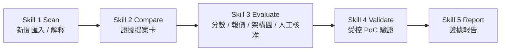

# Cleo 的暑期實習專案（2026 CIP）

本專案是「AI Agentic 雲端技術雷達與評估系統」實習專案的工作紀錄與交付物中心。新版可執行核心保存在專案主資料夾；GitHub 是共同紀錄與跨電腦同步來源，儀表板保留成果發表前的 Skill 進度歷史。

## 專案狀態

目前主線是以證據為核心的 S1-S5 流程：公開 AWS URL 或官方探索進入 Skill 1，Skill 2 建立來源證據提案卡，Skill 3 對候選產出中文說明、分數、PoC 報價與人工核准區，人類在看完同一份決策報告後才核准是否進入 Skill 4，Skill 5 只依已留下的證據產出可回查報告。

截至 2026-08-14，主線已完成 S1 新聞解釋、Skill 3 合併 PoC 決策報告、網頁架構圖報告、Skill 4 資源盤點、分段計時，以及 Skill 5 的成本邊界。四個成果報告案例已依新版 Skill 3 權重重評：Lambda 自主管理程式碼儲存 `4.35 / 5`、S3 Files `4.15 / 5`，兩者是成功案例；WorkSpaces AI Agents `2.60 / 5`、Amazon Quick Suite `3.10 / 5`，兩者是停止案例。2026-08-14 已完成預言者雷達成果發表、公司格式雙週誌，並依 Cleo 指示清除 Lambda 2026-08-14 與 S3 Files 2026-08-13 兩個保留中的 PoC 部署；因本次 cleanup 走成本控制 abort 路徑，報告標示為 `closed_without_console_review`，不宣稱正常 Console-reviewed final。

五個階段已整理為專案內的正式 Skill 套件。每個 Skill 都有自己的說明與介面設定，並共用同一套已測試的 S1-S5 核心。

## 實習旅程故事

如果用塔羅牌來說，這個夏天像是我從 **愚者** 開始的一趟旅程。

一開始，我帶著不確定走進國泰，很多事情都還看不清楚。後來在 mentor 和雲端部門的陪伴下，我慢慢拿起 **魔術師** 的工具：AI、AWS、GitHub、日誌、簡報、測試與證據，把一個模糊的想法整理成「預言者雷達」這套可以掃描、評估、驗證、報告的流程。

中途也有很多 **高塔** 時刻：部署卡住、權限受限、報告寫得不夠好、PoC 必須停下來重想。但那些不是失敗，而是讓我學會不能只追求漂亮結果，也要誠實面對限制、成本、風險和證據。

到了成果發表和黑客松，我像走到 **太陽**。我站上台，把 AI 在系統裡的角色、token 成本控制、動態更新和測試相容性講給評審聽；我們組拿到第一名，我也收到同儕的稱讚。那一刻我覺得，原來這個夏天學到的東西，真的有在我身上發光。

最後 8/31 的晚上，和實習生朋友走在河濱，背後黃光路燈把大家的髮絲照成金色，那很像 **世界** 牌的結尾：一段旅程完成了，但不是結束，而是帶著成果、朋友、感謝和新的自己，走向下一段路。

這個夏天，我從愚者出發，最後帶著世界回來。謝謝國泰、謝謝 CIP、謝謝 mentor。這是一段我不會忘記的旅程。

## 每日工作日誌

| 日期 | 今日主軸 |
|---|---|
| 9/3（待補） | 未收到可佐證的當日完成事項，因此未建立正式日誌；待補成果與證據後再統整。 |
| 9/1（待補） | 未收到可佐證的當日完成事項，因此未建立正式日誌；8/29 ASML 校園大使已投遞另待補建前日紀錄。 |
| [8/31](./logs/daily/work-log-2026-08-31.md) / [實習總結版](./logs/daily/work-log-2026-08-31-internship-summary.md) | 完成 CIP 集團結訓與國泰黑客松「步步公億走」提案報告；組別獲得第一名與 4,000 元禮券，Cleo 擔任主講者之一，並在晚間與實習生朋友完成河濱、夜市與寒假再見面的收尾回憶。 |
| [8/28](./logs/daily/work-log-2026-08-28.md) | 完成 mentor 離職／交接盤點、海大教授公司訪視評分與 FinTech 推薦函用印審查的收尾確認；具體交接內容與評語未取得。 |
| 8/27（待補） | 尚未收到可佐證的當日完成事項，因此未建立正式日誌；8/28 交接盤點與教授訪視待實際完成後記錄。 |
| [8/26](./logs/daily/work-log-2026-08-26.md) | 完成職安科 Webex 直播，校正「步步公億走」AI 應用設計頁為個人化推播系統角色，並排定 AWS 校園大使 9/8 說明會、9/9 投遞。 |
| [8/25](./logs/daily/work-log-2026-08-25.md) | 依主辦單位回饋與 mentor 建議修完 8/31「步步公億走」報告簡報，補強 AI 在個人化推播系統中的角色、Prompt 設計與可執行提醒規則。 |
| [8/24](./logs/daily/work-log-2026-08-24.md) | 把 8/28 mentor 離職／交接盤點納入正式追蹤，並開始補會計基礎；目前看到第 5 支影片，內容進到綜合損益表。 |
| [8/21](./logs/daily/work-log-2026-08-21.md) | 完成實習收尾狀態校正：評分表已簽核／送繳、推薦函已送審，並對齊 mentor 建議的金融與 AWS 學習方向；AWS 校園大使投遞仍待完成證據。 |
| [8/20](./logs/daily/work-log-2026-08-20.md) | 補記 mentor 小禮物與人壽 2nd 共融活動；帶領組員完成數理精算職系 Reels，累積團隊合作與組織融入素材。 |
| [8/19](./logs/daily/work-log-2026-08-19.md) | 完成 AI PM 使用分享；AI 根據逐字稿給出約 8.8/10 的非正式內容回饋，並整理後續申請待辦。 |
| [8/18](./logs/daily/work-log-2026-08-18.md) | 完成 8/19 AI PM 使用分享簡報，並補上 AI 競賽 Token 消耗控制流程圖；後續日誌改成輕鬆短記。 |
| [8/17](./logs/daily/work-log-2026-08-17.md) | 整理 8/19 AI PM 使用分享、校正評分表與證據邊界，清除已完成待辦；成果發表後收尾，不再計入 Skill 分數。 |
| [8/14](./logs/daily/work-log-2026-08-14.md) | 完成預言者雷達成果發表、雙週誌 Word 版、Lambda 受控部署與 Lambda / S3 Files 成本控制 cleanup；嚴格評分 10 分。 |
| [8/13](./logs/daily/work-log-2026-08-13.md) | 重跑 S3 Files 預言者流程到 cleanup 前，修正 Skill 3 可驗證性與可控制性準則，依新版權重重評四案例；嚴格評分 10 分。 |
| [8/12](./logs/daily/work-log-2026-08-12.md) | 修正 Skill 5 報告可讀性與 Future work，整理五份 Skill 中文閱讀版，補上 Skill 3 評分準則與四案例對照；嚴格評分 4 分。 |
| [8/11](./logs/daily/work-log-2026-08-11.md) | 補測三案 Skill 1 時間、校正 S3 Files PoC 時間口徑，整理 8/14 協理報告素材並依嚴格口徑下修 Skill 分數 |
| [8/10](./logs/daily/work-log-2026-08-10.md) | 建立 Quick Suite 官方宣傳型新聞停止案例，整理四案例時間統計與 8/14 報告素材，並記錄共融活動學習 |
| [8/5](./logs/daily/work-log-2026-08-05.md) | 校正 Skill 3 評分模型：證據覆蓋率不再加分；WorkSpaces AI Agents 改為 2.65 / 5、不可進 Skill 4，並加入自動測試工作流程 |
| [8/4](./logs/daily/work-log-2026-08-04.md) | 完成新功能雷達與 WorkSpaces AI Agents 的 S1-S3 初步評估；後續評分已於 8/5 校正 |
| [8/3](./logs/daily/work-log-2026-08-03.md) | 合併 Skill 3 PoC 決策報告，新增 S1 新聞解釋、S4 資源盤點、分段計時與 S5 成本邊界，並完成 Lambda / S3 Files 結案驗證 |
| [7/31](./logs/daily/work-log-2026-07-31.md) | 補強可重用 PoC 估價系統，完成 Lambda 與 S3 Files 兩次 S1-S5 實測、清除前用量快照與結案報告 |
| [7/30](./logs/daily/work-log-2026-07-30.md) | 五個 Skills 正式化，完成 S3 Files 公開牌價估算與實際 PoC 雙向驗證 |
| [7/29](./logs/daily/work-log-2026-07-29.md) | 完成新版 S1-S5 實際 PoC 與嚴格清理盤點，GitHub 主線收斂為新版架構 |
| [7/28](./logs/daily/work-log-2026-07-28.md) | 將 S0 移出入口，完成 S1 兩條入口與 S2 提案卡，並加入新加坡可用性硬門檻 |
| [7/27](./logs/daily/work-log-2026-07-27.md) | 完成 AI PM 科會材料，並以真實 AWS 官方 URL 驗證新版雷達 S0→S1 本機鏈路 |
| [7/24](./logs/daily/work-log-2026-07-24.md) | 研究新版 S0 需求輸入層，校正待辦與交付物，並整理 AI PM 科會內容稿 |
| [7/23](./logs/daily/work-log-2026-07-23.md) | 指定 S3 Files 新聞跑完 S1-S5，釐清外部模型備援原因並開始整理 AI PM 科會簡報 |
| [7/22](./logs/daily/work-log-2026-07-22.md) | 調嚴日誌與 Skill 分數，清理舊 S3 Files PoC，建立 CDK / CloudFormation 可重做部署流程 |
| [7/21](./logs/daily/work-log-2026-07-21.md) | 完成 S3 Files 手動與 CloudFormation-managed PoC 證據整理，建立評分表框架並同步正式日誌 |
| [7/20](./logs/daily/work-log-2026-07-20.md) | 整理 final proposal 與 demo 材料，完成 S3 Files 新聞截斷測試、CLI 查證與 CloudFormation template validation |
| [7/17](./logs/daily/work-log-2026-07-17.md) | CloudFormation 公司帳戶部署成功，完成 governance artifacts、7 頁簡報與 AI 執行軌跡 |
| [7/16](./logs/daily/work-log-2026-07-16.md) | 公司 AWS 帳戶 Step Functions 全流程跑通，完成 API-first fallback 與 HR 雙週誌格式修正 |
| [7/15](./logs/daily/work-log-2026-07-15.md) | 建立 AI PM、GitHub、Notion、Skill dashboard 與公司帳戶部署準備 |
| [7/14](./logs/daily/work-log-2026-07-14.md) | 整理 v3 手動部署包與 AWS 部署限制 |
| [7/13](./logs/daily/work-log-2026-07-13.md) | 建立 v3 技術雷達與 AWS pipeline 設計骨架 |

## 紀錄目錄

- `radar-redesign/`：新版 S1-S5 核心、五個正式 Skills、GUI、AWS web demo IaC、測試與操作文件。
- `poc/`：目前維護的 S3 Files 與 Lambda self-managed code storage PoC recipe。
- `logs/daily/`：正式每日實習日誌，17:00 後統整。
- `ai-execution-trace/daily/`：AI 每小時執行軌跡，只記錄 AI 當小時的判斷、產出與驗證，不寫專案前情提要。

## Skill 進度

- [Skill 進度完整紀錄](./SKILL_PROGRESS.md)
- [互動儀錶板 README](./dashboard/README.md)
- [可嵌入 dashboard HTML](./dashboard/cleo-skill-dashboard.html)

Skill 進度分數已於 2026-08-14 成果發表後結止並凍結為歷史追蹤。Cleo 已確認 `預言者雷達` 在暑假初期設定的目標已完成；2026-08-17 起的收尾日誌不再計算五個 Skill 進度積分。

| Skill | 說明 | 累積分數 |
|---|---|---:|
| Skill 1｜掃描 | 資料來源掃描、候選技術收集、帳號資源盤點 | 27 |
| Skill 2｜比較 | 候選技術比較、部署方式與限制對照 | 23 |
| Skill 3｜評估 | 評分邏輯、風險、成本與可行性判斷 | 39 |
| Skill 4｜驗證 | 部署驗證、權限驗證、錯誤排查 | 50 |
| Skill 5｜報告 | 報告、教學書、dashboard、週誌 | 39 |

## 重要交付物

| 交付物 | 日期 / 時點 | 目前狀態 | 完成條件 |
|---|---|---|---|
| AI PM 使用分享 | 2026-08-19（三）下午 | 已完成；AI 根據逐字稿給出約 8.8/10 的非正式內容回饋，正式評價仍待 mentor / 主管確認。 | Cleo 與 mentor 一起主持；Cleo 有 15 分鐘分享 AI PM 的實際使用方式，包含白話指令、AI 轉成可執行任務、Cleo 修正判斷、規則寫入記憶、最後形成日誌／文件／驗證證據的前後差異。 |
| CIP 集團結訓 / 國泰黑客松 | 2026-08-31（一） | Cleo 回報已完成結訓與「步步公億走」提案報告；組別獲得第一名與 4,000 元禮券，Cleo 為主講者之一；已保留正式日誌與長版實習總結，正式書面評審評語尚未取得。 | 完成結訓提案報告，補記得獎結果、主講內容、同儕回饋、mentor 對提案方法的啟發、晚間實習生收尾回憶，以及後續簡報練習方向。 |
| S1-S5 Skills 第一版完整交付 | 2026-07-31（五） | 已完成。五個正式 Skill 套件已建立；7/31 全測試 43 項通過。後續擴充測試在 8/4 記錄 91 項通過，8/5 的 Skill 3／Skill 4／recipe／costing 回歸測試 63 項通過；GitHub Actions 會在後續 push 與 PR 執行不依賴外部網站的完整單元測試，RSS 與即時 AWS 文章檢查保留為可選 integration test。AWS S3 Files 與 Lambda 自主管理程式碼儲存都已完整走過掃描到報告、實際 PoC、人工 Console 確認、清除前用量快照、資源清除與結案報告；Mentor 審查包已建立。 | 至少一條公開 AWS URL 完整跑過 S1-S5；五個 Skills 的輸入、輸出、跑法與限制可重現，並交付 Mentor 審查包。 |
| CIP 雙週工作進度（7/20-7/31） | 2026-07-31（五） | 已匯出 `2026CIP_WangGuanting_biweekly_worklog2_20260720-20260731.docx`，內容按成果與影響整理。 | 匯出正式檔案，內容按成果與影響整理，不寫成逐日流水帳。 |
| CIP 雙週工作進度（8/3-8/14） | 2026-08-14（五） | 已完成並已交出 `docs/2026CIP_王冠婷_雙週工作週誌3.docx`，另有完整 Markdown 版。 | 匯出正式檔案，補齊該期間成果、問題、學習與下期重點。 |
| 最終部會實習成果簡報 / 展示 | 2026-08-14（五） | 已完成；現場回饋整體正向，但目前僅為 Cleo 回報，待正式或具名評語補證。 | 完成《預言者雷達：看見技術的下一步》最終簡報、展示路線、時間控制與可驗證成果標註。 |
| 職安署職業安全衛生數位學習與 IFORM 上傳 | 2026-08-21（五）前 | Cleo 回報已完成 2 小時課程並上傳證明至 IFORM。 | 完成 2 小時職業安全衛生數位學習平台課程，並將數位學習證明上傳至 IFORM 數位表單。 |
| 職安科 Webex 直播 | 2026-08-26（三）09:30-10:30 | 已完成並收錄於 8/26 日誌；尚未補充直播內容重點。 | 準時進入 Webex 觀看職安科直播；若有實習相關重點再補進後續紀錄。 |
| Mentor 離職事項盤點 | 2026-08-28（五）上午 | 已完成並收錄於 8/28 日誌；交接明細未提供。 | 再次和 mentor 盤點離職 / 交接事項，確認需要繳交、歸還、結清或補完成的項目，盤點後補進當日 inbox / 日誌。 |
| 海大教授公司訪視評分 | 2026-08-28（五）13:30 | 已完成並收錄於 8/28 日誌；教授評語未提供。 | 直接使用 8/14 部會成果簡報／剪報作為教授訪視展示材料；訪視後補進當日紀錄。 |
| 實習抵免 4 學分文件 | 2026-09-02（三） | Cleo 回報已將實習抵免學分文件交給系辦，4 學分行政事項已處理完成。 | 文件交給系辦；若系辦後續要求補件，再另開待辦。 |

## 近期待辦（完成後移除）

| 截止 / 日期 | 待辦 | 對應目標 | 完成條件 | 狀態 |
|---|---|---|---|---|
| 2026-09-08（二）12:00 | 到延平大樓 712 和高教授討論專題。 | 確認專題方向與後續研究 / 執行安排。 | 準時到延平大樓 712 與高教授討論，會後整理教授建議、待補資料與下一步。 | 未開始 |
| 2026-09-08（二）19:00-21:00 | 線上參加 AWS Educate 9th 雲端校園大使招募說明會。 | 先理解 AWS 校園大使職缺與申請要求。 | 參加線上說明會，整理投遞需要補強的履歷、作品集或申請重點。 | 未開始 |
| 2026-09-09（三）上午 | 投遞 AWS 校園大使履歷。 | 完成 AWS 校園大使申請。 | 依說明會資訊確認履歷與作品集後送出申請；履歷需凸顯國泰雲端部門、AWS PoC 雷達、AI PM、雲端 / AI / 技術推廣經驗。 | 未開始 |
| 2026-09-09（三）19:00 | 射箭；可穿薄長袖。 | 維持運動安排與生活節奏。 | 準時參加射箭，出門前準備薄長袖。 | 未開始 |
| 2026-09-14（一）當週 | 處理普通物理（上）3 學分人工加簽，找光電系教授簽名。 | 補齊大學課務與學分安排。 | 找到光電系教授完成人工加簽簽名，並確認後續送件或系統登錄流程。 | 未開始 |
