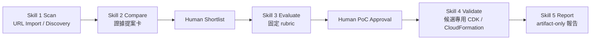

# Cleo 的暑期實習專案（2026 CIP）

本 repository 是「AI Agentic 雲端技術雷達與評估系統」實習專案的工作紀錄與交付物中心。新版可執行核心位於 `radar-redesign/`；Git 是 source of truth，Notion 與 dashboard 用於呈現每日進度與 Skill 成長。

## 主管快速入口

| 按鈕 | 說明 |
|---|---|
| [▶ 查看評分表集合（GitHub）](./evaluation-forms/README.md) | 可選不同評分表：國泰實習生評鑑表單、國泰 Mentor 觀察表、學校成效問卷與成績考核表。 |

## 專案狀態

目前主線是 artifact-first 的 S1-S5 流程：公開 AWS URL 或官方探索進入 Skill 1，Skill 2 建立來源證據提案卡，人工 shortlist 後進入 Skill 3，Skill 4 僅在人工核准後部署候選專用 PoC，Skill 5 只依 artifact 產出可回查報告。既有實體 PoC 僅代表 intern 非 production 環境，不能延伸為公司環境結論。

五個階段已整理為 repository 內的正式 Skill packages，入口位於 [`radar-redesign/skills/`](./radar-redesign/skills/)。每個 Skill 均有獨立 `SKILL.md` 與 UI metadata，並共用同一套已測試的 S1-S5 核心。

## 每日工作日誌

| 日期 | 今日主軸 |
|---|---|
| [7/29](./logs/daily/work-log-2026-07-29.md) | 完成新版 S1-S5 實際 PoC 與嚴格清理盤點，GitHub 主線收斂為新版架構 |
| [7/28](./logs/daily/work-log-2026-07-28.md) | 將 S0 移出入口，完成 S1 兩條入口與 S2 提案卡，並加入新加坡可用性硬門檻 |
| [7/27](./logs/daily/work-log-2026-07-27.md) | 完成 AI PM 科會材料，並以真實 AWS 官方 URL 驗證新版雷達 S0→S1 本機鏈路 |
| [7/24](./logs/daily/work-log-2026-07-24.md) | 研究新版 S0 需求輸入層，校正待辦與交付物，並整理 AI PM 科會內容稿 |
| [7/23](./logs/daily/work-log-2026-07-23.md) | 指定 S3 Files 新聞跑完 S1-S5，釐清 LLM fallback 原因並開始整理 AI PM 科會簡報 |
| [7/22](./logs/daily/work-log-2026-07-22.md) | 調嚴日誌與 Skill 分數，清理舊 S3 Files PoC，建立 CDK / CloudFormation 可重做部署流程 |
| [7/21](./logs/daily/work-log-2026-07-21.md) | 完成 S3 Files 手動與 CloudFormation-managed PoC 證據整理，建立評分表框架並同步正式日誌 |
| [7/20](./logs/daily/work-log-2026-07-20.md) | 整理 final proposal 與 demo 材料，完成 S3 Files 新聞截斷測試、CLI 查證與 CloudFormation template validation |
| [7/17](./logs/daily/work-log-2026-07-17.md) | CloudFormation 公司帳戶部署成功，完成 governance artifacts、7 頁簡報與 AI 執行軌跡 |
| [7/16](./logs/daily/work-log-2026-07-16.md) | 公司 AWS 帳戶 Step Functions 全流程跑通，完成 API-first fallback 與 HR 雙週誌格式修正 |
| [7/15](./logs/daily/work-log-2026-07-15.md) | 建立 AI PM、GitHub、Notion、Skill dashboard 與公司帳戶部署準備 |
| [7/14](./logs/daily/work-log-2026-07-14.md) | 整理 v3 手動部署包與 AWS 部署限制 |
| [7/13](./logs/daily/work-log-2026-07-13.md) | 建立 v3 技術雷達與 AWS pipeline 設計骨架 |

## 紀錄目錄

- `radar-redesign/`：新版 S1-S5 核心、五個正式 Skills、GUI、AWS web demo IaC、測試與操作文件。
- `poc/`：目前維護的 S3 Files 與 Lambda self-managed code storage PoC recipe。
- `logs/daily/`：正式每日實習日誌，17:00 後統整。
- `ai-execution-trace/daily/`：AI 每小時執行軌跡，只記錄 AI 當小時的判斷、產出與驗證，不寫專案前情提要。

## Skill 進度

- [Skill 進度完整紀錄](./SKILL_PROGRESS.md)
- [互動儀錶板 README](./dashboard/README.md)
- [可嵌入 dashboard HTML](./dashboard/cleo-skill-dashboard.html)

截至 2026-07-29，改採硬審核口徑後累積分數 97 分。每日五個 Skill 加總最高 10 分，舊版 107 分不再作為正式值。

| Skill | 說明 | 累積分數 |
|---|---|---:|
| Skill 1｜掃描 | 資料來源掃描、候選技術收集、帳號資源盤點 | 17 |
| Skill 2｜比較 | 候選技術比較、部署方式與限制對照 | 15 |
| Skill 3｜評估 | 評分邏輯、風險、成本與可行性判斷 | 18 |
| Skill 4｜驗證 | 部署驗證、權限驗證、錯誤排查 | 29 |
| Skill 5｜報告 | 報告、教學書、dashboard、週誌 | 18 |

## 最終發表驗證衝刺

2026-07-31（五）仍是第一版完整交付硬截止，但剩下兩天不再擴充功能，改採「證據收斂」：把已完成的 S1-S4 實作與兩條真實 PoC 證據接回 S5 報告，補齊可重跑說明、檢測結果、限制與 Mentor review package。2026-07-29 的基線已確認：S3 Files 已完成實際部署、回驗與 cleanup；Lambda self-managed code storage 已完成部署與 invoke，仍待人工 Console review 與 cleanup 決策。這些都只代表 intern 非 production 環境，不延伸為公司環境結論。

| 日期 | 主軸 | 當日完成條件 |
|---|---|---|
| 2026-07-30（四）下午 | 文件與風險收斂。 | 上午公司活動後，只整理 S1-S5 跑法、artifact lineage、S5 報告與已知限制；不新增大型功能。 |
| 2026-07-31（五） | 第一版完整交付與 Mentor review。 | 至少一條公開 AWS URL 完整走完 S1-S5 並保留輸出；五個 Skills 的輸入、輸出、跑法與限制可閱讀；完成檢測清單、Mentor review package 與 CIP 雙週工作進度（7/20-7/31）。 |
| 2026-08-03（一）至 2026-08-05（三） | 將第一版轉成 final proposal 證據素材。 | 補齊研究方法與比較基準、專案執行軌跡圖、現況架構圖、驗證矩陣與失敗邊界；不把 intern PoC 寫成公司環境結論。 |
| 2026-08-11（二） | AI PM 科會報告。 | 直接使用已完成的原訂 2026-07-28 簡報與講稿，準時完成 10 分鐘報告。 |
| 2026-08-12（三）至 2026-08-14（五） | 完成 final proposal 展示版與第二段 CIP 進度。 | 有可展示的簡報初稿、demo checklist、口說稿與限制標籤；CIP 雙週工作進度（8/3-8/14）依成果與影響匯出。 |

## 重要交付物

| 交付物 | 日期 / 時點 | 目前狀態 | 完成條件 |
|---|---|---|---|
| AI PM 科會 10 分鐘報告 | 2026-08-11（二）15:30 | 簡報與講稿已完成；直接沿用原訂 2026-07-28 報告版本。 | 準時完成 10 分鐘報告；依既有版本呈現 2-3 組去識別化 input/output 前後差異、限制與下一步。 |
| S1-S5 Skills 第一版完整交付 | 2026-07-31（五） | 五個正式 Skill packages 已建立且格式驗證通過；19 項核心測試通過。S3 Files 完整 PoC 已 cleanup；Lambda 候選已部署與 invoke，已完成部分人工 Console review，仍待儲存設定確認與 cleanup 決策。尚待 Mentor review package 與 CIP 雙週進度收斂。 | 至少一條公開 AWS URL 完整跑過 S1-S5；五個 Skills 的輸入、輸出、跑法與限制可重現，並交付 Mentor review package。 |
| CIP 雙週工作進度（7/20-7/31） | 2026-07-31（五） | 待依第一版完整交付的真實證據彙整。 | 匯出正式檔案，內容按成果與影響整理，不寫成逐日流水帳。 |
| CIP 雙週工作進度（8/3-8/14） | 2026-08-14（五） | 未開始。 | 匯出正式檔案，補齊該期間成果、問題、學習與下期重點。 |
| 最終部會實習成果簡報 / 展示 | 2026-08-17（一） | 素材累積中。 | 完成最終簡報、展示路線、時間控制與可驗證成果標註。 |
| 國泰主管評分表 | 2026-08-24（一） | 表單集合已建立。 | 完成自評補證據與填答建議，清楚標示正式分數由主管 / mentor 決定。 |
| 學校評分表 | 2026-08-27（四） | 表單集合已建立。 | 完成自評補證據、填答建議與必要檔案匯出。 |
| 海大教授公司訪視評分 | 2026-08-28（五）13:30 | 已排入時程。 | 直接使用 8/17 部會成果簡報／剪報作為教授訪視展示材料；訪視後補進當日紀錄。 |
| CIP 雙週工作進度（8/17-8/28） | 2026-08-28（五） | 未開始。 | 匯出正式檔案，納入最終展示後的成果與收尾。 |

## 近期待辦（完成後移除）

| 截止 / 日期 | 待辦 | 對應目標 | 完成條件 | 狀態 |
|---|---|---|---|---|
| 2026-07-30（四）上午 | 參加人壽高管交流活動（總公司）。 | 累積公司情境與成長證據。 | 活動後把可公開、非敏感重點整理進當日 inbox / 日誌。 | 未開始 |
| 2026-07-31（五） | 完成 Lambda self-managed code storage 的 S4 人工 Console review 與 cleanup 決策。 | 封閉第二條真實 PoC 的驗證鏈路，或清楚保留未結案原因。 | Cleo 在 AWS Console 檢視 CloudFormation、Lambda 與測試 S3 bucket；明確決定 cleanup 或保留，並留下人工確認證據。 | 待人工確認 |
| 2026-07-31（五） | 拆分 Skill 4 低風險驗證建議與付費 PoC 資格。 | 避免同一技術因缺少部署脈絡而被誤讀為不值得研究。 | 定義 `recommend_low_risk_validation` 與 `eligible_for_paid_poc_review` 的獨立規則、相容策略與回歸測試；若未完成，列入 Mentor package 已知限制。 | 已完成：S3 v2、S4／S5／GUI 與 22 項測試通過 |
| 2026-07-31（五） | 完成 S1-S5 第一版 Mentor review package。 | 本週五完整 Skills 交付。 | 一條公開 AWS URL 的 S1-S5 artifact、S5 報告、五個 Skills 的跑法、檢測清單與限制清單可供 Mentor 回查。 | 進行中 |
| 2026-07-31（五） | 匯出 CIP 雙週工作進度（7/20-7/31）。 | 完成本期正式實習文件。 | 正式檔案依成果、影響、問題與下一步整理完成。 | 未開始 |
| 2026-08-03 10:30 | 出席部會並聆聽。 | 掌握部會資訊與行程安排。 | 準時出席；不需準備或進行報告。 | 未開始 |
| 2026-08-06（四）至 2026-08-07（五） | 到信義區參加集團 AI 競賽，當日不進內湖辦公室。 | 行程監督，避免工作安排衝突。 | 競賽完成後補活動紀錄與可用素材。 | 未開始 |
| 2026-08-10（一） | 參加人壽 1st 共融活動（六度空間）。 | 累積公司情境與團隊合作證據。 | 活動後補進當日 inbox / 日誌，保留可用於 final proposal 的成長素材。 | 未開始 |
| 2026-08-11 15:30 | AI PM 科會 10 分鐘報告。 | 呈現 AI PM 作為工作夥伴的實際協作成果。 | 直接使用已完成的原訂 2026-07-28 報告版本，準時完成現場 10 分鐘報告。 | 待報告 |
| 2026-08-14（五） | 完成 CIP 雙週工作進度（8/3-8/14）。 | 不漏掉 HR / CIP 進度文件。 | 正式檔案匯出完成，內容按成果與影響整理。 | 未開始 |
| 2026-08-17（一） | 部會展示最終實習成果報告。 | 完成 final proposal 主線與展示。 | 最終簡報、展示檢查清單、成果證據與限制標註完成。 | 未開始 |
| 2026-08-20（四） | 參加人壽 2nd 共融活動（總公司）。 | 累積公司情境與團隊合作證據。 | 活動後補進當日 inbox / 日誌，保留可用於 final proposal 的成長素材。 | 未開始 |
| 2026-08-24（一） | 國泰主管評分表整理 / 匯出。 | 不漏掉正式評核文件。 | 完成自評補證據、填答建議與必要檔案。 | 未開始 |
| 2026-08-27（四） | 學校評分表整理 / 匯出。 | 不漏掉學校正式評核文件。 | 完成自評補證據、填答建議與必要檔案。 | 未開始 |
| 2026-08-28（五）13:30 | 海大教授到公司訪視評分。 | 學校端正式訪視與評分。 | 直接拿 8/17 部會成果簡報／剪報給教授看；訪視後補進當日 inbox / 日誌。 | 未開始 |
| 2026-08-28（五） | 完成 CIP 雙週工作進度（8/17-8/28）。 | 完成最後一段 CIP 進度文件。 | 正式檔案匯出完成，納入最終展示與收尾成果。 | 未開始 |
| 2026-08-31（一） | 參加集團結訓典禮（國泰金融會議中心）。 | 實習收尾與成果回顧。 | 活動後補進日誌，整理可放進 final proposal / 結案回顧的素材。 | 未開始 |
