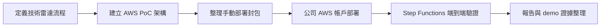

# Cleo 的暑期實習專案（2026 CIP）

本 repository 是 Cathay Tech Intel v3 / 技術雷達實習專案的工作紀錄與交付物中心。Git 是 source of truth；Notion 與 dashboard 用於呈現每日進度與 Skill 成長。

## 專案狀態

目前主線已從本地設計與封包，推進到公司 AWS 帳戶手動部署與端到端驗證。

## 每日工作日誌

| 日期 | 今日主軸 | 狀態 |
|---|---|---|
| [7/16](./logs/daily/work-log-2026-07-16.md) | 公司 AWS 帳戶 Step Functions 全流程跑通，完成 API-first fallback 與 HR 雙週誌格式修正 | direct |
| [7/15](./logs/daily/work-log-2026-07-15.md) | 建立 AI PM、GitHub、Notion、Skill dashboard 與公司帳戶部署準備 | supporting |
| [7/14](./logs/daily/work-log-2026-07-14.md) | 整理 v3 手動部署包與 AWS 部署限制 | supporting |
| [7/13](./logs/daily/work-log-2026-07-13.md) | 建立 v3 技術雷達與 AWS pipeline 設計骨架 | direct |

## 紀錄目錄

- `logs/daily/`：正式每日實習日誌，17:00 後統整。
- `ai-execution-trace/daily/`：AI 每小時執行軌跡，只記錄 AI 當小時的判斷、產出與驗證，不寫專案前情提要。

## Skill 進度

- [Skill 進度完整紀錄](./SKILL_PROGRESS.md)
- [互動儀錶板 README](./dashboard/README.md)
- [可嵌入 dashboard HTML](./dashboard/cleo-skill-dashboard.html)

截至 2026-07-16，累積分數 70 分。

| Skill | 說明 | 累積分數 |
|---|---|---:|
| Skill 1｜掃描 | 資料來源掃描、候選技術收集 | 8 |
| Skill 2｜比較 | 候選技術比較、案例對照 | 9 |
| Skill 3｜評估 | 評分邏輯、AHP/rubric/LLM 輔助評估 | 16 |
| Skill 4｜驗證 | 部署驗證、權限驗證、錯誤排查 | 17 |
| Skill 5｜報告 | Top 3 報告、HTML/文件輸出、週誌 | 20 |

## 重要交付物

- [AI PM 工作流程](./AI_PM_WORKFLOW.md)
- [專案記憶](./PROJECT_MEMORY.md)
- [公司如何幫助我成長草稿](./final-proposal/公司如何幫助我成長-草稿.md)
- [簡報架構與執行軌跡](./final-proposal/簡報架構與執行軌跡.md)
- [AHP scoring report HTML](./v3-tech-radar-ahp-scoring-report.html)
- [HR 雙週工作週誌格式正確版](./2026CIP_王冠婷_雙週工作週誌1_格式正確版.docx)

## 目前待辦

- 驗證 S3 `report.html` 的開啟方式，必要時使用 Download 或 presigned URL。
- 檢查 DynamoDB `cathay-techintel-v3-picks-log` 是否已有 actor=`ai` 的紀錄。
- 評估是否補正式 Anthropic API key，或改以 AWS Bedrock 做公司環境的 AI 評估路徑。
- 將 7/16 的部署成功證據整理進 demo checklist 與 final proposal 執行軌跡。
