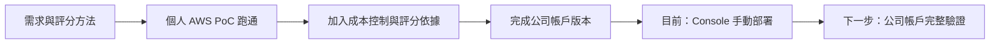

# Cleo 的暑期實習日誌｜2026 CIP

> 這是主管閱讀用首頁。日誌與專案內容保存在 Private GitHub repository，受邀的 collaborator 可直接用瀏覽器閱讀，不需要下載程式或專案封包。

## 目前進度

**技術雷達公司帳戶版本已完成程式與架構驗證，目前進行公司帳戶手動部署。**

## 每日工作日誌

| 日期 | 今日主題 | 狀態 |
|---|---|---|
| [7/14](./work-log-2026-07-14.md) | 整理技術雷達公司帳戶版本、成本控制與評分依據 | 手動部署進行中 |
| [7/13](./work-log-2026-07-13.md) | 將 v3 從架構雛形推進至 AWS 端到端執行 | 個人 AWS 驗證成功 |

> 7/15 日誌預計於今日 17:20 自動統整，完成前不先發布。

## Skill 進度儀表板

| Skill | 內容 | 累積積分 | 目前狀態 |
|---|---|---:|---|
| 🔵 Tech Intel Scan | 技術雷達掃描與 Top 3 報告 | 16 | 個人 AWS 已驗證，公司版持續落地 |
| 🟢 Case Study Registry | 企業案例庫 | 0 | 尚無可獨立計分證據 |
| 🟠 Pick Experiment Tracker | AI vs 人類判斷實驗 | 0 | 尚未開始累積有效實驗資料 |
| 🟣 AWS Architecture Scout | AWS 架構檢查與落地補強 | 12 | 已完成架構驗證，持續處理公司限制 |
| 🔴 Work Log | AI PM 日誌與成果追蹤 | 4 | Git／Notion 同步機制建置中 |

目前累積：**32 分**。7/15 分數將在 17:20 依當日證據更新。

- [查看每日積分與目標對齊明細](./SKILL_PROGRESS.md)
- [開啟 Notion 互動式儀表板](https://app.notion.com/p/39e9d9fba316813c8e68fa80f8f33d08)

## 專案閱讀入口

- [AI PM 工作方式](./AI_PM_WORKFLOW.md)
- [專案長期記憶與目前決策](./PROJECT_MEMORY.md)
- [Final proposal 架構與執行軌跡](./final-proposal/簡報架構與執行軌跡.md)
- [公司如何幫助我成長](./final-proposal/公司如何幫助我成長-草稿.md)
- [每日實習日誌模板](./templates/每日實習日誌模板.md)

## 閱讀說明

- 日誌以簡單語言整理成果、驗證、問題與下一步。
- 「已驗證」、「等待公司環境驗證」與「成本估算」會分開標示。
- 技術細節與原始碼保留在 repository；主管閱讀日誌不需要下載這些檔案。
