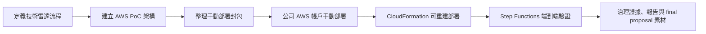

# Cleo 的暑期實習專案（2026 CIP）

本 repository 是 Cathay Tech Intel v3 / 技術雷達實習專案的工作紀錄與交付物中心。Git 是 source of truth；Notion 與 dashboard 用於呈現每日進度與 Skill 成長。

## 主管快速入口

| 按鈕 | 說明 |
|---|---|
| [▶ 查看評分表集合（GitHub）](./evaluation-forms/README.md) | 可選不同評分表：國泰實習生評鑑表單、國泰 Mentor 觀察表、學校成效問卷與成績考核表。 |

## 專案狀態

目前主線已從本地設計與手動 Console 部署，推進到公司 AWS 帳戶可用 CloudFormation 重建並端到端驗證的版本。

## 每日工作日誌

| 日期 | 今日主軸 | 狀態 |
|---|---|---|
| [7/24](./logs/daily/work-log-2026-07-24.md) | 研究新版 S0 需求輸入層，校正待辦與交付物，並整理 AI PM 科會內容稿 | direct |
| [7/23](./logs/daily/work-log-2026-07-23.md) | 指定 S3 Files 新聞跑完 S1-S5，釐清 LLM fallback 原因並開始整理 AI PM 科會簡報 | direct |
| [7/22](./logs/daily/work-log-2026-07-22.md) | 調嚴日誌與 Skill 分數，清理舊 S3 Files PoC，建立 CDK / CloudFormation 可重做部署流程 | direct |
| [7/21](./logs/daily/work-log-2026-07-21.md) | 完成 S3 Files 手動與 CloudFormation-managed PoC 證據整理，建立評分表框架並同步正式日誌 | direct |
| [7/20](./logs/daily/work-log-2026-07-20.md) | 整理 final proposal 與 demo 材料，完成 S3 Files 新聞截斷測試、CLI 查證與 CloudFormation template validation | direct |
| [7/17](./logs/daily/work-log-2026-07-17.md) | CloudFormation 公司帳戶部署成功，完成 governance artifacts、7 頁簡報與 AI 執行軌跡 | direct |
| [7/16](./logs/daily/work-log-2026-07-16.md) | 公司 AWS 帳戶 Step Functions 全流程跑通，完成 API-first fallback 與 HR 雙週誌格式修正 | direct |
| [7/15](./logs/daily/work-log-2026-07-15.md) | 建立 AI PM、GitHub、Notion、Skill dashboard 與公司帳戶部署準備 | supporting |
| [7/14](./logs/daily/work-log-2026-07-14.md) | 整理 v3 手動部署包與 AWS 部署限制 | supporting |
| [7/13](./logs/daily/work-log-2026-07-13.md) | 建立 v3 技術雷達與 AWS pipeline 設計骨架 | direct |

## 紀錄目錄

- `logs/daily/`：正式每日實習日誌，17:00 後統整。
- `ai-execution-trace/daily/`：AI 每小時執行軌跡，只記錄 AI 當小時的判斷、產出與驗證，不寫專案前情提要。

## Skill 進度

- [Skill 進度完整紀錄](./SKILL_PROGRESS.md)
- [互動儀錶板 README](./dashboard/README.md)
- [可嵌入 dashboard HTML](./dashboard/cleo-skill-dashboard.html)

截至 2026-07-24，改採硬審核口徑後累積分數 70 分。每日五個 Skill 加總最高 10 分，舊版 107 分不再作為正式值。

| Skill | 說明 | 累積分數 |
|---|---|---:|
| Skill 1｜掃描 | 資料來源掃描、候選技術收集、帳號資源盤點 | 10 |
| Skill 2｜比較 | 候選技術比較、部署方式與限制對照 | 10 |
| Skill 3｜評估 | 評分邏輯、風險、成本與可行性判斷 | 15 |
| Skill 4｜驗證 | 部署驗證、權限驗證、錯誤排查 | 21 |
| Skill 5｜報告 | 報告、教學書、dashboard、週誌 | 14 |

## 最終發表驗證衝刺

扣掉科會上午、公司活動、集團 AI 競賽、週末與 8/17 發表日，至最終部會成果展示前只剩 10 個完整工作日；但若以「一天驗證兩個階段」推進，時間仍足夠。接下來採短衝刺：先把 S0-S5 快速打通，再用多篇報導驗證，最後轉成論文式 final proposal。

| 日期 | 主軸 | 當日消光條件 |
|---|---|---|
| 2026-07-24（五） | 研究 S0 需求輸入層與 AI PM 科會內容。 | 已進行但未消光：S0 尚未讀完，CLI、unittest、compileall 不能列為完成證據。 |
| 2026-07-27（一） | 優先完成 AI PM 科會簡報，再接 S0 / S1 / S2。 | 科會簡報、10 分鐘講稿與 2-3 組證據先收斂；剩餘時間先補完 S0 閱讀與完成條件，再推進 S1 掃描與 S2 比較。 |
| 2026-07-28（二）下午 | 完成 S3 / S4。 | S3 評估與 S4 驗證可重跑，保留分數、限制、fallback 與驗證證據。 |
| 2026-07-29（三） | 完成 S5 + 多篇報導驗證。 | S5 報告可產出；用多篇報導跑過流程，整理通過 / 失敗 / 限制。 |
| 2026-07-31（五） | 第一段雙週進度 + 驗證整理。 | CIP 雙週工作進度（7/20-7/31）匯出，S0-S5 驗證結果整理成 final proposal 素材。 |
| 2026-08-03（一） | 補研究方法與比較基準。 | 官方來源、質化 / 量化指標、相近做法比較整理完成。 |
| 2026-08-04（二） | 補圖表與執行軌跡。 | 專案軌跡圖、S0-S5 流程圖、驗證矩陣草稿完成。 |
| 2026-08-05（三） | 補第二輪驗證。 | 重跑關鍵案例，補失敗邊界、成本 / cleanup 或替代驗證記錄。 |
| 2026-08-11（二） | 轉成 final proposal 初稿。 | 依論文式結構排出完整簡報草稿，不只放素材。 |
| 2026-08-12（三） | 補第二輪驗證與圖表。 | 關鍵證據、執行軌跡圖、限制標籤更新完成。 |
| 2026-08-13（四） | 完成展示版。 | 簡報、demo checklist、口說稿第一版完成。 |
| 2026-08-14（五） | 最終演練與第二段雙週進度。 | CIP 雙週工作進度（8/3-8/14）匯出，展示演練後修正完成。 |

## 重要交付物

| 交付物 | 日期 / 時點 | 目前狀態 | 完成條件 |
|---|---|---|---|
| AI PM 科會 10 分鐘報告 | 2026-07-28（二） | 已有 v2 簡報初稿，仍需收斂證據與口說節奏。 | 10 分鐘內講完，含 2-3 組去識別化 input/output 前後差異、限制與下一步。 |
| CIP 雙週工作進度（7/20-7/31） | 2026-07-31（五） | 進行中。 | 匯出正式檔案，內容按成果與影響整理，不寫成逐日流水帳。 |
| CIP 雙週工作進度（8/3-8/14） | 2026-08-14（五） | 未開始。 | 匯出正式檔案，補齊該期間成果、問題、學習與下期重點。 |
| 最終部會實習成果簡報 / 展示 | 2026-08-17（一） | 素材累積中。 | 完成最終簡報、展示路線、時間控制與可驗證成果標註。 |
| 國泰主管評分表 | 2026-08-24（一） | 表單集合已建立。 | 完成自評補證據與填答建議，清楚標示正式分數由主管 / mentor 決定。 |
| 學校評分表 | 2026-08-27（四） | 表單集合已建立。 | 完成自評補證據、填答建議與必要檔案匯出。 |
| CIP 雙週工作進度（8/17-8/28） | 2026-08-28（五） | 未開始。 | 匯出正式檔案，納入最終展示後的成果與收尾。 |

## 近期待辦（照期限消光）

| 截止 / 日期 | 待辦 | 對應目標 | 消光條件 | 狀態 |
|---|---|---|---|---|
| 2026-07-27（一） | 先完成 AI PM 科會簡報與講稿。 | 確保 2026-07-28 科會可穩定報告，不讓 S1/S2 驗證擠壓簡報收斂。 | v2 簡報內容定稿、2-3 組證據選定、10 分鐘講稿與演練完成。 | 進行中 |
| 2026-07-28（二） | 科會報告 AI PM。 | 說明 AI PM 如何監督、串聯、校正工作，而不是介紹功能清單。 | 簡報、講稿、2-3 組證據與 10 分鐘演練完成。 | 進行中 |
| 2026-07-30（四）上午 | 參加人壽高管交流活動（總公司）。 | 累積公司情境與成長證據。 | 活動後把可公開、非敏感重點整理進當日 inbox / 日誌。 | 未開始 |
| 2026-07-31（五） | 完成 CIP 雙週工作進度（7/20-7/31）。 | 不漏掉 HR / CIP 進度文件。 | 正式檔案匯出完成，內容按成果與影響整理。 | 進行中 |
| 2026-08-06（四）至 2026-08-07（五） | 到信義區參加集團 AI 競賽，當日不進內湖辦公室。 | 行程監督，避免工作安排衝突。 | 競賽完成後補活動紀錄與可用素材。 | 未開始 |
| 2026-08-10（一） | 參加人壽 1st 共融活動（六度空間）。 | 累積公司情境與團隊合作證據。 | 活動後補進當日 inbox / 日誌，保留可用於 final proposal 的成長素材。 | 未開始 |
| 2026-08-14（五） | 完成 CIP 雙週工作進度（8/3-8/14）。 | 不漏掉 HR / CIP 進度文件。 | 正式檔案匯出完成，內容按成果與影響整理。 | 未開始 |
| 2026-08-17（一） | 部會展示最終實習成果報告。 | 完成 final proposal 主線與展示。 | 最終簡報、展示檢查清單、成果證據與限制標註完成。 | 未開始 |
| 2026-08-20（四） | 參加人壽 2nd 共融活動（總公司）。 | 累積公司情境與團隊合作證據。 | 活動後補進當日 inbox / 日誌，保留可用於 final proposal 的成長素材。 | 未開始 |
| 2026-08-24（一） | 國泰主管評分表整理 / 匯出。 | 不漏掉正式評核文件。 | 完成自評補證據、填答建議與必要檔案。 | 未開始 |
| 2026-08-27（四） | 學校評分表整理 / 匯出。 | 不漏掉學校正式評核文件。 | 完成自評補證據、填答建議與必要檔案。 | 未開始 |
| 2026-08-28（五） | 完成 CIP 雙週工作進度（8/17-8/28）。 | 完成最後一段 CIP 進度文件。 | 正式檔案匯出完成，納入最終展示與收尾成果。 | 未開始 |
| 2026-08-31（一） | 參加集團結訓典禮（國泰金融會議中心）。 | 實習收尾與成果回顧。 | 活動後補進日誌，整理可放進 final proposal / 結案回顧的素材。 | 未開始 |
