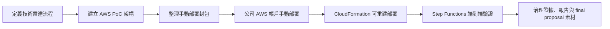

# Cleo 的暑期實習專案（2026 CIP）

本 repository 是 Cathay Tech Intel v3 / 技術雷達實習專案的工作紀錄與交付物中心。Git 是 source of truth；Notion 與 dashboard 用於呈現每日進度與 Skill 成長。

## 主管快速入口

| 按鈕 | 說明 |
|---|---|
| [▶ 查看評分表集合（GitHub）](./evaluation-forms/README.md) | 可選不同評分表：國泰實習生評鑑表單、國泰 Mentor 觀察表、學校成效問卷與成績考核表。 |
| [▶ 主管評分摘要（Notion）](https://app.notion.com/p/3a49d9fba316816c8f95d2a2ff997350) | 快速查看目前自評分數與每日更新規則。 |
| [▶ Cleo｜主管評分表細則與回覆（GitHub）](./dashboard/Cleo-主管評分表細則與回覆.md) | 主管可在 GitHub 直接點開的細則入口。 |
| [▶ 完整細則與表單回覆（GitHub）](./dashboard/mentor-evaluation-details.md) | 完整評分依據、第二張表單建議與優缺點文字。 |
| [▶ 主管評分細則（Notion）](https://app.notion.com/p/3a49d9fba316814e923ad82718952a71) | Notion 版細則頁。 |
| [▶ Skill 進度儀表板](./dashboard/README.md) | 五個 Skill 累積分數與每日趨勢。 |

## 專案狀態

目前主線已從本地設計與手動 Console 部署，推進到公司 AWS 帳戶可用 CloudFormation 重建並端到端驗證的版本。

## 每日工作日誌

| 日期 | 今日主軸 | 狀態 |
|---|---|---|
| [7/17](./logs/daily/work-log-2026-07-17.md) | CloudFormation 公司帳戶部署成功，完成 governance artifacts、7 頁簡報與 AI 執行軌跡 | direct |
| [7/20](./logs/daily/work-log-2026-07-20.md) | 整理 final proposal 與 demo 材料，完成 S3 Files 新聞截斷測試、CLI 查證與 CloudFormation template validation | direct |
| [7/16](./logs/daily/work-log-2026-07-16.md) | 公司 AWS 帳戶 Step Functions 全流程跑通，完成 API-first fallback 與 HR 雙週誌格式修正 | direct |
| [7/15](./logs/daily/work-log-2026-07-15.md) | 建立 AI PM、GitHub、Notion、Skill dashboard 與公司帳戶部署準備 | supporting |
| [7/14](./logs/daily/work-log-2026-07-14.md) | 整理 v3 手動部署包與 AWS 部署限制 | supporting |
| [7/13](./logs/daily/work-log-2026-07-13.md) | 建立 v3 技術雷達與 AWS pipeline 設計骨架 | direct |

## 紀錄目錄

- `logs/daily/`：正式每日實習日誌，17:00 後統整。
- `ai-execution-trace/daily/`：AI 每小時執行軌跡，只記錄 AI 當小時的判斷、產出與驗證，不寫專案前情提要。

## Skill 進度

- [Skill 進度完整紀錄](./SKILL_PROGRESS.md)
- [互動儀錶板 README](./dashboard/README.md)
- [可嵌入 dashboard HTML](./dashboard/cleo-skill-dashboard.html)

截至 2026-07-20，改採硬審核口徑後累積分數 91 分。

| Skill | 說明 | 累積分數 |
|---|---|---:|
| Skill 1｜掃描 | 資料來源掃描、候選技術收集 | 14 |
| Skill 2｜比較 | 候選技術比較、案例對照 | 14 |
| Skill 3｜評估 | 評分邏輯、AHP/rubric/LLM 輔助評估 | 19 |
| Skill 4｜驗證 | 部署驗證、權限驗證、錯誤排查 | 26 |
| Skill 5｜報告 | Top 3 報告、HTML/文件輸出、週誌 | 18 |

## 重要交付物

- [AI PM 工作流程](./AI_PM_WORKFLOW.md)
- [專案記憶](./PROJECT_MEMORY.md)
- [公司如何幫助我成長草稿](./final-proposal/公司如何幫助我成長-草稿.md)
- [簡報架構與執行軌跡](./final-proposal/簡報架構與執行軌跡.md)
- [7/17 AI 執行軌跡](./ai-execution-trace/daily/2026-07-17.md)
- [CloudFormation 手動部署 README](./radar-company-account-complete/radar/manual-cloudformation/README.md)
- [AHP scoring report HTML](./v3-tech-radar-ahp-scoring-report.html)
- [HR 雙週工作週誌格式正確版](./2026CIP_王冠婷_雙週工作週誌1_格式正確版.docx)

## 目前待辦

- 若要驗證真實 LLM 評分，需更新正式 Anthropic API key 或改走公司核准的 Bedrock 路徑。
- 繼續累積 human review logs，讓 `feedback-stats.json` 從少量資料變成可說明趨勢。
- 將 7/17 CloudFormation 成功、governance artifacts 與報告畫面整理進 final proposal。
- 若要正式使用 7 頁部會自我介紹簡報，可再補 speaker notes 或口說稿。
