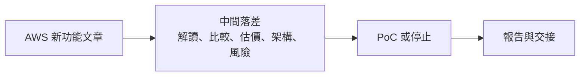
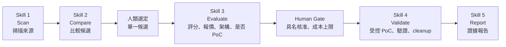
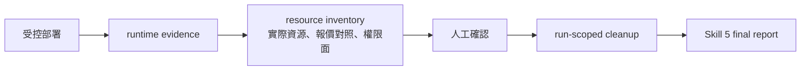

# 2026-08-14 協理成果報告｜詳細投影片內容稿

主題：`《預言者雷達：看見技術的下一步》`

報告時間：30 分鐘，最後保留提問。

核心定位：這不是 AWS 新聞摘要工具，而是一套把新技術轉成「可理解、可比較、可報價、可驗證、可停止、可交接」的雲端技術決策流程。

## 簡報主線

一句話：

> 我把 AI 從問答工具用成雲端技術雷達的 AI PM，讓 AWS 新技術在進入 PoC 前先被問對問題：值不值得做、要花多少、能不能驗證、失敗或完成後能不能收乾淨。

完整故事：

1. 雲端新技術很多，真正困難是篩選、判斷、估成本與留下證據。
2. 我把流程拆成五個 Skill：Scan、Compare、Evaluate、Validate、Report。
3. 人類保留選題、成本核准、風險判斷；AI 負責蒐集、整理、報價、部署輔助、報告與記錄。
4. 成功案例證明流程能落地：Lambda、S3 Files。
5. 停止案例證明流程有治理價值：WorkSpaces AI Agents、Quick Suite。
6. 最大收穫不是多做幾個 demo，而是把「AI 協作」變成可重跑、可稽核、可交接的工作方法。

## 投影片總覽

| 頁 | 建議時間 | 投影片標題 | 這頁要讓協理記住什麼 |
|---:|---:|---|---|
| 1 | 0:00-0:40 | 預言者雷達：看見技術的下一步 | 專案名稱與一句話價值 |
| 2 | 0:40-1:40 | 我解決的不是「看新聞」，而是「做決策」 | 先把問題定義清楚 |
| 3 | 1:40-3:00 | 以前的痛點：新技術到 PoC 之間缺一條證據鏈 | 說明為什麼需要這個專案 |
| 4 | 3:00-4:20 | 核心成果：五個 Skill 串成一條決策流程 | 呈現 S1-S5 |
| 5 | 4:20-5:40 | 人和 AI 的分工 | AI 不自動決策，人類保留關鍵 gate |
| 6 | 5:40-7:00 | 工作關聯圖：所有雲端工作都回扣到同一個核心 | connected graph |
| 7 | 7:00-8:30 | 使用者怎麼用：一篇 AWS 文章如何跑流程 | 展示操作路徑 |
| 8 | 8:30-10:00 | Skill 3 是最重要的決策點 | PoC 前先看懂、評分、報價、定義問題 |
| 9 | 10:00-11:20 | Skill 4 的價值：不是部署，而是補決策證據 | 受控 PoC 的定義 |
| 10 | 11:20-12:30 | Skill 5 的價值：把證據整理成主管看得懂的報告 | final report 的責任 |
| 11 | 12:30-14:00 | 實作成果總表 | 系統、報告、成本、治理、交接 |
| 12 | 14:00-15:20 | 成效：時間節省與風險前移 | 用四案例時間統計說話 |
| 13 | 15:20-17:20 | 成功案例一：Lambda self-managed code storage | 小而準的 PoC |
| 14 | 17:20-19:30 | 成功案例二：S3 Files | 較完整的 AWS 資源整合驗證 |
| 15 | 19:30-21:00 | Skill 4/5 看見的不是截圖，而是資源、權限、cleanup | 展示可稽核價值 |
| 16 | 21:00-23:00 | 停止案例一：WorkSpaces AI Agents | 成本、合規、可逆性風險 |
| 17 | 23:00-24:30 | 停止案例二：Quick Suite | 官方新聞不等於可 PoC |
| 18 | 24:30-26:00 | 我如何和 AI 協作：不是代做，是校正與管理 | 相處亮點與方法論 |
| 19 | 26:00-27:10 | 公司如何幫助我成長 | 從寫功能到設計決策流程 |
| 20 | 27:10-28:20 | 目前限制與未來產品化方向 | 誠實標示未完成 |
| 21 | 28:20-29:20 | 收尾：這套流程的公司價值 | 回到主管關心的價值 |
| 22 | 29:20-30:00 | 提問 | 邀請協理提問 |

## Slide 1｜預言者雷達：看見技術的下一步

畫面建議：

- 大標：`預言者雷達：看見技術的下一步`
- 副標：`AI Agentic 雲端技術雷達與評估系統`
- 小字：`從 AWS 新聞到可審查 PoC 證據鏈`

講稿：

> 各位長官好，我這次暑期實習的專案叫做「預言者雷達」。它不是單純整理 AWS 新聞，而是把新技術從一篇文章，轉成可以被理解、比較、報價、驗證和交接的決策證據。

備註：

- 封面不要塞技術細節。
- 如果要破冰，可以說「預言者」不是預測未來，而是讓新技術在投入時間和成本前先被看清楚。

## Slide 2｜我解決的不是「看新聞」，而是「做決策」

畫面重點：

| 看到 AWS 新聞後 | 主管真正需要知道 |
|---|---|
| 這個功能看起來很新 | 它和我們有沒有關係？ |
| 官方說有效率提升 | 實作方式是否足夠清楚？ |
| 文件說可以使用 | 在帳號與 Region 裡能不能部署？ |
| 想做 PoC 看看 | 成本多少？能不能清乾淨？ |
| PoC 成功了 | 有沒有可複查的證據？ |

講稿：

> 雲端新功能每天都很多，但企業真正困難的不是知道消息，而是判斷這個技術是否值得投入。尤其 PoC 會牽涉成本、權限、合規和 cleanup，如果沒有先把問題問清楚，很容易只是做了一個 demo，卻沒有得到決策價值。

## Slide 3｜以前的痛點：新技術到 PoC 之間缺一條證據鏈

畫面建議：

三個痛點：

- 資訊落差：官方文章常有很多價值宣稱，但不一定有足夠實作細節。
- 決策落差：不是每個新功能都值得 PoC；但如果沒有制度，很難說服自己停止。
- 證據落差：PoC 成功後，如果沒有 resource inventory、runtime evidence、cleanup 回查，就很難交接或被複查。

講稿：

> 我一開始也不是一次就把流程想完整。這個專案是一路被問題推著修正：報告看不懂、成本太晚出現、PoC 問題不明確、截圖不能當作唯一證據。這些問題最後都被收斂到一條證據鏈裡。

## Slide 4｜核心成果：五個 Skill 串成一條決策流程

畫面建議：

每個 Skill 的一句話：

- Skill 1：把官方來源轉成候選與重點。
- Skill 2：把候選整理成可比較的技術卡。
- Skill 3：把單一候選轉成主管可看的 PoC 決策報告。
- Skill 4：只在通過人工核准後建立受控 AWS 資源。
- Skill 5：把部署前報價、驗證結果、cleanup 與限制整理成 final report。

講稿：

> 這五個 Skill 的重點是階段責任。前面可以快速蒐集和整理，但 Skill 3 之後一次只評估一個人類選定的候選。任何會建立 AWS 資源的 Skill 4，都必須先經過報價、recipe、成功條件、成本上限和具名核准。

## Slide 5｜人和 AI 的分工

畫面重點：

| Cleo / 人類 | AI PM / 系統 |
|---|---|
| 決定問題是否值得做 | 掃描來源、整理候選 |
| 選定單一候選 | 產生比較與報告 |
| 判斷成本與風險是否可接受 | 產出報價、架構、blocker |
| 核准是否建立 AWS 資源 | 執行受控部署與驗證 |
| 確認 Console 或資源盤點 | 留下 runtime evidence 與 cleanup 回查 |
| 決定對外怎麼說 | 整理日誌、雙周誌、成果素材 |

講稿：

> 我不是把判斷全部交給 AI。這個專案反而更強調人類 gate：AI 加速整理和執行，但人類決定題目、成本、合規和是否進 PoC。這也是它比較適合企業情境的原因。

相處亮點：

- 當 AI 一開始把流程講得太像「全自動 PoC」時，Cleo 修正為「人工核准後才可以建立付費資源」。
- 當 AI 只產出工程式報告時，Cleo 要求改成主管看得懂的繁體中文報告。
- 當 AI 把人工等待混進執行時間時，Cleo 要求改成「AI 純執行時間，不含人工關卡」。

## Slide 6｜工作關聯圖：所有雲端工作都回扣到同一個核心

畫面建議：

- 放 `雲端工作關聯圖-草稿.md` 的 connected graph。
- 圖中重點標出三條線：
  - 輸入：AWS 官方新聞 / RSS / URL。
  - 決策：Skill 3 報價、recipe、proof question。
  - 證據：Skill 4 runtime、resource inventory、cleanup、Skill 5 report。

講稿：

> 這張圖想說明，我做過的雲端工作不是分散的幾個 demo。Lambda、S3 Files、WorkSpaces、Quick Suite 都回到同一個核心：用 S1-S5 把 AWS 新技術轉成決策證據。成功案例走到 Skill 5，停止案例停在 Skill 3，但兩者都對流程有價值。

## Slide 7｜使用者怎麼用：一篇 AWS 文章如何跑流程

畫面重點：

1. 貼上 AWS 官方文章 URL。
2. Skill 1 抽出文章主張、服務、證據。
3. Skill 2 整理候選與比較資訊。
4. 人類選定單一候選。
5. Skill 3 產出主管版 HTML 決策報告。
6. 人類看分數、報價、recipe、proof question，決定是否進 Skill 4。
7. Skill 4 建立受控 PoC、驗證、盤點、cleanup。
8. Skill 5 產出 final report。

講稿：

> 使用者不需要一開始就知道所有 AWS 細節。系統會先把文章翻成決策材料，等人類確認這次 PoC 到底要證明什麼、成本是否可接受，再進入真正可能花錢的 Skill 4。

## Slide 8｜Skill 3 是最重要的決策點

畫面重點：

Skill 3 必須回答：

- 這篇文章到底在說什麼？
- 技術前後差異是什麼？
- 可能的最小 PoC 架構是什麼？
- 分數是否達門檻？
- 是否有 blocker？
- 預估成本是多少？
- 是否有可部署 recipe？
- 這次 PoC 成功後，決策者會多知道什麼？

講稿：

> 後來我發現，Skill 3 是整套流程最重要的一關。因為如果 Skill 3 做得好，很多不值得的 PoC 會在這裡停下來；值得做的 PoC，也會在進 Skill 4 前先知道目的、成本、資源與停止條件。

相處亮點：

- Cleo 曾指出「PoC 要證明什麼？如果成功，決策者會多知道什麼？」這句話是關鍵。後來它被寫進 Skill 3 與 Skill 4 的 gate。
- Cleo 也指出成本不可以等 PoC 後才知道，所以報價被移到 Skill 3 的部署前輸出。

## Slide 9｜Skill 4 的價值：不是部署，而是補決策證據

畫面重點：

Skill 4 只回答 Skill 3 無法完全回答的問題：

- 帳號與 Region 裡能不能建立？
- CloudFormation / CDK 是否能串起資源？
- IAM 權限與服務連線是否成立？
- Runtime 行為是否符合預期？
- 成功或失敗後能不能 cleanup？
- cleanup 前後是否有證據可回查？

講稿：

> Skill 4 不是為了展示 AI 會部署，而是為了補 Skill 3 無法回答的證據。PoC 只有在有決策增量時才值得做。這也是我後來在 WorkSpaces 和 Quick Suite 案例裡學到的：能做不代表該做。

## Slide 10｜Skill 5 的價值：把證據整理成主管看得懂的報告

畫面重點：

Skill 5 彙整：

- Skill 1 / Skill 2 來源與候選證據。
- Skill 3 技術解釋、分數與部署前報價。
- Skill 4 runtime evidence、resource inventory、權限面與 cleanup。
- 限制：哪些已驗證、哪些只是預估、哪些仍待公司環境確認。
- Future work 與 reviewer questions。

講稿：

> Skill 5 不是補一篇漂亮結論，而是把前面每一段證據串起來。尤其我有明確標示，Skill 3 的成本是公開牌價預估，不是 AWS 帳單；Skill 4 的 runtime snapshot 是執行證據，不是正式帳務。這讓報告比較不會過度宣稱。

## Slide 11｜實作成果總表

畫面重點：

| 類型 | 已完成內容 | 對專案的價值 |
|---|---|---|
| 流程 | S1-S5 五階段核心流程 | 可重跑、可交接 |
| Skill 化 | 五個 repository-backed Skill packages | 不只是一次性腳本 |
| 報告 | Skill 3 HTML-first 主管版報告 | 人能看懂、可做決策 |
| 成本 | low / expected / high 報價 | 部署前知道成本型態 |
| 治理 | 具名核准、成本上限、recipe registry | 避免 AI 自動建立付費資源 |
| 驗證 | Lambda、S3 Files 受控 PoC | 證明可落地 |
| 停止 | WorkSpaces、Quick Suite | 證明能踩煞車 |
| 交接 | PROJECT_MEMORY、AI_PM_INBOX、GitHub、daily logs | 換 AI / 換電腦可延續 |

講稿：

> 我的實作成果可以分成四層：第一是能跑的流程，第二是主管看得懂的報告，第三是受控 AWS PoC 的證據，第四是能接續的專案管理紀錄。

## Slide 12｜成效：時間節省與風險前移

畫面重點：

| 案例 | 結果 | AI 純執行時間 | 成效 |
|---|---|---:|---|
| Lambda | 成功到 Skill 5 | 約 3 分 40 秒 | 快速完成小型 PoC 證據 |
| S3 Files | 成功到 Skill 5 | 完整約 18 分 45 秒；PoC 部署驗證約 8 分 26 秒 | 完整資源整合、驗證、cleanup |
| WorkSpaces | 停止案例，停在 Skill 3 | 初評約 3 分 24 秒；修正版另計 | 教流程不要把高風險桌面 agent 硬縮成入口 demo |
| Quick Suite | 停止案例，停在 Skill 3 | 約 4.8 秒 | 官方宣傳型文章不硬編 PoC |

講稿：

> 這裡我只統計 AI 純執行時間，不含我核准、看 Console 或等待回覆的時間。這樣才能和我手動做同樣工作比較。比較有價值的不只是成功案例花了多久，而是停止案例能在 Skill 3 擋下硬做：不要為了展示，把不適合 PoC 的題目硬套成一個簡略版 demo。

> S3 Files 這個案例要特別拆開講：真正建立 AWS 資源並完成自動驗證大約 8 分 26 秒；如果把資源盤點、cleanup 和 Skill 5 final 報告也算進完整成功流程，排除人工等待後大約 18 分 45 秒。

備註：

- 成功案例的早期階段部分時間仍採 artifact 推估；Skill 1 已於 2026-08-11 補跑精準計時。
- S3 Files 原本整理成 21 分鐘口徑過寬，已拆除人工確認前等待；簡報請優先講 PoC 部署驗證約 8 分 26 秒。
- 失敗案例請改稱「停止案例」；重點是教 AI 不要硬做，而不是說它們單純失敗。
- 不要宣稱正式節省百分比，除非 Cleo 補上手動時間。

## Slide 13｜成功案例一：Lambda self-managed code storage

畫面重點：

- 新聞主張：Lambda 可引用 Amazon S3 中的程式碼儲存。
- Skill 3：產出技術解釋、PoC 架構、成本估算與是否建議進 Skill 4。
- Skill 4：建立 CloudFormation stack，驗證 `S3ObjectStorageMode=REFERENCE` 與 Lambda invoke。
- Skill 5：產出 final report，保留 cleanup 與限制。

講稿：

> Lambda 是一個很適合展示流程的小型成功案例。它的 proof question 很清楚：新的程式碼儲存方式能不能透過 CloudFormation 建立？Lambda 能不能成功 invoke？cleanup 能不能回查乾淨？這些都是 Skill 3 文件推論之外，Skill 4 可以補上的證據。

可展示素材：

- Lambda Skill 3 HTML 決策報告。
- Lambda 架構圖。
- Lambda Skill 5 final report。

## Slide 14｜成功案例二：S3 Files

畫面重點：

- 新聞主張：讓 Amazon S3 bucket 像檔案系統一樣被 compute 使用。
- PoC 架構：Amazon S3 bucket、S3 Files filesystem、VPC、EC2、mount target、SSM、IAM。
- 驗證：EC2 掛載成功，S3 到 mount、mount 到 S3 雙向同步。
- 資源盤點：19 個 CloudFormation resources，權限面記錄 29 個 action。
- cleanup：回查 stack 不存在，主要資源已清除。

講稿：

> S3 Files 是更完整的雲端整合案例。Skill 3 已經能讓主管理解價值、架構和成本，但 Skill 4 補上的是實際部署可行性、跨服務 wiring、雙向同步、資源盤點和 cleanup 回查。這讓 PoC 不只是成功截圖，而是可以複查的證據包。

可展示素材：

- S3 Files Skill 3 HTML 報告。
- S3 Files PoC 架構圖。
- S4 resource inventory 摘要。
- Skill 5 final report。

## Slide 15｜Skill 4/5 看見的不是截圖，而是資源、權限、cleanup

畫面重點：

要強調的改版：

- 舊問題：只靠 Console 截圖，程式不能自動判讀圖片內容。
- 新做法：資源盤點成為可驗證資料，截圖只是輔助人眼確認。
- Skill 5 不把 cleanup 前用量快照當 AWS 帳單。

講稿：

> 這裡有一個重要演進：原本我們可能很容易把截圖當成成功證據，但後來我修正成 structured resource inventory。也就是實際列出建立了什麼、報價有沒有涵蓋、權限面有哪些、cleanup 是否回查成功。這比截圖更能被審查。

相處亮點：

- Cleo 接收 Claude 的審查意見，但沒有照單全收，而是讓 AI 把有價值的部分落成 resource inventory、timing、permission surface。

## Slide 16｜停止案例一：WorkSpaces AI Agents

畫面重點：

| 判斷面 | 發現 |
|---|---|
| 技術吸引力 | 讓 AI agent 操作桌面應用，主題新且有想像空間 |
| 成本風險 | 完整 Windows desktop session 可能觸發月費型使用者成本 |
| cleanup 邊界 | cleanup 可刪資源，但不能退回已觸發的月費 |
| 合規風險 | 桌面畫面被 AI 觀看或操作，可能需要合規覆核 |
| 決策增量 | 第一段基礎設施驗證不足以證明完整桌面任務 |
| 結論 | 停在 Skill 3，不建議進 Skill 4 |

講稿：

> WorkSpaces 是我最想保留的停止案例。它一開始看起來很新，也有展示效果，AI 很容易想硬做一個簡略版：只建立 WorkSpaces / AppStream 入口，然後把它說成桌面 agent PoC。但 Cleo 指出如果真的開 Windows session，可能一開就有月費型成本，而且 cleanup 不能退費；只建入口又不能證明 AI 真的完成桌面任務。後來我們把 recipe 拆成第一段基礎設施驗證與第二段完整桌面 session，並重新評分。結論是目前不應該進 Skill 4。

相處亮點：

- Cleo 指出「成本能不能靠 cleanup 止血」是報價模型必須回答的問題。
- AI 原本容易被官方文件完整度和新奇性拉高分數；Cleo 修正後，評分改成技術價值、可驗證性、導入前提、可控制性、可逆性五構面。

## Slide 17｜停止案例二：Quick Suite

畫面重點：

| 項目 | 結果 |
|---|---|
| 來源 | AWS 官方新聞 |
| 問題 | 內容偏產品願景、廣告詞與成效宣稱 |
| 缺口 | 缺少可部署最小架構、成功條件、cleanup 範圍 |
| Skill 3 分數 | 3.7 / 5，未達 3.75 門檻 |
| blocker | 實作細節不足、沒有可部署 recipe |
| Skill 4 結果 | 不進入，沒有建立 AWS 資源 |

講稿：

> Quick Suite 補上另一種停止理由：即使是 AWS 官方新聞，也不代表可以直接 PoC。如果文章多是效益宣稱，但沒有足夠實作做法，系統就不能為了 demo 硬編架構。這裡的硬做，就是把官方廣告詞當成部署證據，然後用 AI 想像一個最小架構。這個案例讓我的流程更像企業治理工具，而不是新技術追逐工具。

相處亮點：

- Cleo 直接要求「人看的報告都要寫成人看得懂的中文」，因此 Quick Suite 報告改成主管摘要、新聞說明、PoC 價值、最小架構判斷、評估結果與決策建議。
- Cleo 也指出舊版 Skill 3 報告形式不符合前面改版，促成 HTML-first 主管版報告修正。

## Slide 18｜我如何和 AI 協作：不是代做，是校正與管理

畫面重點：

| Cleo 的一句話修正 | 系統後來變成什麼 |
|---|---|
| 「PoC 要證明什麼？」 | Skill 3 / Skill 4 必答 proof question |
| 「預算應該 PoC 前就知道」 | Skill 3 部署前報價與人工核准 gate |
| 「不含人工關卡，AI 自己跑多久」 | 四案例 AI 純執行時間統計 |
| 「報告要給人看懂」 | Skill 3 HTML-first 繁體中文主管報告 |
| 「官方新聞也可能只是廣告」 | Quick Suite 停止案例與 blocker |
| 「另一台電腦也要能接續」 | GitHub、PROJECT_MEMORY、MIGRATION、AI_PM_INBOX |
| 「不要只用截圖當證據」 | structured resource inventory 與 cleanup 回查 |

講稿：

> 這頁是我覺得最能代表我和 AI 相處方式的地方。我不是只把任務丟給 AI，而是不斷校正它的判斷邊界。每次我指出一個問題，AI 就把它落成規則、程式、報告格式或日誌制度。最後留下來的不是聊天紀錄，而是一套更成熟的工作流程。

## Slide 19｜公司如何幫助我成長

畫面重點：

| 起點 | 公司 / Mentor / 專案環境給我的刺激 | 後來的改變 |
|---|---|---|
| 一開始比較像在做功能 | Mentor 要求 PoC 原理要自己懂，不能只叫 AI 跑 | 我開始重視 proof question、Console 確認與可重做性 |
| 一開始報告偏工程輸出 | 需要對主管、協理說清楚價值 | 報告改成主管能懂的中文決策文件 |
| 一開始看到新技術容易想做 PoC | 公司環境讓我意識到成本、權限、合規與 cleanup | 我學會「停止」也是成果 |
| 一開始 AI 像工具 | 專案時程、跨電腦、跨 AI 協作需求 | 我把 AI 用成 PM / 工程協作者 |

講稿：

> 公司給我的成長不是只有讓我接觸 AWS，而是讓我理解企業環境裡的技術評估要有責任邊界。新技術不是做出 demo 就結束，還要能解釋價值、控制成本、留下證據、清除資源，並且讓下一個人能接手。

注意：

- 這頁不要變成感謝詞，要用前後差異和證據講成長。
- 可以提 Mentor 對「PoC 要自己理解、Console 要人工確認」的要求。

## Slide 20｜目前限制與未來產品化方向

畫面重點：

目前限制：

- 這是可重跑的實習專案流程包，還不是完整 production 系統。
- AWS Billing / Cost Explorer / CUR 沒有做正式實際成本對帳。
- 更多服務要進 Skill 4，需要補專用 recipe、成本模型、成功條件與 cleanup 範圍。
- GUI 主要作為展示層；正式產品化還需要 auth、API、監控、審計與 CI/CD。
- 公司環境落地仍需要正式權限、資料邊界、合規流程與維運責任。

未來方向：

- 補更多常見 AWS 服務的 Skill 4 recipe。
- 將 Skill 3 報告模板穩定化，讓主管可以快速審閱。
- 加入正式使用者權限、審計與成本追蹤。
- 把 GUI 從 demo layer 推進成可用的審核入口。
- 建立可提交給團隊使用的標準流程文件。

講稿：

> 我會清楚標示，這不是已經 production-ready 的系統。但它已經完成核心方法：怎麼從新技術走到決策、報價、PoC、cleanup 和報告。後續若要產品化，重點不是再多跑一篇新聞，而是補正式權限、監控、審計、UI 和更多 recipe。

## Slide 21｜收尾：這套流程的公司價值

畫面重點：

三句收斂：

1. 更快：AI 先整理來源、架構、成本與報告。
2. 更穩：PoC 前有分數、blocker、報價、proof question 與人工核准。
3. 更可交接：每次結果都有 artifact、日誌、GitHub、記憶與 final report。

最後一句：

> 預言者雷達不是預測未來，而是讓新技術在花時間與花錢以前，先被看清楚。

講稿：

> 這次專案讓我從做功能，進到設計一個決策流程。它的公司價值不是幫大家多看幾篇 AWS 新聞，而是讓新技術被更快理解、更早暴露成本風險、也更容易留下可審查證據。

## Slide 22｜提問

畫面文字：

> 以上是我的專案成果，接下來想請協理給我建議，也歡迎提問。

可準備回答：

1. 這套流程和一般研究報告差在哪？
   - 一般報告多停在整理；這套有報價、gate、PoC、cleanup 與 final evidence。
2. AI 在流程裡能不能自動建立 AWS 資源？
   - 不行。Skill 4 必須具名核准、成本上限、recipe、成功條件與 cleanup 範圍都明確。
3. 成本估算能不能當正式帳單？
   - 不能。它是部署前公開牌價估算，用來提早暴露成本型態；正式帳務需 AWS Billing / Cost Explorer / CUR。
4. 為什麼停止案例也算成果？
   - 因為企業技術治理不是每個新技術都做 PoC。能有根據地停下來，本身就是節省時間、成本與風險。
5. 如果要交給團隊使用，下一步是什麼？
   - 補正式 UI、權限、監控、審計、CI/CD，以及更多可部署 recipe。

## 建議展示素材

| 頁面 | 建議素材 | 來源 |
|---|---|---|
| Slide 6 | 雲端工作 connected graph | `final-proposal/雲端工作關聯圖-草稿.md` |
| Slide 8 | Skill 3 HTML 報告截圖 | Lambda / S3 Files / Quick Suite 報告 |
| Slide 12 | 四案例時間表 | `docs/four-case-stage-time-comparison-20260810.md` |
| Slide 13 | Lambda Skill 5 final | `radar-redesign/out/smoke-20260803-lambda-s3-decision-report/` |
| Slide 14 | S3 Files Skill 5 final / resource inventory | `radar-redesign/out/s3-files-20260803-s1-s5/` |
| Slide 16 | WorkSpaces 評分修正 | `logs/daily/work-log-2026-08-05.md` |
| Slide 17 | Quick Suite 主管版停止報告 | `radar-redesign/out/quick-suite-ad-claim-20260810/skill3-poc-decision-report.html` |
| Slide 18 | 人類與 AI 軌跡對比 | `docs/ai-human-trace-2026-08-03.md` |
| 補充頁 | 停止案例與硬做定義 | `final-proposal/slide-markdown-20260814/01-停止案例與硬做定義.md` |
| 補充頁 | Skill 搜尋方式、GitHub 檔案位置與五個 Skill 摘要 | `final-proposal/slide-markdown-20260814/02-Skill搜尋與GitHub執行位置.md` |
| 補充圖像 | 五個 Skill SVG 圖檔 | `final-proposal/skill-visuals-20260814/` |

## 最值得被提及的相處亮點

這些不是閒聊，而是能展示 Cleo 如何管理 AI、如何把 AI 產物變成企業可用流程的素材：

1. 從「AI 產出答案」變成「AI 被要求留下證據」
   - Cleo 多次要求不要只給結論，要能回查 artifact、日誌、測試與 cleanup。
   - 對應成果：Skill 5 final report、resource inventory、AI_PM_INBOX、PROJECT_MEMORY。

2. 從「會跑 PoC」變成「知道何時不跑 PoC」
   - WorkSpaces 和 Quick Suite 都是代表案例。
   - 對應成果：PoC blocker、recipe gate、cost reversibility、implementation detail blocker。

3. 從「工程師看得懂」變成「主管看得懂」
   - Cleo 指出 Skill 3 報告必須是人能讀的繁體中文，不該出現 raw machine codes 或舊版格式。
   - 對應成果：HTML-first 主管版 Skill 3 report。

4. 從「成本事後再看」變成「部署前先知道」
   - Cleo 指出預算應在 PoC 前就知道，也指出 WorkSpaces 的月費風險不能靠 cleanup 解決。
   - 對應成果：Skill 3 deployment-before quote、low/expected/high、approval ceiling、cost-stop boundary。

5. 從「AI 幫忙做」變成「AI PM 協作」
   - Cleo 要求跨電腦、跨 AI、跨日仍能接續。
   - 對應成果：PROJECT_MEMORY、MIGRATION_STATUS、daily logs、AI execution trace、GitHub source of truth。

6. 從「聊天修正」變成「規則固化」
   - 每次 Cleo 指出問題，都被轉成長期記憶、Skill 文件或測試。
   - 對應成果：proof question gate、HTML-first rule、resource inventory gate、pure execution timing rule。

## 30 分鐘講稿節奏建議

前 5 分鐘：

- 不要先鑽技術細節。
- 先講「我解決的是雲端新技術決策問題」。
- 讓協理知道這套東西和管理、成本、風險有關。

中間 15 分鐘：

- 用 S1-S5 架構讓人理解方法。
- 用 Lambda 和 S3 Files 證明可以做到實際 PoC。
- 每個案例都講「Skill 3 先知道什麼，Skill 4 又補了什麼」。

後 5 分鐘：

- 用 WorkSpaces 和 Quick Suite 證明停止價值。
- 這段會比只講成功更成熟，因為它展現治理邊界。

最後 5 分鐘：

- 講 AI 協作方法與個人成長。
- 收到「不是只會用 AI，而是會管理 AI 產物」這個點。
