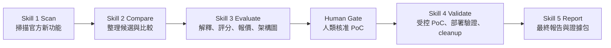

# 2026-08-14 協理成果報告主軸

主題：《預言者雷達：看見技術的下一步》

報告對象：協理

時間：30 分鐘完整報告，最後保留提問

方法：電梯簡報法。先用一句話講出價值，再逐層展開目的、架構、使用方式、實作成果、成效、成功案例、停止案例與提問。

## MBTI 小猜測

如果只從目前專案互動推測，我會猜 Cleo 比較像 ENTJ，第二可能是 ENFJ。理由是你很在意目標、成果、主管溝通、流程收斂與決策品質，而且會要求 AI 不只做東西，還要能交代價值、證據與下一步。不過你同時也很重視呈現方式和人怎麼理解，所以若 F 比 T 高一點，也可能落在 ENFJ。

這只是互動風格猜測，不是正式判斷。

## 一句話核心主張

我做的不是單純整理 AWS 新聞，而是一套 AI PM 雲端技術雷達流程，能把新技術從「看到文章」轉成「可理解、可比較、可報價、可驗證、可清理、可交接」的決策證據鏈，讓團隊在進入 PoC 前就先知道這項技術值不值得投入。

## 30 秒電梯簡報

雲端新功能很多，但企業真正困難的不是知道新消息，而是判斷它是否和公司有關、PoC 要證明什麼、成本能不能控制、做完後有沒有留下可信證據。我的專案把這件事拆成五個 Skill：掃描、比較、評估、驗證、報告。AI 協助抓資料、整理報告、產出報價與驗證證據；人類負責選題、成本核准與風險判斷。最後產出的不是一次性簡報，而是一條可重跑、可審查、可交接的技術評估流程。

## 建議投影片架構

| 順序 | 時間 | 段落 | 目標 |
|---:|---:|---|---|
| 1 | 0:00-2:00 | 開場與核心主張 | 先讓協理知道我解決什麼問題 |
| 2 | 2:00-6:00 | 專案目的與背景 | 說明為什麼需要 AI 技術雷達 |
| 3 | 6:00-11:00 | 詳細架構 | 說清楚 S1-S5 與人機分工 |
| 4 | 11:00-14:00 | 如何使用 | 示範一篇 AWS 文章如何跑完整流程 |
| 5 | 14:00-18:00 | 實作成果與整體成效 | 展示已做出的系統、報告與節省時間 |
| 6 | 18:00-23:00 | 成功案例：Lambda 與 S3 Files | 展示 Skill 3 之後的報告與 Skill 4/5 證據 |
| 7 | 23:00-26:00 | Skill 4 PoC 與 Skill 5 的價值 | 說明 PoC 不是為了炫技，而是補決策證據 |
| 8 | 26:00-28:30 | 停止案例：WorkSpaces AI Agents | 說明系統如何擋下不值得投入的 PoC |
| 9 | 28:30-30:00 | 收尾與提問 | 回到公司效益、個人成長與主管提問 |

## 1. 開場：先講結論

投影片重點：

- 專案名稱：預言者雷達。
- 核心問題：新技術很多，但值得 PoC 的不多。
- 核心成果：建立 S1-S5 技術雷達流程，讓 PoC 前先看見價值、成本與風險。

講法：

> 這次暑期實習我做的不是單純追 AWS 新聞，而是把「技術新知」轉成「主管可以做決策的證據」。以前看到一篇新功能文章，可能要人工查文件、想架構、估成本、決定要不要做 PoC。我的專案把這個流程拆成五段，讓 AI 協助整理與執行，人類保留最後的核准與風險判斷。

## 2. 專案目的

投影片重點：

- 降低雲端新技術評估的資訊落差。
- 在建立 AWS 資源前先回答：值不值得做、成本多少、風險能不能停。
- 把 PoC 從「嘗試看看」改成「有明確證明問題」。
- 讓每次評估留下可交接的證據，而不是散在對話與本機資料夾。

講法：

> 這個專案的目的有三個。第一，把新功能公告翻成公司能理解的應用價值。第二，在 PoC 前先把成本、限制、區域支援、清理風險攤開。第三，真的做 PoC 時，要能留下部署、驗證、資源盤點與 cleanup 證據，讓後面的人可以複查。

## 3. 詳細架構：五個 Skill

投影片建議放一張流程圖：

各階段說明：

- Skill 1 Scan：抓官方文章或雲端新功能，整理文章重點、前後差異、可能應用情境。
- Skill 2 Compare：把候選轉成可比較的技術卡，協助人類選題。
- Skill 3 Evaluate：產生人類可讀 HTML 報告，包含技術解釋、評分、PoC 最小架構、成本估算與是否建議進入 PoC。
- Skill 4 Validate：只有在具名核准、成本上限、recipe、成功條件與 cleanup 範圍都明確後，才建立 AWS 資源做受控驗證。
- Skill 5 Report：整理 S1-S4 的證據、驗證結果、限制、清理狀態、未來建議，形成可交接報告。

講法：

> 這五個 Skill 的重點不是自動化到底，而是責任分工。AI 可以快速整理資料、產出報價、跑測試；但是否花錢建立資源，仍需要人類核准。這可以避免 AI 看到新功能就自動往 PoC 衝。

## 4. 如何使用

投影片重點：

1. 輸入一篇 AWS 官方文章或啟動新功能雷達。
2. 系統跑 Skill 1 / Skill 2，整理候選。
3. 在 Skill 3 產出 HTML 決策報告。
4. 人類看分數、報價、架構圖、blocker，決定是否進 Skill 4。
5. 若核准，Skill 4 建立受控資源、驗證成功條件、留下資源盤點並 cleanup。
6. Skill 5 產出最終報告。

可以展示的使用畫面：

- Skill 3 HTML 報告截圖。
- PoC 架構圖。
- 報價區塊。
- Skill 4 resource inventory。
- Skill 5 final report。

講法：

> 使用者不需要先懂所有 AWS 細節。系統會先把文章翻成決策材料，等人類確認「這次 PoC 到底要證明什麼」後，才進入真正可能產生成本的 Skill 4。

## 5. 實作成果

已完成成果：

- S1-S5 可重跑的核心流程與 CLI。
- 五個 repository-backed Skill packages。
- Skill 3 HTML-first 人類決策報告。
- GPT-style 架構圖嵌入報告，讓決策者能直接看 PoC 最小架構。
- 三段式 PoC 成本估算：低、預期、高情境。
- Skill 4 recipe registry：沒有登錄 recipe 的候選不能 live 部署。
- Skill 4 structured resource inventory：記錄實際 AWS 資源、權限面、報價對照與 cleanup 前用量快照。
- Skill 5 final report：保留驗證、限制、清理狀態與下一步。
- GitHub / PROJECT_MEMORY / daily log / AI PM inbox 交接機制。

## 6. 整體成效

可以主張的已驗證成效：

- 決策前移：成本、架構、blocker 在 Skill 3 先出現，不必等到 PoC 後才發現。
- 風險降低：Skill 4 必須有具名核准、成本上限、recipe、成功條件與 cleanup 範圍。
- 證據完整：PoC 後不只說成功，還保留資源盤點、驗證結果、cleanup 回查與 Skill 5 報告。
- 交接成本降低：專案記憶、日誌、reference runs 與 GitHub 讓不同 AI 或另一台電腦能接續。

節省時間的講法要有邊界：

> 目前我不會宣稱精準節省百分比，因為還沒有正式量測 KPI。但從流程上，原本人工需要分散完成的查文件、整理摘要、畫架構、估成本、設計 PoC、寫報告，現在可以集中在同一條 S1-S5 流程內完成。更重要的是，像 WorkSpaces 這種不值得進 PoC 的案例，可以在 Skill 3 就停止，避免後續建立雲端資源、等待 cleanup 或承擔月費型成本。

## 7. 成功案例一：Lambda self-managed S3 code storage

案例定位：低成本、驗證目標明確、適合進 PoC。

Skill 3 之後展示：

- 技術主張：Lambda 可以引用 S3 中的程式碼版本，而不是傳統直接打包到 Lambda。
- Skill 3 報告：說明用途、最小架構、分數、成本估算、是否建議進 Skill 4。
- PoC 問題：REFERENCE 模式是否真的能透過 CloudFormation 建立、Invoke 是否成功、cleanup 是否能清掉。

Skill 4 驗證價值：

- 建立 run-scoped CloudFormation stack。
- 驗證 Lambda `S3ObjectStorageMode=REFERENCE`。
- 實際 invoke 成功。
- 完成 Console / resource evidence 與 cleanup。

Skill 5 成果：

- 最終結論為已驗證並完成清理。
- 報告保留部署證據、runtime evidence、cleanup 狀態與限制。
- 成本說明保留為公開牌價預估，不把短期 runtime facts 假裝成 AWS 帳單。

講法：

> Lambda 這個案例適合展示 Skill 4 的價值，因為它的驗證問題很明確：新的程式碼儲存方式到底能不能建立、能不能呼叫、能不能清掉。這不是只靠文件可以完全確認的，所以進 PoC 有決策增量。

## 8. 成功案例二：S3 Files

案例定位：架構整合明確，能證明「文件看起來可行」與「帳號內真的可部署」的差異。

Skill 3 之後展示：

- 技術主張：S3 bucket 可以像檔案系統一樣掛載。
- Skill 3 報告：包含架構圖、評分、低/預期/高成本估算。
- PoC 問題：VPC、EC2、mount target、filesystem、S3 bucket 是否能實際串起來。

Skill 4 驗證價值：

- 建立 S3 Files PoC stack。
- 驗證 EC2 掛載成功。
- 驗證 S3 到 mount、mount 到 S3 的雙向同步。
- 產出 structured resource inventory，確認 19 個 CloudFormation resources。
- 記錄權限面與 cleanup 前用量快照。
- cleanup 後回查 stack 已不存在，主要資源已清除。

Skill 5 成果：

- final report 結論為已驗證並完成清除。
- 報告清楚保留成本邊界：預估成本是公開牌價估算，不是 AWS Billing。
- 展示 PoC 的真正價值：功能、權限、部署與 cleanup 可行性證據。

講法：

> S3 Files 的 Skill 3 報告已經能讓人看懂價值與成本，但 Skill 4 補上的，是實際部署、雙向同步、資源盤點與 cleanup 回查。這讓 PoC 不只是成功截圖，而是可審查的證據包。

## 9. Skill 4 PoC 的價值

Skill 4 不是為了證明 AI 很會部署，而是回答 Skill 3 無法完全回答的問題：

- 實際資源能不能建立？
- 服務之間的權限與連線能不能成立？
- 官方文件主張在受控環境中是否可驗證？
- PoC 成功後多知道了什麼？
- 失敗或完成後能不能清除？
- cleanup 能不能停止風險與成本？

講法：

> 我後來修正的一個重要觀念是，PoC 不是越多越好。PoC 要有明確的 proof question。如果 Skill 3 已經足夠判斷不值得，停止就是正確結果；如果 Skill 3 還缺部署可行性、權限、cleanup 證據，Skill 4 才有價值。

## 10. Skill 5 成果價值

Skill 5 的價值：

- 把 S1-S4 的證據串成可讀報告。
- 說明技術驗證結果與限制。
- 保留 runtime evidence、resource inventory、cleanup 狀態。
- 明確區分公開牌價預估與實際 AWS 帳務。
- 讓主管看到「這次 PoC 得到什麼結論、還不能宣稱什麼」。

展示方式：

- 放 Lambda 的 Skill 5 final report 一頁。
- 放 S3 Files 的 Skill 5 final report 一頁。
- 用黃色標註：validated、cleanup verified、future work、limitations。

## 11. 停止案例：WorkSpaces AI Agents

我推測你說的「資源一開啟就要收一個月月費、評估後成效不大」是 WorkSpaces AI Agents 這篇。

案例定位：技術有趣，但目前不推薦進入 Skill 4。

Skill 3 發現的問題：

- 若真的開啟 Windows desktop streaming session，可能觸發月費型使用者成本。
- cleanup 可以刪資源，但不能退回已觸發的月費型成本。
- 目前第一段基礎設施驗證只能證明入口與資源建立，不能證明 AI 真的完成桌面業務流程。
- 桌面畫面被 AI agent 觀看或操作可能需要合規覆核。
- 評分修正後，WorkSpaces AI Agents 不應因文件完整或話題新奇就拿高分。

結論：

- Skill 3 報告產出後，不推薦進入 Skill 4 PoC。
- 這不是專案失敗，而是流程成功踩煞車。
- 它證明系統不只會推薦，也會在成本型態、合規風險與決策增量不足時停止。

講法：

> 這個案例是我很想放進簡報的，因為它證明這套流程不是只會把每個新技術推進 PoC。WorkSpaces AI Agents 很新，也很吸引人，但如果第一階段 PoC 不能證明真正的桌面代理任務，而且一開 session 可能產生月費型成本，那 Skill 3 擋下來就是正確結果。這直接幫公司避免把時間和預算花在決策增量不大的 PoC 上。

## 11-1. 補充停止案例：AWS 官方宣傳型新聞

案例：Amazon Quick Suite 官方新聞。

來源：[AWS News Blog - Announcing Amazon Quick Suite](https://aws.amazon.com/blogs/aws/reimagine-the-way-you-work-with-ai-agents-in-amazon-quick-suite/)

案例定位：官方來源可信，但文章偏產品願景與效率宣稱，不足以直接形成可部署、可清理、可驗證的 Skill 4 PoC。

Skill 3 / Skill 4 gate 結果：

- Skill 3 分數：3.7 / 5，未達 3.75 門檻。
- `recommend_poc=false`。
- PoC blockers：`implementation_detail_insufficient`、`no_deployable_recipe`。
- Skill 4 gate：`no_poc_candidates`。
- AWS resources：沒有建立。

講法：

> 這個反例補充的是另一種停止理由。它不是因為 AWS 不是官方，也不是因為主題不重要，而是因為文章本身缺少實作做法。通篇多是 AI agent 提升效率、整合資料、觸發工作流程的價值宣稱，但沒有足夠資訊讓我們定義最小資源、成功條件、成本邊界與 cleanup 範圍。這種情況就應該停在 Skill 3，不應該為了做 PoC 而硬編一個部署方案。

## 12. 收尾

收尾投影片一句話：

> 預言者雷達不是預測未來，而是讓新技術在花時間與花錢之前，先被問對問題。

最後 60 秒講法：

> 這次專案對我最大的收穫，是我從「做一個功能」變成「設計一個決策流程」。我學到 AI 很適合加速整理、測試和報告，但 AI 的產物一定要有邊界、有證據、有人工關卡。對公司來說，這套流程的價值是讓新技術評估更快、更可控，也更容易交接。接下來如果要延伸，可以把 GUI 與更多 Skill 4 recipe 補齊，讓它從實習成果往正式技術評估工具靠近。

最後停下來：

> 以上是我的專案成果，接下來想請協理給我建議，也歡迎提問。

## 主管可能提問與回答方向

1. 這套和一般技術研究報告差在哪裡？

一般報告多半停在資料整理；這套流程會把資料轉成決策關卡、成本估算、PoC proof question、資源盤點與 cleanup 證據。

2. AI 在裡面扮演什麼角色？

AI 負責掃描、整理、產生報告、輔助測試與留下紀錄；人類負責選題、成本核准、合規判斷與是否進 PoC。

3. 為什麼不每篇都做 PoC？

PoC 只有在能補足 Skill 3 無法回答的決策證據時才值得做。如果成本型態不可逆、合規風險未處理，或成功後也沒有新增決策價值，就應停在 Skill 3。

4. 成本估算準不準？

目前是根據公開價格表的預部署估算，不是正式採購報價，也不是 AWS 帳單。它的價值在於提早暴露成本型態、最貴項目與 cleanup 能不能止血。

5. 這套能不能產品化？

目前是可重跑的實習專案流程包，不是完整產品。若要產品化，還需要正式權限、登入、審計、監控、CI/CD、UI 權限控管與更多 recipe。

## 投影片素材清單

- Skill 3 HTML 決策報告截圖：Lambda、S3 Files、WorkSpaces。
- Lambda Skill 5 final report。
- S3 Files Skill 5 final report。
- S3 Files resource inventory 摘要。
- WorkSpaces Skill 3 評分修正與不推薦進 PoC 的頁面。
- S1-S5 流程圖。
- 人類 / AI 分工圖。
- 成效頁：決策前移、風險降低、證據完整、交接降低。
