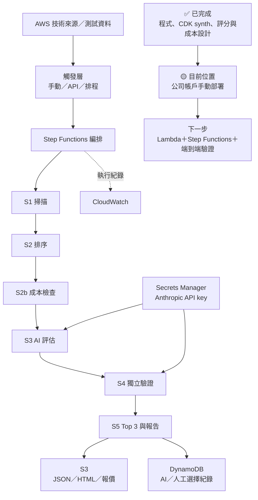
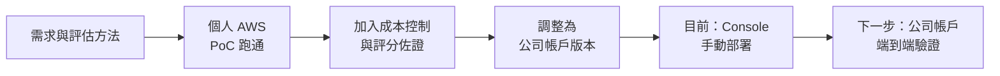

# Final Proposal｜簡報架構與專案執行軌跡

## 簡報核心主張

這個專案不只是完成一套技術雷達程式，而是建立一條可追溯、可評估成本與風險、可部署到公司 AWS 帳戶的技術情報決策流程。

## 建議簡報架構

### 1. 專案背景：為什麼需要技術雷達

- 面對大量且快速變化的雲端技術資訊，人工蒐集與判讀成本高。
- 專案要解決的不只是「找到新技術」，還包括排序、完整評估、風險檢查、成本控制與報告產出。

### 2. 專案目標與成功標準

- 建立單一入口的端到端評估流程。
- 每個候選都走完整評估流程，再選出 Top 3。
- 評分、技術依據、成本與選擇結果可追溯。
- 能整理成公司帳戶可部署、可交接的封包。

### 3. 目前專案框架與進度

主圖先讓觀眾看懂「系統現在長什麼樣」以及「目前做到哪裡」。

### 4. 執行軌跡（輔助圖）

這張圖只交代演進，可在簡報中縮小放在框架圖旁邊。

## 軌跡圖的講法

不要只念八個階段，應挑三個轉折說故事：

1. 從「蒐集技術」轉為「支援採用決策」：加入多維度評估與完整候選流程。
2. 從「能執行」轉為「可控地執行」：加入 Quote Gate、單次成本上限與 fallback。
3. 從「架構概念」轉為「公司環境可落地」：依公司帳戶限制調整服務選擇，補齊 CDK、權限、Secrets、部署與交接文件。

### 5. 最終方案與端到端流程

- S1 掃描來源與候選。
- S2 依公司情境排序。
- S2b 執行前報價與成本閘門。
- S3 對所有候選進行 evaluator 評估。
- S4 由 validator 獨立重評。
- S5 依平均分數產出 Top 3 與最終報告。

### 6. 主要執行成果

- AWS CDK stacks 與 Lambda S1–S5 handlers。
- Step Functions 完整編排與 Quote Gate。
- S3 報告保存、DynamoDB pick log、Secrets Manager 金鑰管理。
- 選配 Cognito＋API Gateway，以及預設關閉的 EventBridge 排程。
- 報價、成本估算、架構掃描、部署與交接文件。

### 7. 成效如何呈現

| 成效面向 | 目前證據 | 簡報標示 |
|---|---|---|
| 流程完整性 | 單一 Entry、所有候選走完整評估、最終 Top 3 | 已實作 |
| 部署準備 | CDK stacks、部署文件、公司帳戶版封包 | 已完成落地準備 |
| 技術驗證 | Python compile、`cdk synth`、架構掃描 | 已驗證 |
| 成本控制 | 單次完整 LLM 報價約 USD 0.0892；上限 USD 0.50 | 已估算／程式已設閘門 |
| 預估營運成本 | 輕量驗證月估 USD 5–15 | 估算，非實際帳單 |
| 公司帳戶部署 | 仍需公司 AWS credentials、bootstrap 權限與 API key | 待環境驗證 |

### 8. 成功案例

分成兩類呈現，避免混在一起：

#### 專案內成功驗證

- 成功把架構骨架補成公司帳戶落地封包。
- 成功通過 CDK synthesis 與 Python 語法驗證。
- 成功建立報價閘門；超過預算時可切換 zero-token rubric fallback，不讓流程直接中斷。
- 成功保留 AI pick 與 human pick 紀錄，支援後續比較與研究問題追蹤。

#### 外部產業案例證據

- GSA Pegasys。
- InsuranceDekho。
- PayU Enterprise AI。
- SBI Life Insurance。

每個案例頁只回答三件事：案例遇到什麼問題、採用什麼做法、它如何支持本專案的評估或選擇。詳細敘事需依案例 JSON 再整理，不先誇大成效。

### 9. 關鍵取捨與修正

- 不採用 CloudFront：降低公司帳戶 global service／SCP 風險，改用 S3 物件或 presigned URL。
- 不依賴 Bedrock：降低模型開通、區域、權限與成本不確定性，改以 Anthropic API＋fallback。
- EventBridge 與 API 預設關閉：先完成最低風險的部署驗證，需要時再啟用。

### 10. 公司如何幫助我成長

使用 `公司如何幫助我成長-草稿.md`，濃縮為一頁；定位為執行成果背後的能力轉變。

### 11. 結論、限制與下一步

- 結論：已完成可部署、可追溯且有成本控制的技術雷達落地封包。
- 限制：尚未在公司 AWS 帳戶完成實際 deploy 與帳單驗證。
- 下一步：取得權限、部署驗證、記錄實際執行時間／成本／Top 3 品質，再把估算成效替換成實測成效。

## 後續需要持續補的軌跡證據

- [ ] 專案最早版本或第一次架構圖，用於「前後比較」。
- [ ] 每次重要修正的日期、原因與決策者回饋。
- [ ] 公司帳戶實際部署截圖與執行結果。
- [ ] 實際單次成本、執行時間、候選數與 Top 3 結果。
- [ ] 一個完整成功案例的輸入、評估過程、輸出與價值。
