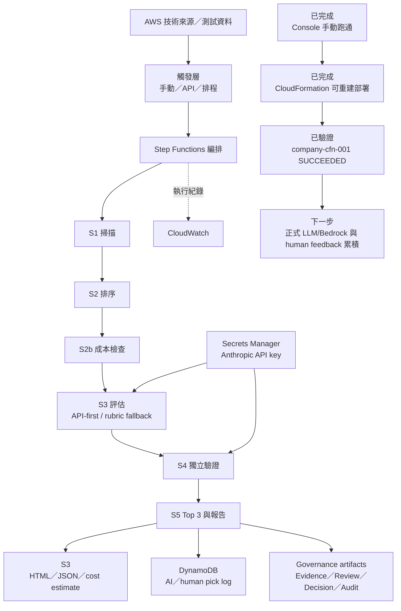
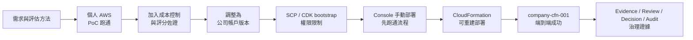

# Final Proposal｜簡報架構與專案執行軌跡

## 簡報核心主張

這個專案不只是完成一套技術雷達程式，而是建立一條可追溯、可評估成本與風險、可在公司 AWS 帳戶重建並端到端驗證的技術情報決策流程。

## 2026-07-24 Mentor 補充方向

- 用電梯簡報法設計：先用一句話講清楚專案價值，再逐層展開問題、方法、成果、驗證與限制；每一層都要能在時間內收束。
- 前段要回答「為什麼值得做」：可用剪報、雲端技術更新速度、公司決策成本、人工評估痛點或實習期間觀察作為開場證據。
- 研究方法要清楚：資料來源包含官方文件、AWS News / Blog、公司可公開情境、實作 PoC、日誌與 mentor 回饋；方法上區分質化判斷（限制、風險、使用情境）與量化指標（分數、成本、通過 / 失敗、執行次數）。
- 可用論文式敘事回答兩件事：新穎性是「把 AI PM、human gate、evidence-first 與 S1-S5 Skill 化整合成可追蹤流程」；進步性是「比單次 AI 摘要或單一 PoC 更重視完整評估、可驗證證據、人工核准與可交接性」。

## 建議簡報架構

### 1. 專案背景：為什麼需要技術雷達

- 面對大量且快速變化的雲端技術資訊，人工蒐集與判讀成本高。
- 專案要解決的不只是「找到新技術」，還包括排序、完整評估、風險檢查、成本控制與報告產出。
- 開場要留一個「為什麼現在值得做」的證據，例如雲端新服務更新太快、人工評估容易漏掉限制、或金融場景需要可審核的導入理由。

### 2. 專案目標與成功標準

- 建立單一入口的端到端評估流程。
- 每個候選都走完整評估流程，再選出 Top 3。
- 評分、技術依據、成本與選擇結果可追溯。
- 能整理成公司帳戶可部署、可交接的封包。

### 2.5 研究方法與比較基準

- 資料來源：官方文件、AWS News / Blog、可引用案例、PoC 結果、成本估算、每日實習日誌與 mentor 回饋。
- 質化方法：判斷公司適配性、治理限制、安全 / 權限風險、可維運性與 human review 必要性。
- 量化方法：S1-S5 分數、PoC gate 門檻、估算成本、測試通過 / 失敗、cleanup 結果與累積 Skill 進度。
- 比較基準：不是只和人工剪報比，也要和「單次 LLM 摘要」、「只做 PoC 不做採用評估」、「只看分數不留證據」等相近做法比較。

### 3. 目前專案框架與進度

主圖先讓觀眾看懂「系統現在長什麼樣」以及「目前做到哪裡」。

### 4. 執行軌跡（輔助圖）

這張圖只交代演進，可在簡報中縮小放在框架圖旁邊。

## 軌跡圖的講法

不要只念八個階段，應挑三個轉折說故事：

1. 從「蒐集技術」轉為「支援採用決策」：加入多維度評估與完整候選流程。
2. 從「能執行」轉為「可控地執行」：加入 Quote Gate、單次成本上限與 fallback。
3. 從「能手動跑通」轉為「可交接重建」：CDK bootstrap 被 SCP 擋住後，改用純 CloudFormation，讓公司帳戶部署不依賴 CDK bootstrap roles。
4. 從「產出報告」轉為「可被審核的決策流程」：補上 Evidence Ledger、Human Review Gate、Decision Layer 與 Audit Packet。

### 5. 最終方案與端到端流程

- S1 掃描來源與候選。
- S2 依公司情境排序。
- S2b 執行前報價與成本閘門。
- S3 對所有候選進行 evaluator 評估。
- S4 由 validator 獨立重評。
- S5 依平均分數產出 Top 3 與最終報告。

### 6. 主要執行成果

- Lambda S1–S5 handlers 與 RecordHumanPick。
- 純 CloudFormation 公司帳戶部署 template，避開 CDK bootstrap 權限限制。
- Step Functions 完整編排與 Quote Gate；`company-cfn-001` 已端到端成功。
- S3 報告保存、DynamoDB pick log、Secrets Manager 金鑰管理。
- Evidence Ledger、Review Packet、Decision Layer、Feedback Stats、Audit Packet。
- 報價、成本估算、架構掃描、部署文件、demo checklist 與 AI 執行軌跡。

### 7. 成效如何呈現

| 成效面向 | 目前證據 | 簡報標示 |
|---|---|---|
| 流程完整性 | 單一 Entry、所有候選走完整評估、最終 Top 3 | 已實作並於公司帳戶跑通 |
| 部署準備 | CloudFormation template、部署 README、公司帳戶 stack `CREATE_COMPLETE` | 已驗證 |
| 技術驗證 | Step Functions `company-cfn-001` `SUCCEEDED`、evaluation harness quality gate=pass | 已驗證 |
| 成本控制 | Quote approve；單次估價 USD 0.0892；上限 USD 0.50 | 已估算／程式已設閘門 |
| 預估營運成本 | 輕量驗證月估 USD 5–15 | 估算，非實際帳單 |
| 公司帳戶部署 | CloudFormation 版已成功；真實 LLM 評分仍待正式 API key 或 Bedrock | 部分已驗證／部分待驗證 |
| 治理證據 | Evidence Ledger、Review Packet、Decision Layer、Audit Packet | 已實作並產出 artifacts |

### 8. 成功案例

分成兩類呈現，避免混在一起：

#### 專案內成功驗證

- 成功把架構骨架補成公司帳戶落地封包。
- 成功通過 CDK synthesis 與 Python 語法驗證。
- 成功建立報價閘門；超過預算時可切換 zero-token rubric fallback，不讓流程直接中斷。
- 成功保留 AI pick 與 human pick 紀錄，支援後續比較與研究問題追蹤。

#### 外部產業案例證據

- GSA Pegasys。
- InsuranceDekho。
- PayU Enterprise AI。
- SBI Life Insurance。

每個案例頁只回答三件事：案例遇到什麼問題、採用什麼做法、它如何支持本專案的評估或選擇。詳細敘事需依案例 JSON 再整理，不先誇大成效。

### 9. 關鍵取捨與修正

- 不採用 CloudFront：降低公司帳戶 global service／SCP 風險，改用 S3 物件或 presigned URL。
- 不依賴 Bedrock：降低模型開通、區域、權限與成本不確定性，改以 Anthropic API＋fallback。
- EventBridge 與 API 預設關閉：先完成最低風險的部署驗證，需要時再啟用。

### 10. 公司如何幫助我成長

使用 `公司如何幫助我成長-草稿.md`，濃縮為一頁；定位為執行成果背後的能力轉變。

### 11. 結論、限制與下一步

- 結論：已完成可重建、可追溯且有成本控制的公司帳戶技術雷達版本。
- 限制：目前成功 run 仍是 fallback/rubric 路徑，實際 LLM token 為 0；不可說成真實 Anthropic API 評分完成。
- 下一步：補正式 Anthropic API key 或 Bedrock 路徑、累積 human review logs、整理 final proposal 畫面證據，再把估算成效逐步替換成實測成效。

## 後續需要持續補的軌跡證據

- [ ] 專案最早版本或第一次架構圖，用於「前後比較」。
- [ ] 每次重要修正的日期、原因與決策者回饋。
- [x] 公司帳戶實際部署與執行結果：CloudFormation stack `CREATE_COMPLETE`、Step Functions `company-cfn-001` `SUCCEEDED`。
- [x] 候選數與 Top 3 結果：S1 `kept_count=27`、S2 `kept_count=6`、Top 3 IDs 已記錄於 7/17 日誌。
- [ ] 實際單次帳單成本與真實 LLM token 成本。
- [ ] 多筆 human review logs 與 feedback trend。
- [ ] 一個完整成功案例的輸入、評估過程、輸出與價值。
