# 雲端工作關聯圖草稿

核心選擇：`AI 新技術雷達的五階段證據鏈`

選這個當核心，是因為它可以同時串起我做過的雲端掃描、AWS PoC、成本控管、停止案例、報告產出與主管展示素材。圖中的每個節點都連回同一條主流程，因此是 connected graph，不是分散的工作清單。

```mermaid
flowchart LR
  Core["核心：AI 新技術雷達<br/>五階段證據鏈"]

  Goal["工作目的<br/>把 AWS 新技術從新聞變成可判斷、可驗證、可報告的證據"]
  Input["來源輸入<br/>AWS 官方新聞 / RSS / 使用者提供 URL"]
  Skills["流程方法<br/>Skill 1 Scan → Skill 2 Compare → Skill 3 Evaluate → Skill 4 Validate → Skill 5 Report"]
  Governance["雲端治理邊界<br/>部署前報價 / 具名核准 / 成本上限 / 資源盤點 / run-scoped cleanup"]
  Deliverables["成果輸出<br/>主管版報告 / 成本估算 / 架構圖 / 時間統計 / 雙周誌與成果簡報素材"]

  Core --> Goal
  Core --> Input
  Core --> Skills
  Core --> Governance
  Core --> Deliverables

  Skills --> S1["Skill 1 Scan<br/>抓官方來源、抽候選與關鍵主張"]
  Skills --> S2["Skill 2 Compare<br/>比較候選、整理證據與限制"]
  Skills --> Pick["人類選定單一候選<br/>Skill 3 起不再同時跑多個候選"]
  Skills --> Skill3["Skill 3 Evaluate<br/>評分、報價、判斷是否值得 PoC"]
  Skills --> Skill4["Skill 4 Validate<br/>只在通過 gate 後建立受控 AWS PoC"]
  Skills --> Skill5["Skill 5 Report<br/>整理驗證、限制、cleanup 與後續問題"]

  S1 --> S2 --> Pick --> Skill3

  Skill3 --> Score["部署前技術判斷<br/>分數、blocker、是否有決策增量"]
  Skill3 --> Quote["部署前 PoC 報價<br/>low / expected / high 與建議核准上限"]
  Skill3 --> Recipe["部署前 recipe 檢查<br/>要建哪些資源、怎麼驗證、怎麼清除"]
  Skill3 --> Proof["部署前 proof question<br/>PoC 成功後決策者會多知道什麼"]

  Score --> Decision{"是否值得申請<br/>Skill 4 PoC？"}
  Quote --> Decision
  Recipe --> Decision
  Proof --> Decision
  Quote --> Governance
  Recipe --> Governance
  Proof --> Governance

  Decision -->|通過| Approval["人工核准 gate<br/>具名核准、成本上限、Region 與執行範圍"]
  Approval --> Governance
  Governance --> Skill4
  Decision -->|不通過| StopReport["停止報告<br/>說明為何不建立雲端資源"] --> Deliverables

  Skill4 --> CloudFormation["CloudFormation / CDK<br/>用 IaC 建立可追蹤資源"]
  Skill4 --> IAM["IAM / 權限邊界<br/>最小權限與可稽核操作"]
  Skill4 --> Runtime["Runtime evidence<br/>部署結果、資源盤點、權限面、用量快照"]
  CloudFormation --> Runtime
  IAM --> Runtime
  Runtime --> HumanReview["人工確認<br/>Console 畫面或資源盤點"]
  HumanReview --> Cleanup["cleanup 回查<br/>確認 run 建立的資源已清除"]

  Quote --> Skill5
  Runtime --> Skill5
  Cleanup --> Skill5
  Skill5 --> Deliverables

  CaseLambda["成功案例 1<br/>Lambda self-managed code storage"]
  LambdaCloud["雲端關聯<br/>AWS Lambda / Amazon S3 code bucket / CloudFormation / IAM / CloudWatch"]
  LambdaResult["結果<br/>部署與 invoke 驗證成功，cleanup 後進 Skill 5 final"]
  CaseLambda --> LambdaCloud --> LambdaResult --> Runtime

  CaseS3Files["成功案例 2<br/>S3 Files"]
  S3FilesCloud["雲端關聯<br/>Amazon S3 bucket / S3 Files filesystem / VPC / EC2 / mount target / SSM / IAM"]
  S3FilesResult["結果<br/>驗證 S3 與掛載目錄雙向同步，完成資源盤點與 cleanup"]
  CaseS3Files --> S3FilesCloud --> S3FilesResult --> Runtime

  CaseWorkSpaces["停止案例 1<br/>WorkSpaces AI Agents"]
  WorkSpacesCloud["雲端關聯<br/>WorkSpaces Applications / AppStream / VPC / streaming URL / Windows session 成本"]
  WorkSpacesStop["停止原因<br/>合規風險、可逆性不足、完整桌面 session 可能產生月費"]
  CaseWorkSpaces --> WorkSpacesCloud --> WorkSpacesStop --> StopReport

  CaseQuickSuite["停止案例 2<br/>Amazon Quick Suite"]
  QuickSuiteCloud["雲端關聯<br/>官方新聞提到 agentic teammate，但缺少可部署最小架構"]
  QuickSuiteStop["停止原因<br/>偏宣傳與成效宣稱，實作細節不足，沒有可部署 recipe"]
  CaseQuickSuite --> QuickSuiteCloud --> QuickSuiteStop --> StopReport

  Input --> CaseLambda
  Input --> CaseS3Files
  Input --> CaseWorkSpaces
  Input --> CaseQuickSuite

  Deliverables --> TimeStats["四案例時間統計<br/>比較 AI 純執行時間與手動實作時間"]
  Deliverables --> FinalTalk["8/14 成果報告<br/>用成功與停止案例說明流程價值"]
  Deliverables --> Biweekly["8/3-8/14 雙周誌<br/>整理成果、問題、學習與下一步"]
```

## 這張圖要表達的一句話

我的雲端工作不是單純「做了幾個 AWS demo」，而是建立一套先用 Skill 3 在部署前完成評分、報價與 PoC 問題定義，再由人工核准進入受控 AWS PoC，最後用 Skill 5 彙整預估成本、實際驗證、清除回查與限制的證據鏈；成功案例證明它能落地，停止案例證明它知道何時不該花雲端資源。
