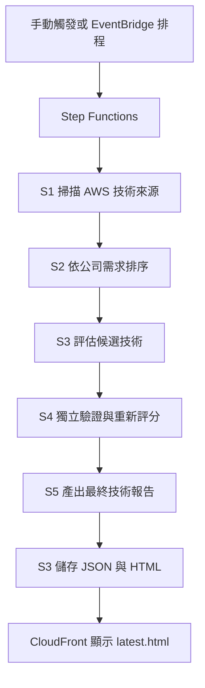

# 工作日誌 - 2026-07-13

## 今日主題

把 v3 技術雷達從架構雛形，推到可以在 AWS 上跑完整流程。

## 今日完成事項

- 整理 v3 架構：Skills 是 AI 大腦，CDK 是雲端骨架，Anthropic API 是 AI 評分來源。
- 補齊 CDK 需要的 AWS 資源與 Lambda handlers。
- 流程改成單一 AWS 掃描入口，移除入口 B。
- 所有候選技術都要跑完五步驟，再用平均分數選 Top 3。
- GCP / Azure 對應服務移到最終報告，不放在前段流程。
- 用個人 AWS 帳戶成功部署並跑完 v3 pipeline。
- 成功產出 CloudFront 技術報告：[開啟報告](https://d3nzvbx5swpv31.cloudfront.net/reports/latest.html)。

## 執行驗證

- State machine：`cathay-techintel-v3-pipeline`
- Region：`ap-southeast-1`
- 執行類型：Standard
- 執行狀態：成功
- 狀態轉換：8 次
- 執行時間：2026/07/13 16:28:33 至 16:28:44
- 總耗時：約 10.857 秒
- 結果：`GenerateRunId`、`Task_S1` 至 `Task_S5` 全數成功。

## Skill 進度與積分

> 2026-07-20 依硬審核口徑重算。個人 AWS 帳戶跑通是重要里程碑，但公司帳戶尚未驗證，報告品質也還要檢查，所以不給接近滿分。

| 今日工作 | 對應 Skill | 整數積分 | 與目標關係 | 證據 |
|---|---|---:|---|---|
| 建立單一 AWS 掃描入口，移除入口 B | 掃描 | +3 | 直接扣回目標 | S1 可在個人帳戶執行 |
| 改成全候選跑完五步驟後再選 Top 3 | 比較 | +3 | 直接扣回目標 | 流程規則已改，品質仍待人工檢查 |
| 建立 rubric fallback 與平均分排序 | 評估 | +3 | 直接扣回目標 | S3/S4 可執行，報告內容仍待回驗 |
| 個人 AWS 帳戶 S1-S5 全數成功 | 驗證 | +5 | 直接扣回目標 | Step Functions 成功，約 10.857 秒 |
| 產出 CloudFront 技術報告 | 報告 | +3 | 直接扣回目標 | `latest.html` 可開啟，內容仍待驗證 |

今日總分：17 分。

## 當日流程圖

## Mentor 討論筆記

### 第一次討論

- 關鍵字：公司 AWS 權限、Region、CDK 部署
- 小筆記：公司帳戶部署失敗可能和權限或 Region 有關，先用個人帳戶驗證架構可行。

### 第二次討論

- 關鍵字：Bedrock 成本、Anthropic API、手動部署備案
- 小筆記：公司環境目前不適合直接用 Bedrock，v3 先改用 Anthropic API；公司帳戶若仍受限，就準備手動部署。

## 遇到的問題與處理

- 公司 AWS 帳戶還有權限或 Region 問題，需再確認。
- Bedrock 涉及成本、模型啟用與內部審核，因此先改走 Anthropic API。
- API key 改由 AWS Secrets Manager 管理。
- Anthropic API 尚未設定或呼叫失敗時，用 rubric fallback 讓 pipeline 能完成。
- 今日報告還要再檢查資料來源、摘要與國泰應用情境。

## 技術調整紀錄

- 補齊 Lambda、Step Functions、S3、CloudFront、Secrets Manager、EventBridge、Cognito 與 API Gateway。
- 補齊 S1 至 S5 Lambda handlers。
- 修正流程：全候選完成五步驟後，再計算平均分數並選 Top 3。
- 修正 Windows 本地執行的 encoding 與輸出問題。

## 提醒事項

- [ ] 重新檢查公司 AWS 帳戶的 Region。
- [ ] 再次以公司帳戶執行 CDK 部署。
- [ ] 若仍受限，改測手動部署流程。
- [ ] 以含報價表版本重新執行 CDK。
- [ ] 驗證 CloudFront 報告的來源、摘要與應用情境。
- [ ] 補齊 Step Functions、CloudFront、S3 與 CloudFormation 截圖。

## 今日總結

v3 技術雷達已在個人 AWS 帳戶跑通，Step Functions 五步驟全成功，CloudFront 報告也能開。下一步處理公司帳戶權限與報告品質。
