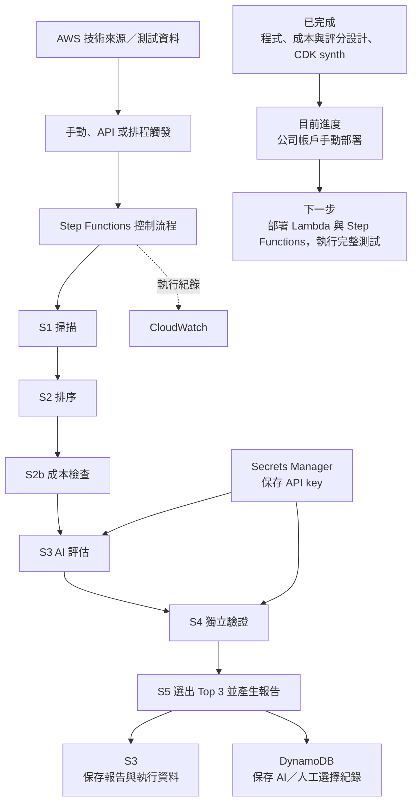
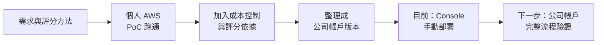

# 工作日誌 - 2026-07-14

## 今日主題

把昨天跑通的技術雷達，整理成公司帳戶可部署的版本，並補成本控制與評分依據。

## 今日完成事項

- 整理公司帳戶版程式與部署架構，保留掃描、排序、AI 評估、交叉驗證與 Top 3 報告流程。
- 加入執行前成本檢查；費用超過上限時，改用不消耗 API 額度的規則評分。
- 把評分方式整理成五項準則，並補 9 個外部參考來源。
- 因公司 AWS 權限受限，調整服務設計並準備 Console 手動部署。
- 建立日誌、Git 專案記憶與 final proposal 草稿，讓後續成果可以累積。

## 執行驗證

- 公司帳戶版程式已通過 Python 語法檢查與 CDK synth。
- 架構掃描確認主要程式、成本控制與資料保存設計已完成。
- 公司帳戶目前只完成部分基礎資源；Lambda、Step Functions 與完整流程尚未部署測試。
- Git 已在本機初始化，遠端 repository commit / push 尚未完成。

## Skill 進度與積分

> 2026-07-20 依硬審核口徑重算。今天多是公司帳戶版本整理與部署備案，尚未完成公司帳戶端到端驗證，所以給低至中低分。

| 今日工作 | 對應 Skill | 整數積分 | 與目標關係 | 證據 |
|---|---|---:|---|---|
| 整理公司帳戶版掃描與 pipeline | 掃描 | +2 | 直接扣回目標 | 程式與架構已整理，尚未公司帳戶執行 |
| 對照 Bedrock、Anthropic API、CDK 與 Console 手動部署限制 | 比較 | +2 | 直接扣回目標 | 部署方向已調整，仍待驗證 |
| 補成本控制與五項評分準則 | 評估 | +2 | 直接扣回目標 | 有評分依據與成本檢查設計，尚未完整實測 |
| Python 語法檢查與 CDK synth 通過 | 驗證 | +2 | 間接支援 | 離線驗證通過，公司帳戶完整流程未部署 |
| 建立日誌、Git 記憶與 final proposal 草稿 | 報告 | +2 | 間接支援 | 支援後續整理，非核心技術報告交付 |

今日總分：10 分。

## 目前專案框架與進度

## 執行軌跡

## Mentor 討論筆記

### 第一次討論

- 關鍵字：雙週誌、final proposal、專案成果、執行軌跡
- 小筆記：日常可留細節，雙週誌要整理成成果、成效與學習。Final proposal 要看整體成果與執行軌跡。

### 第二次討論

- 關鍵字：Git repository、跨電腦同步、專案記憶
- 小筆記：公司不方便使用 Notion，所以原始碼、文件與重要決策要放 Git。

## 遇到的問題與處理

- 公司帳戶 CloudFormation / CDK 權限受限，近期改用 Console 手動部署；完整 CDK 版保留。
- Bedrock 與 CloudFront 可能受權限或區域限制，公司版先改用 Anthropic API 與 S3 報告。
- 評分權重原本不好說明，已補五項準則、分數定義與外部參考資料。

## 技術調整紀錄

- 最終流程：`S1 掃描 → S2 排序 → S2b 成本檢查 → S3 評估 → S4 驗證 → S5 Top 3 報告`。
- Anthropic API key 只放 Secrets Manager，不寫入程式或日誌。
- 排程與對外 API 預設關閉，等公司確認權限與需求後再啟用。
- 每日保留工作細節；雙週誌再整理成成果與成長。

## 提醒事項

- [ ] 核對公司帳戶已建立的 S3、DynamoDB 與 Secrets Manager 設定。
- [ ] 部署 Lambda、IAM role 與 Step Functions，完成一次完整執行。
- [ ] 記錄實際執行時間、費用、Top 3 結果與報告畫面。
- [ ] 完成 GitHub 遠端 repository 的 commit 與 push。

## 今日總結

今天把技術雷達整理成公司帳戶版本，補上成本控制、評分依據與部署文件。程式和架構先通過離線驗證，下一步是補齊 Lambda、Step Functions 並做端到端測試。
