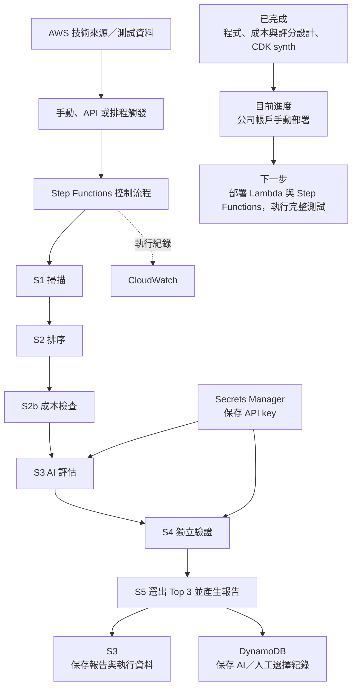
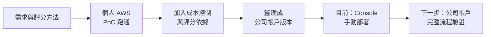

# 工作日誌 - 2026-07-14

## 今日主題

將昨天已在個人 AWS 帳戶跑通的技術雷達，整理成適合公司帳戶部署的版本，並補上成本控制與評分依據。

## 今日完成事項

- 完成公司帳戶版的程式與部署架構，保留掃描、排序、AI 評估、交叉驗證及 Top 3 報告流程。
- 加入執行前的成本檢查。若預估費用超過上限，系統會改用不消耗 API 額度的規則評分。
- 將評分方式整理成五項準則，並補上 9 個外部參考來源，讓評分結果更容易說明。
- 因公司 AWS 權限限制，調整部分服務並準備 Console 手動部署。目前已回報完成 S3、DynamoDB 與 Secrets Manager 的建立。
- 建立日誌、Git 專案記憶及 final proposal 草稿，讓後續進度與成果可以持續累積。

## 執行驗證

- 公司帳戶版程式已通過 Python 語法檢查及 CDK synth。
- 架構掃描確認主要程式、成本控制與資料保存設計已完成。
- 公司帳戶目前只完成部分基礎資源；Lambda、Step Functions 與完整流程仍待部署和測試。
- Git 已在本機初始化，但尚未完成遠端 repository 的 commit 與 push。

## 目前專案框架與進度

## 執行軌跡

## Mentor 討論筆記

### 第一次討論

- 關鍵字：雙週誌、final proposal、專案成果、執行軌跡
- 小筆記：日常可以保留細節，但雙週誌要整理成成果、成效與學習。Final proposal 以整個專案的成果及成功案例為主，並呈現執行軌跡。

### 第二次討論

- 關鍵字：Git repository、跨電腦同步、專案記憶
- 小筆記：公司不方便使用 Notion，因此專案原始碼、文件與重要決策要放在 Git，方便換電腦後繼續工作。

## 遇到的問題與處理

- 公司帳戶的 CloudFormation／CDK 權限受限，因此近期改用 Console 手動部署，完整 CDK 版仍保留作為後續主版本。
- Bedrock 與 CloudFront 可能受到權限或區域限制，因此公司版改用 Anthropic API 與 S3 報告。
- 評分權重原本不容易說明，因此補上五項準則、分數定義及外部參考資料。

## 技術調整紀錄

- 最終流程為 `S1 掃描 → S2 排序 → S2b 成本檢查 → S3 評估 → S4 驗證 → S5 Top 3 報告`。
- Anthropic API key 只存放在 Secrets Manager，不寫入程式或日誌。
- 排程與對外 API 預設關閉，等公司確認權限及需求後再啟用。
- 每日保留工作細節；雙週誌再合併成主要成果與成長。

## 提醒事項

- [ ] 核對公司帳戶已建立的 S3、DynamoDB 與 Secrets Manager 設定。
- [ ] 部署 Lambda、IAM role 與 Step Functions，完成一次完整執行。
- [ ] 記錄實際執行時間、費用、Top 3 結果及報告畫面。
- [ ] 完成 GitHub 遠端 repository 的 commit 與 push。

## 今日總結

今天把已跑通的技術雷達整理成公司帳戶版本，並補上成本控制、評分依據與部署文件。目前程式與架構驗證已完成，正在進行公司帳戶手動部署，下一步是補齊 Lambda 與 Step Functions 並完成端到端測試。
