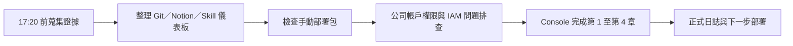

# 工作日誌 - 2026-07-15

## 今日主題

建立可跨工作階段延續的 AI PM 紀錄機制，並推進公司 AWS 帳戶的手動部署驗證。

## 今日完成事項

- 建立專案的 Git／GitHub 延續機制，將日誌、專案記憶、Skill 積分規則與主管閱讀入口整理到 private repository。
- 將 Notion 日誌欄位、五個 Skill 積分與互動式儀表板同步整理，讓每日成果可以用掃描、比較、評估、驗證、報告五個面向追蹤。
- 檢查 `雷達-v3-手動部署包.zip`，確認 7 個 Lambda 套件、IAM policy、Step Functions policy 與 state machine definition 通過離線語法檢查。
- 實查公司 AWS 帳戶部署前置條件，確認部分服務讀取／列舉動作受 Organizations SCP 限制，需由 AWS 管理者調整 SCP、提供部署角色或代為部署。
- 協助處理 IAM policy 建立時的 `legacy parsing` 問題，將 S3 bucket 權限與 object 權限拆開，降低 Console parser 誤判。
- 使用者回報已在公司 AWS Console 完成手動部署第 1 至第 4 章：Lambda 用 IAM policy、Lambda execution role、S3 bucket 與 lifecycle rule、DynamoDB table。

## 執行驗證

- 執行環境：本機專案資料夾、公司 AWS Console、公司帳戶 CLI 身分、`ap-southeast-1`。
- 執行結果：手動部署包可離線通過 JSON 與 Python 語法檢查；核心流程保留單一入口、五步驟評估與 Top 3 報告邏輯。
- 證據或連結：
  - `PROJECT_MEMORY.md` 已記錄公司帳戶權限限制與部署狀態。
  - `AI_PM_INBOX.md` 已保存 17:20 前的原始證據。
  - 使用者回報 Console 已完成第 1 至第 4 章資源建立；實際資源狀態仍需待權限允許後核對。

## Skill 進度與積分

| 今日工作 | 對應 Skill（掃描／比較／評估／驗證／報告） | 整數積分 | 與該 Skill 原始目標的關係 | 證據 |
|---|---|---:|---|---|
| 檢查手動部署包、Lambda 套件與狀態機定義 | 掃描 | +2 | 直接扣回目標 | 離線檢查部署包內容與語法 |
| 對照公司限制調整部署方式與 IAM policy | 比較 | +2 | 直接扣回目標 | 從 CDK／自動部署轉為 Console 手動部署，並拆分 S3 權限 |
| 釐清 IAM policy、SCP 與資源權限的影響 | 評估 | +2 | 直接扣回目標 | 判斷 legacy parsing 與 Organizations SCP 的不同層級限制 |
| 驗證公司帳戶前置條件並追蹤第 1 至第 4 章部署狀態 | 驗證 | +3 | 直接扣回目標 | 公司帳戶 CLI 檢查、Console 操作回報、DynamoDB schema 記錄；資源狀態仍待權限允許後核對 |
| 建立 GitHub／Notion／日誌的主管閱讀與積分追蹤機制 | 報告 | +5 | 直接扣回目標 | GitHub private 儀表板、Notion 欄位與本日正式工作日誌 |

## 當日流程圖

## Mentor 討論筆記

### 第一次討論

- 關鍵字：五個 Skill、每日積分、主管閱讀儀表板
- 小筆記：五個 Skill 應回扣專案中的掃描、比較、評估、驗證與報告；每日進度要能用整數積分與證據說明。

### 第二次討論

- 關鍵字：Git、Notion、跨電腦延續
- 小筆記：公司環境不一定方便使用 Notion，因此 Git repository 要保留日誌、專案決策與可讀入口，作為主要交接紀錄。

## 遇到的問題與處理

- 問題：公司 AWS 帳戶對 Lambda、Step Functions、IAM、DynamoDB、Secrets Manager 與 S3 的多項讀取／列舉動作出現 Organizations SCP 限制。
- 處理：確認這類限制無法由一般 IAM policy 覆蓋，後續需請 AWS 管理者調整 SCP、提供部署角色或代為部署。
- 結果：目前公司環境部署仍可依 Console 步驟推進部分資源，但完整端到端驗證需等待權限核對與後續服務建立。

- 問題：建立 Lambda IAM policy 時出現 `The policy failed legacy parsing`。
- 處理：將 S3 `ListBucket` 與物件層級的 `GetObject`、`PutObject`、`DeleteObject` 拆成不同 statement。
- 結果：提供可貼上的修正版 policy，協助繼續完成 IAM policy 建立。

## 技術調整紀錄

- 手動部署進度改記為「使用者回報完成、待權限核對」，避免把尚未實查的公司帳戶資源寫成已驗證上線。
- 7/15 積分採較嚴格標準：未經獨立回驗的 Console 部署操作只算低至中等進度，不列為高分里程碑。
- `cathay-techintel-v3-picks-log` 用於保存 AI／人工選擇紀錄，key schema 為 `run_id` 與 `pick_time`。
- S3 `runs/` lifecycle rule 設為 90 天過期，用來控制 PoC 執行產物的保存週期與成本。
- 手冊與 state machine definition 有一項差異：`GenerateRunId` 會以執行開始時間覆蓋輸入的 `manual-demo-001`，後續驗證 S3 輸出時需注意實際資料夾名稱。

## 提醒事項

- [ ] 繼續第 5 章 Secrets Manager，若暫無正式 API key，可先放佔位符。
- [ ] 等 AWS 權限允許後，核對第 1 至第 4 章資源的實際名稱、Region、policy 與 schema。
- [ ] 完成 Lambda Layer、7 個 Lambda Function、Step Functions role 與 state machine 後，再執行一次端到端測試。
- [ ] 端到端測試完成後記錄實際執行時間、輸出檔案、Top 3 結果與成本狀態。

## 今日總結

今天把專案從單次開發推進到可交接、可追蹤的工作模式，完成 GitHub／Notion／Skill 積分儀表板與正式日誌機制。同時檢查公司帳戶手動部署包，釐清 IAM policy 與 SCP 權限限制，並推進 Console 手動部署到第 4 章。下一步是建立 Secrets Manager、Lambda Layer 與 Lambda functions，並在權限允許後完成公司帳戶端到端驗證。
