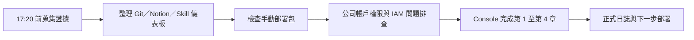

# 工作日誌 - 2026-07-15

## 今日主題

建立可延續的 AI PM 紀錄方式，並推進公司 AWS 帳戶手動部署驗證。

## 今日完成事項

- 建立 Git / GitHub 延續機制，把日誌、專案記憶、Skill 積分規則與主管閱讀入口整理到 private repository。
- 整理 Notion 日誌欄位、五個 Skill 積分與互動式儀表板，讓每日進度可以追蹤。
- 檢查 `雷達-v3-手動部署包.zip`：7 個 Lambda 套件、IAM policy、Step Functions policy 與 state machine definition 都通過離線語法檢查。
- 實查公司 AWS 帳戶前置條件，確認部分服務讀取／列舉動作受 Organizations SCP 限制。
- 處理 IAM policy 建立時的 `legacy parsing` 問題，把 S3 bucket 權限與 object 權限拆開。
- 公司 AWS Console 手動部署已推進到第 1 至第 4 章：Lambda 用 IAM policy、Lambda execution role、S3 bucket / lifecycle rule、DynamoDB table。

## 執行驗證

- 執行環境：本機專案資料夾、公司 AWS Console、公司帳戶 CLI 身分、`ap-southeast-1`。
- 部署包可離線通過 JSON 與 Python 語法檢查。
- 核心流程仍保留單一入口、五步驟評估與 Top 3 報告。
- `PROJECT_MEMORY.md` 已記錄公司帳戶權限限制與部署狀態。
- `AI_PM_INBOX.md` 已保存 17:20 前原始證據。
- Console 第 1 至第 4 章已先完成操作紀錄，實際資源狀態仍待權限允許後核對。

## Skill 進度與積分

| 今日工作 | 對應 Skill | 整數積分 | 與目標關係 | 證據 |
|---|---|---:|---|---|
| 檢查手動部署包、Lambda 套件與狀態機定義 | 掃描 | +1 | 直接扣回目標 | 離線檢查通過，未在公司帳戶執行 |
| 依公司限制調整部署方式與 IAM policy | 比較 | +1 | 直接扣回目標 | 從 CDK / 自動部署改為 Console 手動部署 |
| 釐清 IAM policy、SCP 與資源權限影響 | 評估 | +1 | 直接扣回目標 | 已區分 legacy parsing 與 SCP 限制 |
| 驗證公司帳戶前置條件並追蹤第 1 至第 4 章 | 驗證 | +2 | 直接扣回目標 | CLI 檢查與 Console 操作回報，仍待回驗 |
| 建立 GitHub / Notion / 日誌的主管閱讀與積分追蹤 | 報告 | +3 | 間接支援 | private 儀表板、Notion 欄位與正式日誌 |

今日總分：8 分。2026-07-20 依硬審核口徑重算；未經公司帳戶端到端驗證的 Console 與文件進度只給低分。

## 當日流程圖

## Mentor 討論筆記

### 第一次討論

- 關鍵字：五個 Skill、每日積分、主管閱讀儀表板
- 小筆記：每日進度要能用整數積分和證據說清楚。

### 第二次討論

- 關鍵字：Git、Notion、跨電腦延續
- 小筆記：公司環境不一定方便用 Notion，Git 要作為主要交接紀錄。

## 遇到的問題與處理

- 問題：公司 AWS 帳戶多項讀取／列舉動作受到 Organizations SCP 限制。
- 處理：確認一般 IAM policy 無法覆蓋 SCP。
- 結果：完整端到端驗證需等 AWS 管理者調整 SCP、提供部署角色或代為部署。

- 問題：建立 Lambda IAM policy 時出現 `The policy failed legacy parsing`。
- 處理：將 S3 `ListBucket` 與物件層級 `GetObject`、`PutObject`、`DeleteObject` 拆成不同 statement。
- 結果：提供修正版 policy，讓 IAM policy 建立可繼續。

## 技術調整紀錄

- 手動部署狀態改寫成「已完成操作紀錄、待權限核對」，避免寫成已驗證上線。
- 7/15 積分於 2026-07-20 改採硬審核標準。
- `cathay-techintel-v3-picks-log` 用於保存 AI / 人工選擇紀錄，key schema 為 `run_id` 與 `pick_time`。
- S3 `runs/` lifecycle rule 設為 90 天過期，控制 PoC 產物保存週期與成本。
- `GenerateRunId` 會用實際執行開始時間覆蓋輸入的 `manual-demo-001`，查 S3 輸出時需看實際 run id。

## 提醒事項

- [ ] 繼續第 5 章 Secrets Manager，若暫無正式 API key，可先放佔位符。
- [ ] 權限允許後，核對第 1 至第 4 章資源名稱、Region、policy 與 schema。
- [ ] 完成 Lambda Layer、7 個 Lambda Function、Step Functions role 與 state machine。
- [ ] 端到端測試完成後，記錄執行時間、輸出檔案、Top 3 結果與成本狀態。

## 今日總結

今天把專案整理成可交接、可追蹤的模式，也推進公司帳戶手動部署到第 4 章。主要卡點是 SCP 權限與 IAM policy 格式，下一步是 Secrets Manager、Lambda Layer、Lambda functions 和端到端測試。
