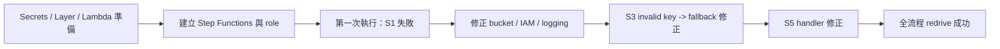

# 工作日誌 - 2026-07-16

## 今日主題

完成公司 AWS 帳戶 Cathay Tech Intel v3 的手動部署排錯與第一次端到端成功執行，並把 Anthropic invalid key 的失敗情境改成 API-first with rubric fallback，避免流程在 S3/S4 中斷。

## 今日完成事項

- 釐清並沿用既有 `cathay-techintel-v3/anthropic-api-key` secret，完成 Lambda Layer、7 個 Lambda function 與 Step Functions 手動部署所需檔案整理。
- 依執行結果逐步修正 `BUCKET_NAME` 尾端空白、Lambda role 缺少 `s3:PutObject`、Step Functions logging 權限不足與 S5 handler 設定錯誤。
- 修改 `common.py`、`s3_evaluate.py`、`s4_validate.py`，讓 Anthropic API key 缺失、placeholder 或 401 時自動降級為 rubric-only，並保留 fallback 記錄。
- 使用 redrive 完成 `GenerateRunId -> Task_S1 -> Task_S2 -> Task_Quote -> Task_S3 -> Task_S4 -> Task_S5` 全流程成功。
- 依 HR 原始範本重整雙週工作週誌，另存 `2026CIP_王冠婷_雙週工作週誌1_格式正確版.docx`。

## 執行驗證

- 執行環境：本機專案資料夾、公司 AWS Console、`ap-southeast-1`。
- 執行結果：Step Functions `cathay-techintel-v3-pipeline` 最終全綠；S1、S2、Quote、S3、S4、S5 都有可追查輸出。
- 證據或連結：
  - S1 輸出 `runs/2026-07-16T06-45-13.905Z/s1_scan.json`，`kept_count=29`。
  - S2 輸出 `runs/2026-07-16T06-45-13.905Z/s2_compare.json`，`kept_count=6`。
  - Quote 輸出 `quotation.json`，`decision=approve`、`total_usd=0.0892`、`max_run_usd=0.5`。
  - S3/S4 改走 API-first with rubric fallback 後通過；S5 handler 改為 `s5_report.handler` 後成功。
  - 本機驗證 `python -m py_compile radar-company-account-complete/radar/cdk/lambda_src/common.py radar-company-account-complete/radar/cdk/lambda_src/s3_evaluate.py radar-company-account-complete/radar/cdk/lambda_src/s4_validate.py` 已通過。

## Skill 進度與積分

| 今日工作 | 對應 Skill（掃描／比較／評估／驗證／報告） | 整數積分 | 與該 Skill 原始目標的關係 | 證據 |
|---|---|---:|---|---|
| 公司 AWS 帳戶首次成功產出 `s1_scan.json`，確認 S1 掃描階段可在公司環境執行 | 掃描 | +3 | 直接扣回目標 | Step Functions `Task_S1` 回傳 200；`kept_count=29` |
| 公司 AWS 帳戶首次成功產出 `s2_compare.json` 與 `quotation.json`，確認比較與預算閘門輸出 | 比較 | +3 | 直接扣回目標 | `kept_count=6`、`decision=approve`、`total_usd=0.0892` |
| 將 Anthropic 呼叫改成 API-first with rubric fallback，讓 S3/S4 在 invalid key 時仍可完成評估 | 評估 | +5 | 直接扣回目標 | `common.py`、`s3_evaluate.py`、`s4_validate.py` 已改；`py_compile` 通過；redrive 後 S3/S4 成功 |
| 逐一修正 bucket name、S3 PutObject、Step Functions logging 與 S5 handler，完成全流程 redrive 驗證 | 驗證 | +7 | 直接扣回目標 | `GenerateRunId` 到 `Task_S5` 全綠；每個錯誤都有 cause 與修正結果 |
| S5 成功產出 `report.html`／`s5_report.json`，並完成 HR 雙週誌正確格式版 | 報告 | +5 | 直接扣回目標 | S3 有報告產出；`2026CIP_王冠婷_雙週工作週誌1_格式正確版.docx` 已輸出 |

今日總分：23 分。

## 當日流程圖

## Mentor 討論筆記

### 第一次討論

- 關鍵字：checkpoint、驗證證據、AI PM 嚴格檢核
- 小筆記：做事前要先定義 checkpoint、完成條件與驗證方式；做完每一步都要留下可檢查證據，不能只靠感覺計分。

### 第二次討論

- 關鍵字：無新增正式 Mentor 討論
- 小筆記：今天第二段主要是依既有規則執行 redrive、排錯與正式統整。

## 遇到的問題與處理

- 問題：`BUCKET_NAME` 尾端空白導致 S1 `ParamValidationError`。
- 處理：回 Lambda environment variables 修正 bucket name，重新 redrive。
- 結果：S1 可成功寫入 `s1_scan.json`。

- 問題：`cathay-techintel-v3-lambda-role` 缺少對 run path 的 `s3:PutObject` 權限，S1 之後出現 `AccessDenied`。
- 處理：補上 `lambda-execution-policy.json` 中的 S3 讀寫權限。
- 結果：S1、S2、Quote 可順利通過。

- 問題：Step Functions 建立時出現 `The state machine IAM Role is not authorized to access the Log Destination`。
- 處理：補上 Step Functions role 的 CloudWatch Logs delivery/resource policy 權限。
- 結果：state machine 可成功建立並啟動。

- 問題：Secrets Manager 內的 Anthropic key 無效，S3 直接回 `401 invalid x-api-key`。
- 處理：把 LLM 路徑改成 API-first with rubric fallback，讓 API 失敗時改走 rubric-only。
- 結果：S3、S4 不再因 invalid key 中斷，流程可繼續完成。

- 問題：S5 handler 仍是 AWS 預設 `lambda_function.lambda_handler`。
- 處理：改為 `s5_report.handler` 後 redrive。
- 結果：S5 成功產出報告檔案。

## 技術調整紀錄

- 新增 `radar-company-account-complete/radar/manual-step-functions/step-functions-definition.json`，用於公司帳戶 Console 建立 state machine。
- 新增 `radar-company-account-complete/radar/manual-step-functions/stepfunctions-execution-policy.json` 與 `lambda-execution-policy.json`，補齊 logging 與 Lambda role 權限。
- `common.py` 加入 placeholder 判斷、fallback 計數與 `llm_mode_label()`；`s3_evaluate.py`、`s4_validate.py` 會依實際路徑標示 `mode`。
- `GenerateRunId` 會覆蓋輸入的 `manual-demo-*`，後續查 S3 路徑要以實際產生的 `run_id` 為準。

## 提醒事項

- [ ] 到 S3 核對完整 run folder 檔案數與 `report.html` 開啟方式。
- [ ] 到 DynamoDB 檢查 `cathay-techintel-v3-picks-log` 是否已有 actor=`ai` 的紀錄。
- [ ] 若要驗證真實 API 路徑，補正式 Anthropic API key 或評估改用 Bedrock。
- [ ] 把今天的端到端成功證據整理進 demo checklist 與 final proposal。

## 今日總結

今天把公司 AWS 帳戶部署從「已建立大部分資源」推進到「已完成第一次端到端成功執行」，而且每個主要錯誤都有明確原因與修正證據。Anthropic invalid key 不再讓流程卡死，代表 demo 已具備較穩定的 fallback 路徑。下一步是補做 S3 與 DynamoDB 的結果回驗，並決定正式 API key 或 Bedrock 的公司環境策略。
