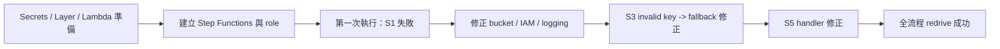

# 工作日誌 - 2026-07-16

## 今日主題

完成公司 AWS 帳戶手動部署排錯，讓 Cathay Tech Intel v3 第一次端到端跑成功。

## 今日完成事項

- 沿用既有 `cathay-techintel-v3/anthropic-api-key` secret。
- 整理 Lambda Layer、7 個 Lambda function 與 Step Functions 手動部署檔案。
- 逐步修正 `BUCKET_NAME` 尾端空白、Lambda role 缺少 `s3:PutObject`、Step Functions logging 權限不足、S5 handler 設定錯誤。
- 修改 `common.py`、`s3_evaluate.py`、`s4_validate.py`：Anthropic API key 缺失、placeholder 或 401 時，自動改走 rubric-only。
- 使用 redrive 跑完 `GenerateRunId -> Task_S1 -> Task_S2 -> Task_Quote -> Task_S3 -> Task_S4 -> Task_S5`。
- 依 HR 範本重整雙週工作週誌，另存 `2026CIP_王冠婷_雙週工作週誌1_格式正確版.docx`。

## 執行驗證

- 執行環境：本機專案資料夾、公司 AWS Console、`ap-southeast-1`。
- Step Functions `cathay-techintel-v3-pipeline` 最終全綠。
- S1 輸出 `runs/2026-07-16T06-45-13.905Z/s1_scan.json`，`kept_count=29`。
- S2 輸出 `runs/2026-07-16T06-45-13.905Z/s2_compare.json`，`kept_count=6`。
- Quote 輸出 `quotation.json`，`decision=approve`、`total_usd=0.0892`、`max_run_usd=0.5`。
- S3/S4 改走 API-first with rubric fallback 後通過。
- S5 handler 改為 `s5_report.handler` 後成功。
- 本機 `py_compile` 已通過 `common.py`、`s3_evaluate.py`、`s4_validate.py`。

## Skill 進度與積分

| 今日工作 | 對應 Skill | 整數積分 | 與目標關係 | 證據 |
|---|---|---:|---|---|
| 公司 AWS 帳戶成功產出 `s1_scan.json` | 掃描 | +2 | 直接扣回目標 | `Task_S1` 回傳 200；`kept_count=29` |
| 成功產出 `s2_compare.json` 與 `quotation.json` | 比較 | +2 | 直接扣回目標 | `kept_count=6`、`decision=approve`、`total_usd=0.0892` |
| 改成 API-first with rubric fallback | 評估 | +4 | 直接扣回目標 | `py_compile` 通過；S3/S4 redrive 成功，但仍是 fallback/rubric |
| 修正 bucket、IAM、logging、S5 handler 並完成 redrive | 驗證 | +6 | 直接扣回目標 | `GenerateRunId` 到 `Task_S5` 全綠，S3/DynamoDB 回驗待補 |
| S5 產出報告，並完成 HR 雙週誌格式版 | 報告 | +4 | 直接扣回目標 | S3 有報告產出；雙週誌是支援交付 |

今日總分：18 分。2026-07-20 依硬審核口徑重算；公司帳戶手動流程跑通，但真實 API 評分與 S3/DynamoDB 回驗仍待補。

## 當日流程圖

## Mentor 討論筆記

### 第一次討論

- 關鍵字：checkpoint、驗證證據、AI PM 嚴格檢核
- 小筆記：做事前先定義 checkpoint、完成條件與驗證方式；做完要留可檢查證據。

### 第二次討論

- 關鍵字：無新增正式 Mentor 討論
- 小筆記：今天主要依既有規則排錯、redrive 與整理。

## 遇到的問題與處理

- 問題：`BUCKET_NAME` 尾端空白造成 S1 `ParamValidationError`。
- 處理：修正 Lambda environment variables。
- 結果：S1 成功寫入 `s1_scan.json`。

- 問題：`cathay-techintel-v3-lambda-role` 缺少 run path 的 `s3:PutObject` 權限。
- 處理：補上 `lambda-execution-policy.json` 的 S3 讀寫權限。
- 結果：S1、S2、Quote 通過。

- 問題：Step Functions role 無法寫 CloudWatch Logs。
- 處理：補上 logging 相關權限。
- 結果：state machine 可建立並啟動。

- 問題：Secrets Manager 內 Anthropic key 無效，S3 回 `401 invalid x-api-key`。
- 處理：改成 API-first with rubric fallback。
- 結果：S3、S4 不再中斷。

- 問題：S5 handler 還是 AWS 預設 `lambda_function.lambda_handler`。
- 處理：改為 `s5_report.handler` 後 redrive。
- 結果：S5 成功產出報告。

## 技術調整紀錄

- 新增公司帳戶 Console 用 Step Functions definition 與 policy 檔。
- `common.py` 加入 placeholder 判斷、fallback 計數與 `llm_mode_label()`。
- `s3_evaluate.py`、`s4_validate.py` 會標示實際模式。
- `GenerateRunId` 會覆蓋輸入的 `manual-demo-*`，查 S3 路徑要以實際 run id 為準。

## 提醒事項

- [ ] 到 S3 核對完整 run folder 檔案數與 `report.html` 開啟方式。
- [ ] 到 DynamoDB 檢查 `cathay-techintel-v3-picks-log` 是否已有 actor=`ai` 的紀錄。
- [ ] 若要驗證真實 API 路徑，補正式 Anthropic API key 或評估改用 Bedrock。
- [ ] 把端到端成功證據整理進 demo checklist 與 final proposal。

## 今日總結

今天公司 AWS 帳戶第一次端到端成功。主要錯誤都已定位並修正，invalid key 也不會再讓流程中斷。下一步補 S3 / DynamoDB 回驗，再決定正式 API key 或 Bedrock 路線。
