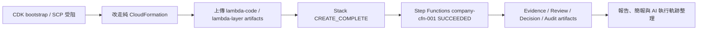

# 工作日誌 - 2026-07-17

## 今日主題

把公司帳戶部署從手動 Console 跑通，推到可用 CloudFormation 重建，並補治理證據、人工審核與評估基準。

## 今日完成事項

- CDK deploy 卡在 SCP 對 `/cdk-bootstrap/hnb659fds/version` 的 `ssm:GetParameter` explicit deny，改走不依賴 CDK bootstrap 的純 CloudFormation。
- 新增公司帳戶 CloudFormation template 與 README，整合 S3、DynamoDB、Secrets Manager、Lambda role、Lambda layer、7 個 Lambda、Step Functions、CloudWatch log groups 與預設關閉的 EventBridge Scheduler。
- 上傳 artifact zip 後，成功部署 CloudFormation stack `cathay-techintel-v3-cfn`。
- 啟動 Step Functions execution `company-cfn-001`，狀態 `SUCCEEDED`。
- 補上 Evidence Ledger、Human Review Loop、Evaluation Harness、Algorithmic Decision Layer、feedback stats 與 audit packet。
- 驗證新版 `report.html` 可下載開啟，且包含 Evidence Ledger、Human Review Gate、Budget Quotation、Pipeline Funnel 與 research disclosure。
- 確認本次仍是 fallback/rubric 路徑，不能寫成真實 Anthropic API 評分。
- 完成下週部會自我介紹簡報新版 7 頁版。
- 建立 AI 執行軌跡紀錄，作為正式實習日誌的補充；今日每小時整理一次，並補回 7/13 至 7/16 的每日總結。

## 執行驗證

- 執行環境：本機專案資料夾、公司 AWS 帳戶 `ap-southeast-1`、S3、CloudFormation、Step Functions、DynamoDB、PowerPoint 產製與渲染工具。
- `aws cloudformation validate-template` 第二次成功回傳 template Parameters。
- CloudFormation stack `cathay-techintel-v3-cfn` 全部資源 `CREATE_COMPLETE`。
- Step Functions execution `company-cfn-001` 狀態 `SUCCEEDED`。
- S1 `kept_count=27`，S2 `kept_count=6`。
- Quote `decision=approve`、`total_usd=0.0892`。
- S3 `evaluated_count=6`，S4 `validated_count=6`。
- S5 產出 `report.html`、`s5_report.json`、`evidence-ledger.json`、`review-packet.json`、`decision-layer.json`、`feedback-stats.json`、`audit-packet.json` 與 `cost-estimate.yaml`。
- `evaluation_harness.py` 通過，quality gate=pass；相關 Python source compile 通過。
- `outputs/部會自我介紹_王冠婷_AI_PM_7頁版.pptx` 已通過 `slides_test.py`，並完成 7 頁渲染人工檢視。
- CloudFormation output 的完整帳號 ID 與 ARN 已遮蔽，不寫入日誌。
- 已下載 `report.html` 並確認內容正確；run id 為 `2026-07-17T01-08-13.216Z`，Top 3 IDs 為 `R-493965E0`、`R-07FA8EA4`、`R-28074DF1`。

## Skill 進度與積分

| 今日工作 | 對應 Skill | 整數積分 | 與目標關係 | 證據 |
|---|---|---:|---|---|
| CloudFormation 版公司帳戶流程完成 S1 掃描 | 掃描 | +3 | 直接扣回目標 | `company-cfn-001` S1 `kept_count=27` |
| S2、Quote gate 與 Decision Layer 串接 | 比較 | +4 | 直接扣回目標 | S2 `kept_count=6`、Quote approve、`decision-layer.json` |
| 補 Evidence Ledger、Human Review Loop、Decision Layer、audit packet 與 evaluation harness | 評估 | +6 | 直接扣回目標 | quality gate=pass；治理 artifacts 已產出 |
| CloudFormation stack 重建成功，Step Functions 端到端成功 | 驗證 | +7 | 直接扣回目標 | stack `CREATE_COMPLETE`、execution `SUCCEEDED`、S3 報告可下載 |
| 完成新版報告 artifact、7 頁簡報與 AI 執行軌跡 | 報告 | +4 | 直接扣回目標 | 核心報告與治理 artifacts 已產出；簡報與軌跡屬支援 |

今日總分：24 分。2026-07-20 依硬審核口徑重算；此日分數最高，因為有公司帳戶 CloudFormation 與 Step Functions 成功，但仍是 PoC，不是正式上線。

## 當日流程圖

## Mentor 討論筆記

### 第一次討論

- 關鍵字：95 分策略、治理證據、human-in-the-loop、評估基準
- 小筆記：高分不只是跑完流程，還要有決策治理、可解釋證據、人工審核、評估基準、觀測與成本治理。

### 第二次討論

- 關鍵字：AI 執行軌跡、每小時紀錄、人與 AI 分工
- 小筆記：正式實習日誌和 AI 執行軌跡分開；AI 軌跡今天起每小時整理，並補回 7/13 至 7/16。

## 遇到的問題與處理

- 問題：CDK deploy 被 SCP 擋住，不能讀 CDK bootstrap version。
- 處理：改用純 CloudFormation template。
- 結果：`validate-template` 後續成功，stack 完成 `CREATE_COMPLETE`。

- 問題：第一次 CloudFormation 部署讀不到 `lambda-layer.zip`，stack rollback。
- 處理：重新產出 `lambda-code.zip` 與 `lambda-layer.zip`，上傳到 artifact bucket。
- 結果：重新部署成功。

- 問題：S3 private bucket 的 object URL 不能公開開報告。
- 處理：使用 Console Open 或 Download，不改公開 bucket。
- 結果：下載 `report.html` 後可正常檢視。

- 問題：Quote gate approve，但實際 LLM token 為 0。
- 處理：日誌標示本次仍是 fallback/rubric 路徑。
- 結果：避免把成果寫成真實 Anthropic API 評分。

## 技術調整紀錄

- 新增 `radar-company-account-complete/radar/manual-cloudformation/cathay-techintel-v3.yaml` 與 README。
- `pipeline_lib.py` 新增 evidence confidence、governance flags、Tech Radar ring、Evidence Ledger、Review Packet、Decision Layer、Feedback Stats 與 Audit Packet。
- `s5_report.py` 輸出 governance artifacts，並在 `s5_report.json` 保留 artifact key。
- `record_human_pick.py` 從 `picked_ids` 擴充為 approve / reject / override / comment。
- `common.py` 新增 DynamoDB pick logs 掃描與 Decimal 轉換。
- `evaluation_harness.py` 離線檢查 Top 3、full-flow、source URL、evidence confidence、review packet、decision layer 與 audit packet。
- `logs/daily/` 保存正式實習日誌；`ai-execution-trace/daily/` 保存 AI 執行軌跡。

## 提醒事項

- [ ] 若要驗證真實 LLM 評分，需更新正式 Anthropic API key 或改走公司核准的 Bedrock 路徑；key 不寫入聊天、日誌或 repo。
- [ ] 繼續累積 human review logs，讓 `feedback-stats.json` 變成可說明趨勢。
- [ ] 把 CloudFormation 成功、治理 artifacts 與報告畫面整理進 final proposal。
- [ ] 若要正式使用 7 頁部會自我介紹簡報，可再補 speaker notes 或口說稿。

## 今日總結

今天把公司帳戶部署推到 CloudFormation 可重建，而且端到端執行成功。也補了 evidence、review、decision、audit 等治理素材。限制是本次仍走 fallback/rubric，下一步要累積 human review，並確認正式 API / Bedrock 路線。
