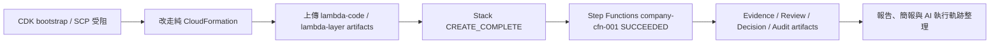

# 工作日誌 - 2026-07-17

## 今日主題

把 Cathay Tech Intel v3 從手動 Console 跑通，推進到可用 CloudFormation 重建的公司帳戶部署版本，並補上治理證據、人工審核與評估基準，讓成果更接近 final proposal 可展示狀態。

## 今日完成事項

- 因 CDK deploy 卡在公司 Organizations SCP 對 `/cdk-bootstrap/hnb659fds/version` 的 `ssm:GetParameter` explicit deny，改走不依賴 CDK bootstrap 的純 CloudFormation 方案。
- 新增公司帳戶用 CloudFormation template 與 README，將 S3、DynamoDB、Secrets Manager、Lambda role、Lambda layer、7 個 Lambda、Step Functions、CloudWatch log groups 與預設關閉的 EventBridge Scheduler 整合為可重建版本。
- 完成 artifact zip 上傳後，成功部署 CloudFormation stack `cathay-techintel-v3-cfn`，並啟動 Step Functions execution `company-cfn-001`；執行狀態為 `SUCCEEDED`。
- 將系統升級為更有治理與可解釋性的版本：新增 Evidence Ledger、Human Review Loop、Evaluation Harness、Algorithmic Decision Layer、feedback stats 與 audit packet。
- 驗證新版報告可在 S3 下載開啟，內容包含 Evidence Ledger、Human Review Gate、Budget Quotation、Pipeline Funnel 與 research disclosure；並確認本次仍是 fallback/rubric 路徑，不能寫成真實 Anthropic API 評分。
- 完成下週部會自我介紹簡報新版 7 頁版，加入 AI PM、人與 AI 角色邊界、agentic organization，以及人的工作軌跡與 AI 執行軌跡概念。
- 依使用者要求建立 AI 自身執行軌跡：今日每小時整理一篇，並補回 7/13 至 7/16 的一天一篇總結。

## 執行驗證

- 執行環境：本機專案資料夾、公司 AWS 帳戶 `ap-southeast-1`、S3、CloudFormation、Step Functions、DynamoDB、PowerPoint 產製與渲染工具。
- 執行結果：
  - `aws cloudformation validate-template` 第二次成功回傳 template Parameters。
  - CloudFormation stack `cathay-techintel-v3-cfn` 全部資源 `CREATE_COMPLETE`。
  - Step Functions execution `company-cfn-001` 狀態為 `SUCCEEDED`。
  - S1 `kept_count=27`，S2 `kept_count=6`，Quote `decision=approve`、`total_usd=0.0892`，S3 `evaluated_count=6`，S4 `validated_count=6`。
  - S5 產出 `report.html`、`s5_report.json`、`evidence-ledger.json`、`review-packet.json`、`decision-layer.json`、`feedback-stats.json`、`audit-packet.json` 與 `cost-estimate.yaml`。
  - `evaluation_harness.py` 通過，quality gate=pass；source compile 通過相關 Python 檔。
  - `outputs/部會自我介紹_王冠婷_AI_PM_7頁版.pptx` 已通過 `slides_test.py`，並完成 7 頁渲染人工檢視。
- 證據或連結：
  - CloudFormation output 包含 data bucket `cathay-techintel-v3-cfn-data-092211181371`、DynamoDB table `cathay-techintel-v3-cfn-picks-log` 與 state machine `arn:aws:states:ap-southeast-1:092211181371:stateMachine:cathay-techintel-v3-cfn-pipeline`。
  - 使用者下載的 `report.html` 已確認含 Evidence Ledger 與 Human Review Gate；run id 為 `2026-07-17T01-08-13.216Z`，Top 3 IDs 為 `R-493965E0`、`R-07FA8EA4`、`R-28074DF1`。
  - 今日 AI 執行軌跡保存在 `ai-execution-trace/daily/2026-07-17.md`，歷史補回軌跡保存在 `ai-execution-trace/daily/2026-07-13.md` 至 `2026-07-16.md`。

## Skill 進度與積分

| 今日工作 | 對應 Skill（掃描／比較／評估／驗證／報告） | 整數積分 | 與該 Skill 原始目標的關係 | 證據 |
|---|---|---:|---|---|
| CloudFormation 版公司帳戶流程成功完成 S1 掃描，並保留真實 RSS run 的掃描輸出 | 掃描 | +3 | 直接扣回目標 | `company-cfn-001` S1 `kept_count=27`；屬 PoC 等級掃描 |
| S2 比較、Quote gate 與 Decision Layer 串接，讓 Top 3 不只依原始平均分，也可看可解釋決策分數 | 比較 | +4 | 直接扣回目標 | S2 `kept_count=6`、Quote approve、`decision-layer.json` 產出 |
| 新增 Evidence Ledger、Human Review Loop、Algorithmic Decision Layer、feedback stats、audit packet 與離線 evaluation harness | 評估 | +6 | 直接扣回目標 | `evaluation_harness.py` quality gate=pass；S5 產出治理 artifacts，但 human feedback sample 仍有限 |
| CloudFormation stack 重建成功，Step Functions `company-cfn-001` 端到端成功，並確認報告可下載檢視 | 驗證 | +7 | 直接扣回目標 | stack resources `CREATE_COMPLETE`；execution `SUCCEEDED`；S3 報告下載驗證；仍非正式上線 |
| 完成新版報告 artifact、7 頁部會自我介紹簡報、AI 每小時執行軌跡與 7/13-7/16 軌跡補回 | 報告 | +4 | 直接扣回目標 | `report.html` 與治理 artifacts 是核心；部會簡報與 AI 軌跡屬支援 |

今日總分：24 分。2026-07-20 依使用者要求改採硬審核口徑重算；此日仍是目前最高分，因為有公司帳戶 CloudFormation 與 Step Functions 成功，但仍標示為 PoC 成功而非正式上線。

## 當日流程圖

## Mentor 討論筆記

### 第一次討論

- 關鍵字：95 分策略、治理證據、human-in-the-loop、評估基準
- 小筆記：高分方向不只是把流程跑完，而是補上決策治理、可解釋證據、人類審核、評估基準、觀測與成本治理，讓專案能被主管理解與信任。

### 第二次討論

- 關鍵字：AI 執行軌跡、每小時紀錄、人與 AI 分工
- 小筆記：正式實習日誌與 AI 自身執行軌跡分開保存；今天起 AI 軌跡每小時整理一次，7/13 至 7/16 補成一天一篇總結。

## 遇到的問題與處理

- 問題：CDK deploy 因公司 Organizations SCP explicit deny `ssm:GetParameter` 讀取 CDK bootstrap version 而受阻。
- 處理：改為純 CloudFormation template，避免依賴 CDK bootstrap bucket、asset publishing roles 與 `/cdk-bootstrap/.../version`。
- 結果：`validate-template` 後續成功，並完成 stack `CREATE_COMPLETE`。

- 問題：第一次 CloudFormation 部署讀不到 `lambda-layer.zip`，stack rollback。
- 處理：從本機 CDK 目錄重新產出 `lambda-code.zip` 與 `lambda-layer.zip`，並上傳到 artifact bucket。
- 結果：重新部署成功，stack 輸出 data bucket、DynamoDB table 與 state machine ARN。

- 問題：S3 private bucket 的 object URL 不能直接公開開啟報告。
- 處理：確認應使用 Console 的 Open 或 Download，不為了看報告改公開 bucket。
- 結果：使用者下載 `report.html` 後已確認新版報告內容正確顯示。

- 問題：本次報告雖有 quote gate approve，但實際 LLM token 為 0。
- 處理：日誌明確標示本次仍為 fallback/rubric 路徑，不寫成真實 Anthropic API 評分。
- 結果：成果表述維持可驗證且不過度宣稱。

## 技術調整紀錄

- 新增 `radar-company-account-complete/radar/manual-cloudformation/cathay-techintel-v3.yaml` 與 README，作為公司帳戶可重建部署路徑。
- `pipeline_lib.py` 新增 evidence confidence、governance flags、Tech Radar ring、Evidence Ledger、Review Packet、Decision Layer、Feedback Stats 與 Audit Packet。
- `s5_report.py` 會輸出 `evidence-ledger.json`、`review-packet.json`、`decision-layer.json`、`feedback-stats.json`、`audit-packet.json`，並在 `s5_report.json` 保留 artifact key。
- `record_human_pick.py` 從單純 `picked_ids` 擴充為 approve / reject / override / comment，並記錄 reviewer、rationale 與 review/evidence artifact key。
- `common.py` 新增 DynamoDB pick logs 掃描與 Decimal 轉換，供多日 human feedback 統計使用。
- `evaluation_harness.py` 離線檢查 Top 3、full-flow、source URL、evidence confidence、review packet、decision layer 與 audit packet。
- AI 執行軌跡與正式日誌分目錄保存：`logs/daily/` 保存使用者實習日誌，`ai-execution-trace/daily/` 保存 AI 自身執行紀錄。

## 提醒事項

- [ ] 若要驗證真實 LLM 評分，需更新正式 Anthropic API key 或改走公司核准的 Bedrock 路徑；不得把 key 寫入聊天、日誌或 repo。
- [ ] 繼續累積 human review logs，讓 `feedback-stats.json` 從 sample size 0/少量資料變成可說明趨勢。
- [ ] 將今日 CloudFormation 成功、治理 artifacts 與報告畫面整理進 final proposal 的執行軌跡與成效證據。
- [ ] 若要正式使用 7 頁部會自我介紹簡報，可再補 speaker notes 或口說稿。

## 今日總結

今天最大的進展是把公司帳戶部署從手動 Console 成功，推進到可用 CloudFormation 重建並端到端執行成功的版本；同時補上 evidence、review、decision 與 audit artifacts，讓專案不只是能跑，還能被檢查與說明。今天的報告成果仍需誠實標示為 fallback/rubric 路徑，下一步是累積 human review 與正式 API/Bedrock 驗證證據，並把這些成果整理進 final proposal。
