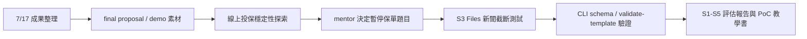

# 每日工作日誌 - 2026-07-20

## 今日主題

整理 7/17 公司帳戶 CloudFormation 成果，補 final proposal / demo 材料。依 mentor 討論，暫停線上投保穩定性題目與 S0 建置，改用 AWS S3 Files 新聞截斷測試來深化 S1-S5。

## 今日完成事項

- [x] 整理 final proposal 素材，新增 7/17 成果摘要、專案執行軌跡更新與 demo checklist。
- [x] 釐清線上投保穩定性 PoC 必須建立在技術雷達流程上，不能獨立變成另一套監測工具。
- [x] 完成本機黑箱 canary PoC；後續因 mentor 決策，保單方向先暫停。
- [x] 依 mentor 新方向完成 S3 Files 新聞截斷評估，從短新聞回推官方文件、CLI schema、可行步驟、限制與 S1-S5 報告。
- [x] 建立 S3 Files CLI 教學書與 CloudFormation PoC 模板，後續可用手動 CLI 或 IaC 做驗證。

## 執行驗證

- 執行環境：Windows PowerShell、本機 Python、AWS CLI `intern` profile、`ap-southeast-1`。
- final proposal 文件已更新：`final-proposal/7-17成果素材.md`、`final-proposal/簡報架構與執行軌跡.md`、`final-proposal/demo-checklist.md`。
- 線上投保穩定性本機 PoC 驗證完成：`normal=PASS`，`quote_500`、`confirmation_timeout`、`frontend_js_error` 都能產生預期失敗與 incident packet。
- AWS Price List API 可用，已估算東京區 CloudWatch Synthetics 三種版本成本。
- S3 Files CLI 查證完成：`aws s3files list-file-systems --profile intern --region ap-southeast-1` 回傳空清單，代表目前未建立 S3 Files file system。
- `cloudformation/s3-files-minimal.yaml` 與 `cloudformation/s3-files-self-contained.yaml` 均通過 `aws cloudformation validate-template`。
- 尚未部署 S3 Files，也尚未建立 AWS 資源。
- 證據：`AI_PM_INBOX.md`、`research/s3-files-s1-s5-evaluation-2026-07-20.md`、`poc/s3-files-cli-poc/S3-Files-CLI教學書-2026-07-20.md`、`cloudformation/s3-files-self-contained.yaml`、`poc/online-insurance-reliability/out/verification/`。

## Skill 進度與積分

| 今日工作 | 對應 Skill | 整數積分 | 與目標關係 | 證據 |
|---|---|---:|---|---|
| 查 AWS 新技術候選、保單穩定性案例與 S3 Files 官方資料，並排除 Bedrock 系列為近期推薦路線 | 掃描 | +3 | 直接扣回目標 | 多為研究與官方查證，尚未形成正式 pipeline run |
| 比較保單穩定性候選方案，並把 S3 Files 拆成可驗證路線 | 比較 | +2 | 直接扣回目標 | S2 文件完成；保單方向已暫停，S3 Files 比較仍初步 |
| 完成 CloudWatch Synthetics 成本估算、保單 PoC 加權評估與 S3 Files 限制判斷 | 評估 | +3 | 直接扣回目標 | 有成本估算與限制判斷，未完成真實 AWS S3 Files PoC |
| 完成本機 canary 故障矩陣、CLI schema 查證、S3 Files read-only 查詢與 template validation | 驗證 | +4 | 直接扣回目標 | 本機 PoC 與 template validation 通過；尚未 deploy |
| 整理 final proposal 素材、demo checklist、AWS 部署教學與 S3 Files 教學書 | 報告 | +2 | 直接扣回目標 | 文件支援完整，但未產出新的核心 S5 報告 artifact |

當日總分：14 分。2026-07-20 依硬審核口徑重算；今天多是研究、文件、本機 PoC 與 template validation，尚未部署 S3 Files，因此不給高分。

## 當日流程圖

## Mentor 討論筆記

### 第一次討論

- 關鍵字：線上投保穩定性、技術雷達入口、S-1、S0、S1-S5
- 小筆記：保單穩定性題目要接在技術雷達流程上；如果不知道公司真實痛點，前面先加 S-1 問題候選蒐集。

### 第二次討論

- 關鍵字：暫停保單題目、S3 Files、新聞截斷、核心能力深化
- 小筆記：近期先不做保單系統與 S0 GUI，改測 AI 能否從短新聞自行抓重點、查證官方資料、推論實作步驟並產出 S1-S5 報告。

## 遇到的問題與處理

- 問題：Bedrock / Bedrock AgentCore 雖是 AWS 熱點，但公司目前無法使用。
- 處理：更新長期限制，後續不主動推薦 Bedrock 系列。
- 結果：後半段改選 S3 Files 作為可用 CLI 與 CloudFormation 驗證的題目。

- 問題：線上投保穩定性 PoC 有本機成果，但 mentor 決定近期不當主線。
- 處理：保留研究、PoC 與成本估算作為支援素材，不包裝成公司正式方向。
- 結果：今日分數以 S1-S5 方法能力與 S3 Files 驗證素材為主。

- 問題：S3 Files CLI 教學初版遇到 profile、JSON encoding、`$Region:` 解析等問題。
- 處理：重寫教學書，固定使用 `intern` profile、UTF-8 no BOM JSON、`${Region}` 變數語法與 cleanup 流程。
- 結果：教學書更適合照著做 PoC。

## 技術調整紀錄

- `PROJECT_MEMORY.md` 新增 Bedrock 不主動推薦、保單題目暫停、S-1/S0/S1 邊界與 mentor 新測試目標。
- `research/online-insurance-reliability-*.md` 保存保單穩定性探索，並標示為暫停主線。
- `research/s3-files-s1-s5-evaluation-2026-07-20.md` 保存 S3 Files 新聞截斷評估。
- `poc/s3-files-cli-poc/S3-Files-CLI教學書-2026-07-20.md` 提供 CLI PoC 與 cleanup 路線。
- `cloudformation/s3-files-minimal.yaml` 與 `cloudformation/s3-files-self-contained.yaml` 提供 IaC PoC 路線，已 validate-template，尚未 deploy。

## 提醒事項

- [ ] S3 Files CloudFormation 目前只做 template validation，尚未部署，不能宣稱已成功建立 file system。
- [ ] 若要實作 S3 Files PoC，需先確認是否允許建立 VPC、S3 bucket、IAM role、mount target 與可能產生成本的 EC2。
- [ ] 保單穩定性 PoC 暫作支援素材，除非 mentor 重新指定或後續方向調整，近期不要延伸成主線。
- [ ] final proposal 要保留「已驗證、已實作但待公司環境驗證、估算或預期」三種標籤。

## 今日總結

今天整理 7/17 成果，也完成保單穩定性探索與 S3 Files 新聞截斷測試。保單方向先暫停，近期主線改為深化 S1-S5。S3 Files 目前完成官方查證、CLI schema 驗證、template validation 與教學書，尚未部署資源。
