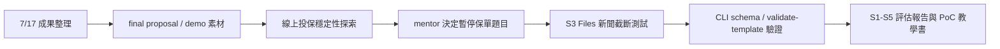

# 每日工作日誌 - 2026-07-20

## 今日主題
把 7/17 公司帳戶 CloudFormation 成功部署的成果整理成 final proposal 與 demo 材料，並依 mentor 討論調整後續方向：暫停線上投保穩定性題目與 S0 建置，改用 AWS S3 Files 新聞截斷測試，深化既有 S1-S5 技術雷達核心能力。

## 今日完成事項
- [x] 整理 final proposal 可用素材，新增 7/17 成果摘要、專案執行軌跡更新與 demo checklist。
- [x] 釐清線上投保穩定性 PoC 應建立在技術雷達流程之上，並完成 S1 掃描、S2 比較、S2b 報價、S3 評估與本機黑箱 canary PoC；後續因 mentor 決策先暫停，不作為近期主線。
- [x] 依 mentor 新方向完成 S3 Files 新聞截斷評估，從短新聞推回官方文件、CLI schema、可行實作步驟、限制與 S1-S5 報告。
- [x] 建立 S3 Files CLI 教學書與 CloudFormation PoC 模板，讓後續可選擇手動 CLI 或 IaC 方式進行實作驗證。

## 執行驗證
- 執行環境：Windows PowerShell、本機 Python、AWS CLI `intern` profile、`ap-southeast-1`。
- 執行結果：
  - final proposal 文件已更新：`final-proposal/7-17成果素材.md`、`final-proposal/簡報架構與執行軌跡.md`、`final-proposal/demo-checklist.md`。
  - 線上投保穩定性本機 PoC 驗證完成：`normal=PASS`，`quote_500`、`confirmation_timeout`、`frontend_js_error` 皆能產生預期失敗與 incident packet。
  - AWS Price List API 可用，已估算東京區 CloudWatch Synthetics 低頻驗證版、正式起步版與高頻強化版成本。
  - S3 Files CLI 查證完成：`aws s3files list-file-systems --profile intern --region ap-southeast-1` 回傳空清單，代表目前未建立 S3 Files file system。
  - `cloudformation/s3-files-minimal.yaml` 與 `cloudformation/s3-files-self-contained.yaml` 均通過 `aws cloudformation validate-template`，尚未部署，也尚未建立 AWS 資源。
- 證據或連結：`AI_PM_INBOX.md` 的 2026-07-20 暫存紀錄、`research/s3-files-s1-s5-evaluation-2026-07-20.md`、`poc/s3-files-cli-poc/S3-Files-CLI教學書-2026-07-20.md`、`cloudformation/s3-files-self-contained.yaml`、`poc/online-insurance-reliability/out/verification/`。

## Skill 進度與積分
| 今日工作 | 對應 Skill（掃描／比較／評估／驗證／報告） | 整數積分 | 與該 Skill 原始目標的關係 | 證據 |
|---|---|---:|---|---|
| 查找 AWS 新技術候選、線上投保穩定性案例與 S3 Files 官方資料，並把 Bedrock 系列排除為近期推薦路線 | 掃描 | +3 | 直接扣回目標 | 多為研究與官方資料查證，尚未形成正式掃描 pipeline run |
| 將線上投保穩定性候選方案按黑箱驗證、PII、成本與 AWS 延伸性比較，並把 S3 Files 由新聞描述拆成可驗證路線 | 比較 | +2 | 直接扣回目標 | S2 文件完成，但保單方向已被 mentor 暫停，S3 Files 比較仍屬初步 |
| 完成 CloudWatch Synthetics 成本估算、線上投保 PoC S3 加權評估，以及 S3 Files 是否適合進 PoC 的限制判斷 | 評估 | +3 | 直接扣回目標 | 有成本估算與限制判斷，但未完成真實 AWS S3 Files PoC |
| 完成本機 canary 故障矩陣、AWS CLI schema 查證、S3 Files read-only 查詢與兩份 CloudFormation template validate-template | 驗證 | +4 | 直接扣回目標 | 本機 PoC 與 template validation 通過；尚未 deploy，未建立 AWS 資源 |
| 整理 final proposal 成果素材、demo checklist、AWS 部署教學、S3 Files CLI 教學書與今日正式日誌 | 報告 | +2 | 直接扣回目標 | 文件支援完整，但今日未產出新的核心 S5 技術雷達報告 artifact |

當日總分：14 分。2026-07-20 依使用者要求改採硬審核口徑重算；今日多為研究、文件、本機 PoC 與 CloudFormation template validation，尚未部署 S3 Files，因此不能給高分。線上投保穩定性 PoC 屬於支援性探索，因 mentor 決定暫停，後續不主動延伸為近期主線。

## 當日流程圖

## Mentor 討論筆記
### 第一次討論
- 關鍵字：線上投保穩定性、技術雷達入口、S-1、S0、S1-S5。
- 小筆記：原先保單穩定性題目必須建立在既有技術雷達流程之上，不能另開一套脫離雷達的監測工具；若使用者不知道公司真實痛點，前面需加 S-1 問題候選蒐集。

### 第二次討論
- 關鍵字：暫停保單題目、S3 Files、新聞截斷、核心能力深化。
- 小筆記：近期不繼續做保單系統與 S0 GUI，而是測試 AI 能否從一小段 AWS 新聞自行抓重點、去除廣告詞、查證官方資料、推論實作步驟、用 CLI 或最小 PoC 驗證，最後產出可信的 S1-S5 報告。

## 遇到的問題與處理
- 問題：Bedrock / Bedrock AgentCore 雖然是 AWS 新聞熱點，但公司目前無法使用。
- 處理：更新長期限制，後續新選題不主動推薦 Bedrock 系列，只保留為不採用原因或概念對照。
- 結果：今日後半段改選 S3 Files 作為可由 CLI 與 CloudFormation 驗證的題目。

- 問題：線上投保穩定性 PoC 有本機成果，但 mentor 決定近期不把它作為主線。
- 處理：保留研究、PoC 與成本估算作為支援性素材，不把它包裝成公司正式方向。
- 結果：今日 Skill 分數仍以 S1-S5 方法能力與 S3 Files 驗證素材為主，但因未部署 AWS 資源，採低至中等分數。

- 問題：S3 Files CLI 教學初版在 PowerShell 與 AWS CLI 使用上暴露出 profile、JSON encoding、`$Region:` 解析等問題。
- 處理：重寫教學書，固定使用 `intern` profile、UTF-8 no BOM JSON、`${Region}` 變數語法與 cleanup 流程。
- 結果：教學書更接近可交給使用者照做的 PoC 操作文件。

## 技術調整紀錄
- `PROJECT_MEMORY.md` 新增 Bedrock 不主動推薦、保單題目暫停、S-1/S0/S1 邊界與 mentor 新測試目標。
- `research/online-insurance-reliability-*.md` 保存保單穩定性探索，但明確標示為暫停主線。
- `research/s3-files-s1-s5-evaluation-2026-07-20.md` 保存 S3 Files 新聞截斷評估。
- `poc/s3-files-cli-poc/S3-Files-CLI教學書-2026-07-20.md` 提供 CLI PoC 操作路線與 cleanup。
- `cloudformation/s3-files-minimal.yaml` 與 `cloudformation/s3-files-self-contained.yaml` 提供 IaC PoC 路線，已 validate-template，尚未 deploy。

## 提醒事項
- [ ] S3 Files CloudFormation 目前只做 template validation，尚未部署，不能宣稱已成功建立 file system。
- [ ] 若要實作 S3 Files PoC，需先確認是否允許建立 VPC、S3 bucket、IAM role、mount target 與可能產生成本的 EC2。
- [ ] 保單穩定性 PoC 暫作支援素材，除非 mentor 或使用者重新指定，近期不要延伸成主線。
- [ ] final proposal 要保留「已驗證、已實作但待公司環境驗證、估算或預期」三種標籤。

## 今日總結
今天把 7/17 公司帳戶成功部署轉成 final proposal 與 demo 可用材料，也完成一輪線上投保穩定性探索；但依 mentor 討論，近期主線改為深化技術雷達 S1-S5 核心能力。下午以 S3 Files 新聞截斷測試完成官方查證、CLI schema 驗證、CloudFormation template validation 與教學書整理；目前仍未部署 S3 Files 資源，下一步需決定是否真的進行可控 PoC。
