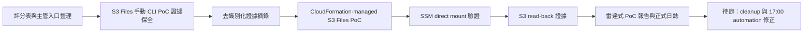

# 每日實習日誌 - 2026-07-21

## 今日主題

今天我主要做兩件事：第一是把主管和學校的評分表整理成之後每天都能累積的自評與證據框架；第二是用 S1-S5 技術雷達流程，把 AWS News Blog 的 S3 Files 從「讀文章」推進到可以重建、驗證和整理成報告的 PoC。

## 今日完成事項

- 我建立了評分表集合 `evaluation-forms/`，把國泰兩張表單和海大兩張學校表單都放進去，也把 GitHub README / dashboard 入口整理成主管比較容易點開看的形式。
- 我整理並保留 `MENTOR_EVALUATION_PROGRESS.md`，把主管評分拆成四大項目與 Mentor 15 項觀察表；正式分數仍以 mentor 填寫為準，我這邊先作為自評證據與補強提醒。
- 我完成 S3 Files 手動 CLI PoC 的證據整理，確認 EC2 可以把 S3 Files 掛載成 NFSv4 檔案系統，能從 mount path 讀 S3 既有檔案，也能從 mount path 寫入後再回到 S3 讀回。
- 我把原始終端機輸出做去識別化摘錄，保留成功證據鏈，但不保存完整 private key、IP、account id、ARN 或 resource IDs。
- 我用 `cloudformation/s3-files-self-contained.yaml` 建立新的 CloudFormation-managed S3 Files PoC，讓這次新聞驗證可以被 CloudFormation / Infrastructure Composer 類工具理解，而不是只留下一串 CLI 操作。
- 我修正 CloudFormation template 的 EC2 UserData：原本 access point 掛載可成功但寫入會遇到 POSIX 權限問題，所以改成預設 direct mount 寫回證據檔，access point mount 則保留為選配觀察點。

## 驗證證據

- 我用 `aws cloudformation validate-template` 檢查 `cloudformation/s3-files-self-contained.yaml`，template 已通過，回傳需要 `CAPABILITY_IAM`。
- CloudFormation-managed stack 已建立完成，狀態為 `CREATE_COMPLETE`；測試 EC2 狀態為 `running / ok / passed`。
- S3 Files file system 與 mount target 狀態都是 `available`。
- 我透過 SSM 在 EC2 上執行 direct mount，`findmnt` 顯示掛載點為 `nfs4`。
- 我從 mount path 寫入測試檔後，S3 可以列出並讀回內容，證明「檔案系統操作」與「S3 object」之間完成雙向同步。
- 手動 CLI PoC 也完成同樣證據鏈：S3 原檔可以從 mount path 讀取，mount path 新增檔案也可以從 S3 讀回。

## 產出文件

- `poc/s3-files-cli-poc/S3-Files-完整流程圖教學書-2026-07-21.md`
- `poc/s3-files-cli-poc/S3-Files端到端驗證報告-2026-07-21.md`
- `poc/s3-files-cli-poc/S3-Files-CLI實作流程圖-2026-07-21.md`
- `poc/s3-files-cli-poc/S3-Files手動部署證據蒐集清單-2026-07-21.md`
- `poc/s3-files-cli-poc/S3-Files手動部署去識別化證據摘錄-2026-07-21.md`
- `poc/s3-files-cli-poc/S3-Files雷達式PoC報告-2026-07-21.md`
- `cloudformation/s3-files-self-contained.yaml`
- `evaluation-forms/`
- `dashboard/mentor-evaluation-details.md`
- `dashboard/Cleo-主管評分表細則與回覆.md`

## Skill 積分

| Skill | 今日加分 | 依據 |
|---|---:|---|
| Skill 1 Scan | +2 | 我讀取並核對 AWS News Blog、S3 Files 文件、CLI schema 與使用條件；但範圍集中在單一新聞與單一服務，還沒有形成廣泛候選池。 |
| Skill 2 Compare | +2 | 我比較 CLI direct resource 與 CloudFormation-managed resource、direct mount 與 access point mount；但比較仍集中在 S3 Files 內部部署差異，還沒有展開多服務替代方案。 |
| Skill 3 Evaluate | +3 | 我評估 IAM、POSIX 權限、成本、cleanup、證據保存與敏感資訊遮蔽；有做風險判斷，但還沒補完整成本估算與正式採用決策。 |
| Skill 4 Validate | +6 | 我完成手動 CLI 端到端驗證與 CloudFormation-managed stack 實機驗證；但 cleanup、多節點、效能、長時間穩定性與重跑回驗還沒完成。 |
| Skill 5 Report | +3 | 我產出教學書、流程圖、去識別化證據摘錄與雷達式 PoC 報告；這些是可追溯素材，但還沒濃縮成 final proposal 或主管版結論頁。 |

今日總分：+16。
硬審核後累積總分：107。

目標對齊：direct。今天的工作直接扣回 S1-S5 主線，保單系統與 S0 建置仍維持暫停。

## 主管評分表自評

| 項目 | 今日新增證據 | 自評草稿 |
|---|---|---:|
| 組織認同與承諾 | 我把評分表、日誌、GitHub 入口與敏感資訊規則都整理成主管可閱讀的版本。 | 4/5 |
| 盡責 | 我完成 S3 Files 手動與 CloudFormation 兩種 PoC 證據整理，但 17:00 日誌自動啟動未準時，需要補強流程。 | 4/5 |
| 團隊合作 | 我把和 mentor 討論到的「公司不一定有需求」與「單位只有一個實習職缺」納入評分判斷，不把不公平條件寫成扣分。 | 4/5 |
| 創新求變 | 我把 AWS 新聞轉成技術雷達式驗證，並實際用 AWS 資源跑出可重建 PoC。 | 5/5 |

補充：Mentor 15 項觀察表目前保留 AI 模擬 mentor 草稿，僅作表單準備參考，正式表單仍需 mentor 最終填寫。

## 問題與修正

- 17:00 日誌同步流程沒有準時觸發，這會影響專案紀錄的穩定性；下一步要檢查或重建 17:00 automation，避免正式日誌流程只靠人工提醒。
- 原始 terminal 輸出含 private key 與基礎設施識別資訊，不能進 Git、日誌或報告；我已改成去識別化摘錄。後續 cleanup 時，還需要刪除已暴露的 EC2 key pair 與本機 `.pem`。
- CloudFormation UserData 的 access point mount 寫入遇到 POSIX permission denied；我已用 SSM direct mount 完成驗證，並修正 template 預設路徑。
- 目前有兩組 AWS 資源待 cleanup：手動 CLI PoC 與 CloudFormation-managed PoC。cleanup 前，我需要先確認是否還要截圖或展示。

## 今日流程圖

## 明日優先事項

- 我會先確認 S3 Files 是否已經完成截圖展示；如果不需要再展示，就清理手動 CLI PoC 與 CloudFormation-managed PoC 資源，降低 AWS 成本。
- 我會檢查 17:00 日誌整理 automation，確認 AI 執行軌跡與正式日誌流程能準時啟動。
- 如果要延伸 S3 Files 報告，我會補一頁「這篇新聞的廣告詞 vs 真正可落地做法」，用來支撐 mentor 提到的新聞截斷／重點抽取能力測試。
