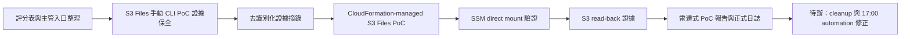

# 每日實習日誌 - 2026-07-21

## 今日主題

今天主要做兩件事：整理主管／學校評分表，讓後續每天可以累積自評證據；用 S1-S5 技術雷達流程驗證 AWS S3 Files PoC。

## 今日完成事項

- 建立 `evaluation-forms/`，放入國泰兩張表單與海大兩張學校表單，並整理 GitHub README / dashboard 入口。
- 保留 `MENTOR_EVALUATION_PROGRESS.md`，把主管評分拆成四大項目與 Mentor 15 項觀察表；正式分數仍以 mentor 填寫為準。
- 完成 S3 Files 手動 CLI PoC 證據整理：EC2 可將 S3 Files 掛載成 NFSv4，mount path 可讀寫並回到 S3 驗證。
- 原始終端機輸出已做去識別化摘錄，不保存完整 private key、IP、account id、ARN 或 resource IDs。
- 建立 `cloudformation/s3-files-self-contained.yaml`，補上 CloudFormation-managed S3 Files PoC。
- 修正 CloudFormation template 的 EC2 UserData：預設改用 direct mount 寫回證據檔，access point mount 保留為選配觀察點。

## 驗證證據

- `aws cloudformation validate-template` 已通過，回傳需要 `CAPABILITY_IAM`。
- CloudFormation-managed stack 已建立完成，狀態為 `CREATE_COMPLETE`；測試 EC2 狀態為 `running / ok / passed`。
- S3 Files file system 與 mount target 狀態都是 `available`。
- 透過 SSM 在 EC2 上執行 direct mount，`findmnt` 顯示掛載點為 `nfs4`。
- 從 mount path 寫入測試檔後，S3 可以列出並讀回，證明檔案系統操作可同步到 S3 object。
- 手動 CLI PoC 也完成同樣證據鏈：S3 原檔可以從 mount path 讀取，mount path 新增檔案也可以從 S3 讀回。

## 產出文件

- `poc/s3-files-cli-poc/S3-Files-完整流程圖教學書-2026-07-21.md`
- `poc/s3-files-cli-poc/S3-Files端到端驗證報告-2026-07-21.md`
- `poc/s3-files-cli-poc/S3-Files-CLI實作流程圖-2026-07-21.md`
- `poc/s3-files-cli-poc/S3-Files手動部署證據蒐集清單-2026-07-21.md`
- `poc/s3-files-cli-poc/S3-Files手動部署去識別化證據摘錄-2026-07-21.md`
- `poc/s3-files-cli-poc/S3-Files雷達式PoC報告-2026-07-21.md`
- `cloudformation/s3-files-self-contained.yaml`
- `evaluation-forms/`
- `dashboard/mentor-evaluation-details.md`
- `dashboard/Cleo-主管評分表細則與回覆.md`

## Skill 積分

| Skill | 今日加分 | 依據 |
|---|---:|---|
| Skill 1 Scan | +2 | 核對 AWS News Blog、S3 Files 文件、CLI schema 與使用條件；範圍仍集中在單一新聞與單一服務。 |
| Skill 2 Compare | +2 | 比較 CLI direct resource / CloudFormation-managed resource、direct mount / access point mount；尚未展開多服務替代方案。 |
| Skill 3 Evaluate | +3 | 評估 IAM、POSIX 權限、成本、cleanup、證據保存與敏感資訊遮蔽；成本估算與採用決策仍待補。 |
| Skill 4 Validate | +6 | 完成手動 CLI 端到端驗證與 CloudFormation-managed stack 實機驗證；cleanup、多節點與重跑回驗未完成。 |
| Skill 5 Report | +3 | 產出教學書、流程圖、去識別化證據摘錄與雷達式 PoC 報告；尚未濃縮成 final proposal 或主管版結論頁。 |

今日總分：+16。
硬審核後累積總分：107。

目標對齊：direct。今天的工作直接扣回 S1-S5 主線，保單系統與 S0 建置仍維持暫停。

## 主管評分表自評

| 項目 | 今日新增證據 | 自評草稿 |
|---|---|---:|
| 組織認同與承諾 | 評分表、日誌、GitHub 入口與敏感資訊規則已整理成主管可閱讀版本。 | 4/5 |
| 盡責 | 完成 S3 Files 手動與 CloudFormation 兩種 PoC 證據整理；17:00 日誌自動啟動仍需補強。 | 4/5 |
| 團隊合作 | 已把 mentor 討論到的組織情境納入評分判斷，不把單位只有一個實習職缺當成扣分理由。 | 4/5 |
| 創新求變 | 將 AWS 新聞轉成技術雷達式驗證，並跑出可重建 PoC。 | 5/5 |

補充：Mentor 15 項觀察表目前保留 AI 模擬 mentor 草稿，僅作表單準備參考，正式表單仍需 mentor 最終填寫。

## 問題與修正

- 17:00 日誌同步流程未準時觸發，需檢查或重建 automation。
- 原始 terminal 輸出含敏感基礎設施資訊，已改成去識別化摘錄；cleanup 時需刪除已暴露的 EC2 key pair 與本機 `.pem`。
- CloudFormation UserData 的 access point mount 寫入遇到 POSIX permission denied；已改用 SSM direct mount 完成驗證並修正 template。
- 目前有兩組 AWS 資源待 cleanup：手動 CLI PoC 與 CloudFormation-managed PoC。

## 今日流程圖

## 明日優先事項

- 確認 S3 Files 是否還需要截圖展示；若不需要，清理手動 CLI PoC 與 CloudFormation-managed PoC。
- 檢查 17:00 日誌整理 automation。
- 視需求補一頁「新聞廣告詞 vs 真正可落地做法」。
