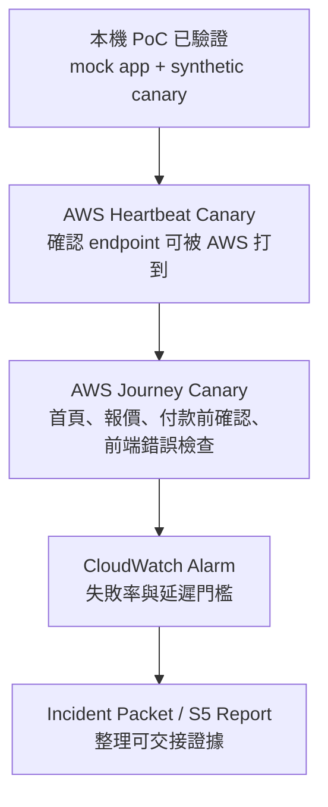

# 線上投保穩定性 PoC：AWS 部署教學

## 先講重點

AWS 上的 CloudWatch Synthetics canary 不能直接連到你本機的 `http://127.0.0.1:8088`。它必須打得到一個公開 endpoint，或是部署在能連到該 endpoint 的 VPC 裡。

所以部署分兩種：

| 路線 | 適合情境 | 建議 |
|---|---|---|
| A. 直接監控公司 sandbox / test endpoint | 公司已提供不付款、不出單、不碰 PII 的測試 URL | 最接近正式導入 |
| B. 先部署 mock endpoint 再監控 | 公司還沒提供測試 URL，只想證明 AWS canary 架得起來 | 教學 PoC 可用 |

目前建議先走 **A 路線**。如果沒有公司測試 URL，就先不要打真實投保站，避免誤觸流量、個資或交易流程。

## 你要準備什麼

- AWS Console 權限：CloudWatch Synthetics、CloudWatch Logs、CloudWatch Alarms、S3、IAM role 建立或 PassRole。
- 一個可以被 AWS canary 打到的測試 URL。
- 測試流程必須符合：
  - 不付款。
  - 不出單。
  - 不寫入真實保單資料。
  - 不使用客戶 PII。
  - 測試資料能被主管或系統負責人接受。

## 先用 CLI 做安全檢查

這些指令只檢查環境，不建立資源。

```powershell
cd C:\Users\youhs\Documents\實習專案

aws sts get-caller-identity --profile intern --no-cli-pager

aws synthetics describe-runtime-versions `
  --profile intern `
  --region ap-southeast-1 `
  --query "RuntimeVersions[?contains(VersionName, 'playwright')].VersionName" `
  --output table `
  --no-cli-pager
```

目前已查到 `ap-southeast-1` 可用 Playwright runtime，例如：

- `syn-nodejs-playwright-7.1`
- `syn-nodejs-playwright-7.0`
- `syn-nodejs-playwright-6.1`

第一次部署建議用 Console 選最新 Playwright runtime，不要手刻完整 `create-canary` CLI，因為第一次最容易卡在 IAM role 與 artifact S3 bucket。

## Console 部署：最小 Heartbeat Canary

這一步先確認「AWS canary 能打到 endpoint」。

1. 開 AWS Console。
2. Region 選公司目前常用的 `ap-southeast-1`。
3. 進入 `CloudWatch`。
4. 找 `Synthetics Canaries`。
5. 按 `Create canary`。
6. 選 `Use a blueprint`。
7. 選最簡單的 heartbeat / URL monitoring 類型。
8. URL 填測試 endpoint，例如：

```text
https://example-sandbox.company.test/health
```

9. Schedule 先設：

```text
rate(15 minutes)
```

10. Artifact bucket：
    - 若 Console 允許自動建立，就讓它自動建。
    - 若公司不允許自動建，請管理者先建立不含 `.` 的 S3 bucket，並給 canary role 寫入權限。
11. IAM role：
    - 若 Console 允許建立 role，選讓 CloudWatch Synthetics 建立。
    - 若不允許，請管理者提供 canary execution role。
12. 建立 canary。
13. 等第一筆 run 完成。
14. 確認：
    - Run status = Passed。
    - CloudWatch Logs 有 log。
    - S3 artifact 有 report / screenshots / HAR 類證據。
    - CloudWatch metrics 有 SuccessPercent / Duration。

## Console 部署：投保 Journey Canary

Heartbeat 成功後，才做 journey canary。這一步對應我們的 PoC 主方案。

1. `Create canary`。
2. 選 `Inline editor` 或自訂 script。
3. Runtime 選最新 Playwright runtime，例如 `syn-nodejs-playwright-7.1`。
4. 貼上範例：

[insurance_journey_canary.js](C:/Users/youhs/Documents/實習專案/poc/online-insurance-reliability/aws/canary/insurance_journey_canary.js)

5. 設定環境變數：

```text
BASE_URL=https://你的-sandbox-投保測試-url
```

6. Handler 設定：

```text
insurance_journey_canary.handler
```

7. Schedule 先用：

```text
rate(15 minutes)
```

8. Timeout 先用 30 秒。
9. Memory 先用預設或 960 MB。
10. 建立 canary 後先手動 `Run once`。

## 成功後要看哪裡

| 位置 | 你要看什麼 |
|---|---|
| CloudWatch Synthetics canary run | 每次 run 是 Pass 還是 Fail |
| Step tab | `homepage_load`、`quote_api`、`application_preview`、`frontend_error_check` 哪一步失敗 |
| Screenshots / HAR | 前端畫面與 network evidence |
| CloudWatch Logs | JSON logs、錯誤 stack、分類訊息 |
| CloudWatch Metrics | SuccessPercent、Duration |
| S3 artifacts | 報告、截圖、HAR、錯誤證據 |

## 建 Alarm

第一次只建兩個 alarm：

1. SuccessPercent < 100 或 Failed > 0。
2. Duration 超過你們可接受門檻，例如 5 秒或 10 秒。

通知方式先不用接真實告警群組，可以先接測試 email / SNS topic，確認不會吵到正式值班。

## 權限卡住時怎麼判斷

| 錯誤 | 可能原因 | 下一步 |
|---|---|---|
| 無法建立 canary | 沒有 `synthetics:CreateCanary` | 請管理者開 CloudWatch Synthetics 權限 |
| 無法建立 role | 沒有 IAM role / PassRole 權限 | 請管理者代建 canary execution role |
| 無法寫 S3 artifact | artifact bucket policy 或 role 權限不足 | 檢查 canary role 是否可寫入 S3 |
| Run timeout | endpoint 打不到、VPC/DNS/防火牆問題 | 先用公開 health endpoint 測 |
| 403 / 401 | endpoint 需要登入或 IP allowlist | 先改測無登入 sandbox health endpoint |

## 一定不要做

- 不要對真實投保付款頁直接跑每分鐘 canary。
- 不要用真實客戶資料。
- 不要把帳號、密碼、API key、cookie、session 資訊寫在 canary script。
- 不要把 S3 artifact bucket 設 public。
- 不要為了看報告關掉 Block Public Access。

## 跟目前專案的對應



## 官方參考

- CloudWatch Synthetics canaries：<https://docs.aws.amazon.com/AmazonCloudWatch/latest/monitoring/CloudWatch_Synthetics_Canaries.html>
- Creating a canary：<https://docs.aws.amazon.com/AmazonCloudWatch/latest/monitoring/CloudWatch_Synthetics_Canaries_Create.html>
- Required roles and permissions：<https://docs.aws.amazon.com/AmazonCloudWatch/latest/monitoring/CloudWatch_Synthetics_Canaries_CanaryPermissions.html>
- Playwright canary sample code：<https://docs.aws.amazon.com/AmazonCloudWatch/latest/monitoring/CloudWatch_Synthetics_Canaries_Samples.html>
- AWS CLI create-canary reference：<https://docs.aws.amazon.com/cli/latest/reference/synthetics/create-canary.html>
