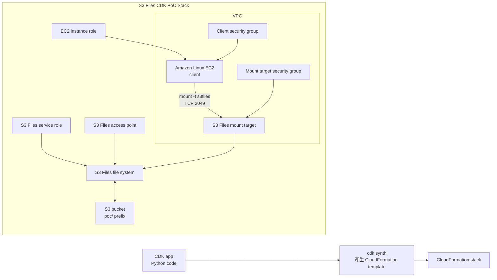

# S3 Files CDK 部署教學書

日期：2026-07-22
目的：用 CDK 產生 CloudFormation stack，再用 CLI 部署 S3 Files + EC2 掛載 PoC，讓你能在 AWS Console 看到資源關係，並自己手動確認檔案同步成功。
建議區域：`ap-southeast-1`
建議 CLI profile：`intern`

> 這份教學書不是要你只複製貼上。重點是看懂：CDK 寫資源藍圖，CloudFormation 建出整包資源，EC2 透過 mount target 掛上 S3 Files，最後你進 Console 確認 S3 檔案真的同步。

## 先講結論

這次要完成三件事：

- 用 CDK 描述一組可重建的 PoC 資源。
- 部署後在 CloudFormation 看到同一個 stack 裡的 VPC、S3 bucket、S3 Files、EC2、IAM。
- 手動進 AWS Console 確認 mount target 建立成功，並確認 EC2 寫到 mount path 的檔案有同步回 S3。

這次不要再用手動 CLI 一個一個建立散落資源。手動 CLI 成功雖然可以證明服務可用，但 CloudFormation 看不到整體流程。CDK 的好處是：你可以看到完整 stack，也可以用同一份程式重做、修改、刪除。

## 這次和昨天手動 CLI 差在哪

你昨天做的是「逐步手動建立與驗證」：

```text
本機 AWS CLI 建 S3 bucket / S3 Files / mount target / EC2
-> SSH 登入 EC2
-> EC2 裡安裝 mount 套件
-> EC2 裡執行 mount 指令
-> 出現 /mnt/s3files
-> cat /mnt/s3files/hello-from-s3.txt
```

這次 CDK 版不是不用這些，而是把其中一部分移到 CloudFormation 自動處理：

| 昨天手動 CLI | 這次 CDK / CloudFormation | 你仍要自己確認什麼 |
|---|---|---|
| 用 AWS CLI 建 bucket | CDK template 定義 bucket，CloudFormation 建立 | 進 S3 Console 看 bucket 和 object |
| 用 AWS CLI 建 S3 Files file system | CDK template 定義 `AWS::S3Files::FileSystem` | 進 S3 Files Console 看 status |
| 用 AWS CLI 建 mount target | CDK template 定義 `AWS::S3Files::MountTarget` | 進 S3 Files Console 看 mount target available |
| 用 AWS CLI 建 EC2 | CDK template 定義 EC2 | 進 EC2 Console 看 running / status checks |
| SSH 登入 EC2 | 可改用 Session Manager；若要練 SSH，也可以另外加 key pair | 你要真的進 EC2 看 mount |
| EC2 裡安裝套件 | UserData 可自動安裝 `amazon-efs-utils` | 你可進 EC2 跑 `rpm -qa` 或 `mount` 確認 |
| EC2 裡執行 mount | UserData 可自動 mount；也可手動重跑 mount command | 你要自己跑 `findmnt` 和 `cat` |
| `cat /mnt/s3files/hello-from-s3.txt` | 仍然要做 | 這是核心驗證，不可省 |

所以這次的學習重點變成：

- CloudFormation 看「整體資源怎麼串」。
- EC2 終端機看「檔案系統是否真的 mount」。
- S3 Console 看「資料是否真的同步回 bucket」。

如果只做到 CloudFormation `CREATE_COMPLETE`，還不算完成新聞主張驗證。真正完成要看到：

```text
/mnt/s3files 出現
cat /mnt/s3files/hello-from-s3-console.txt 成功
EC2 寫入 /mnt/s3files/hello-from-ec2-mount.txt 後，S3 Console 在 poc/ prefix 底下看得到
```

## 本次會建立什麼

會建立的資源：

| 資源 | 用途 | 為什麼需要 |
|---|---|---|
| S3 bucket | 放測試檔案 | S3 Files 的底層資料來源 |
| S3 Files file system | 把 S3 bucket 包成可掛載的檔案系統 | 這是新聞主角 |
| S3 Files mount target | 讓 VPC 裡的 EC2 可透過網路連到 file system | 類似一個 NFS 入口 |
| S3 Files access point | 提供較嚴格的 POSIX 身分與 root directory 設定 | 可在 CloudFormation 圖上看到完整架構 |
| VPC / subnet / route table / IGW | 放 EC2 和 mount target | 讓 PoC 自包含，不依賴公司既有 VPC |
| Security groups | 控制 EC2 到 mount target 的 TCP 2049 | NFS mount 需要 |
| EC2 instance | 實際掛載 S3 Files 的 client | 驗證「像檔案系統使用」 |
| IAM roles | 讓 S3 Files 讀寫 bucket，讓 EC2 mount file system | 權限連接層 |

會產生成本：

- EC2 執行時間。
- S3 Files file system / mount target / data access。
- S3 storage / requests。
- CloudWatch / CloudTrail 可能有少量管理事件或 log 成本。

做完要 cleanup。

## 原理圖



控制線：

- CDK 只負責產生 CloudFormation template。
- CloudFormation 負責建立 AWS 資源。
- IAM role 決定誰可以讀寫 bucket、誰可以 mount。
- Security group 決定 EC2 能不能連到 mount target。

資料線：

- EC2 寫入 `/mnt/s3files/...`。
- S3 Files 把檔案同步回 S3 bucket。
- 你在 S3 Console 看到 object，才算資料線驗證成功。

## 0. 先開 Console

先開 Console，確認你登入的是 intern 帳號，Region 是新加坡。

```powershell
Start-Process "https://ap-southeast-1.console.aws.amazon.com/console/home?region=ap-southeast-1"
Start-Process "https://ap-southeast-1.console.aws.amazon.com/cloudformation/home?region=ap-southeast-1"
Start-Process "https://ap-southeast-1.console.aws.amazon.com/s3/home?region=ap-southeast-1"
Start-Process "https://ap-southeast-1.console.aws.amazon.com/ec2/home?region=ap-southeast-1"
```

不要把完整 account id、ARN、public IP、private key、presigned URL 貼進 Git 或報告。

## 1. 設定本機變數

回到專案目錄：

```powershell
cd "C:\Users\youhs\Documents\實習專案"
$env:AWS_PAGER = ""
$Profile = "intern"
$Region = "ap-southeast-1"
$NamePrefix = "s3files-cdk-$((Get-Date).ToString('yyyyMMddHHmm'))"
```

確認 CLI 可以用：

```powershell
aws --version
aws sts get-caller-identity --profile $Profile --query "Arn" --output text
aws s3files list-file-systems --profile $Profile --region $Region --output table
```

成功標準：

- `sts get-caller-identity` 有回傳目前登入身分。
- `s3files list-file-systems` 沒有 credential error 或 AccessDenied。

如果 CLI 失敗，先不要進部署。

## 2. 建立 CDK 專案資料夾

建議把這次 PoC 放在新的資料夾，不要混到主雷達 pipeline CDK。

```powershell
New-Item -ItemType Directory -Force -Path "poc\s3-files-cdk-poc" | Out-Null
cd "poc\s3-files-cdk-poc"
```

預期結構：

```text
poc/s3-files-cdk-poc/
  app.py
  cdk.json
  requirements.txt
  s3_files_cdk_poc/
    __init__.py
    stack.py
```

為什麼要分開：

- 主雷達 CDK 是 S1-S5 pipeline。
- 這次只是 S3 Files 新聞 PoC。
- 分開後 cleanup 比較不會誤刪主專案。

## 3. CDK 程式負責什麼

CDK 在這裡不是另一套 AWS 服務。它只是用 Python 幫你寫 CloudFormation template。

本次 CDK stack 要做：

1. 建 S3 bucket，啟用 versioning / SSE-S3 / block public access。
2. 建 S3 Files service role，讓 S3 Files 可以同步 bucket。
3. 用 CloudFormation resource `AWS::S3Files::FileSystem` 建 file system。
4. 建 VPC / subnet / route table / internet gateway。
5. 建 client security group 和 mount target security group。
6. 用 `AWS::S3Files::MountTarget` 建 mount target。
7. 用 `AWS::S3Files::AccessPoint` 建 access point。
8. 建 EC2 IAM role / instance profile。
9. 建 Amazon Linux EC2，UserData 安裝 `amazon-efs-utils`，並嘗試 mount S3 Files。
10. 輸出 bucket name、file system id、mount target id、access point id、EC2 id、mount command。

注意：

- S3 Files 是新服務，CDK 可能還沒有好用的 L2 construct。
- 所以 CDK 程式可以用 `CfnResource` 或 L1 resource 直接寫 `AWS::S3Files::*`。
- 這樣 CloudFormation 一樣看得到資源。

## 4. 部署前先 synth

安裝 CDK 依賴：

```powershell
python -m pip install -r requirements.txt
```

確認 CDK CLI：

```powershell
cdk.cmd --version
```

如果 PowerShell 擋 `.ps1`，只放寬目前這個視窗的執行原則：

```powershell
Set-ExecutionPolicy -Scope Process -ExecutionPolicy Bypass
cdk --version
```

或直接使用 `cdk.cmd`，這通常最省事。

產生 CloudFormation template：

```powershell
cdk.cmd synth `
  -c namePrefix=$NamePrefix `
  -c createTestInstance=true
```

CloudFormation template 重點解讀：

> 下面是人工註解版，不是要拿去直接部署的 YAML。真正部署請使用 `cdk.out/` 裡 CDK 產生的 template。

結果：

```yaml
1.Parameters:#部署時要取得的參數
  LatestAmiId:
    Type: AWS::SSM::Parameter::Value<AWS::EC2::Image::Id>
    Default: /aws/service/ami-amazon-linux-latest/al2023-ami-kernel-default-x86_64
    Description: Latest Amazon Linux 2023 x86_64 AMI.
#指定：Amazon Linux 2023
x86_64 架構最新版
不把 AMI ID 寫死，AWS 會透過 Systems Manager Parameter Store 查最新版。

2.Resources: #底下列出的都是準備建立的 AWS 資源

3.Vpc:在 AWS 裡建立的一個私人網路空間
    Type: AWS::EC2::VPC
    Properties:
      CidrBlock: 10.78.0.0/16
      #/16 代表這個 VPC 內可以使用的位址範圍很大，大約涵蓋：(10.78.0.0 ～ 10.78.255.255)
      EnableDnsHostnames: true
      EnableDnsSupport: true(代表 VPC 裡的資源可以使用 DNS 名稱查找其他服務。)
      Tags:標籤(方便在 AWS Console 辨認的名稱)
        - Key: Name
          Value: s3files-cdk-202607221334-vpc
4. InternetGateway:讓 VPC 裡的公開子網路可以連外
    Type: AWS::EC2::InternetGateway
    Properties:
      Tags:
        - Key: Name
          Value: s3files-cdk-202607221334-igw
    Metadata:
      aws:cdk:path: S3FilesCdkPocStack/InternetGateway
5. VpcGatewayAttachment:把剛建立的 Internet Gateway 接到剛建立的 VPC。
    Type: AWS::EC2::VPCGatewayAttachment
    Properties:
      InternetGatewayId:
        Ref: InternetGateway #代表引用前面的 InternetGateway。告訴 CloudFormation：等資源 建立後，自動把InternetGateway和vpc的 ID 帶進來。
      VpcId:
        Ref: Vpc #引用前面的 Vpc
    Metadata:
      aws:cdk:path: S3FilesCdkPocStack/VpcGatewayAttachment
6. PublicSubnet:建立公開子網路
    Type: AWS::EC2::Subnet
    Properties:
      AvailabilityZone:
        Fn::Select:
          - 0 #選第一個可用區。
          - Fn::GetAZs: "" #代表取得目前 AWS Region 中可用的 Availability Zones。
      CidrBlock: 10.78.1.0/24
      MapPublicIpOnLaunch: true #表示在這個 Subnet 中啟動 EC2 時，預設可以分配公開 IP。
      Tags:
        - Key: Name
          Value: s3files-cdk-202607221334-public-subnet
      VpcId:
        Ref: Vpc
7.PublicRouteTable: #建立路由表，決定封包要往哪裡走。前只是先建立路由表，下一段才會放入真正的路由規則。
    Type: AWS::EC2::RouteTable
    Properties:
      Tags:
        - Key: Name
          Value: s3files-cdk-202607221334-public-rt
      VpcId:
        Ref: Vpc
    Metadata:
      aws:cdk:path: S3FilesCdkPocStack/PublicRouteTable
8.PublicRoute:設定預設上網路線
    Type: AWS::EC2::Route
    Properties:
      DestinationCidrBlock: 0.0.0.0/0 #所有不屬於 VPC 內部的 IPv4 流量(不知道目的地在哪裡的對外流量)，全部走Internet Gateway。(0.0.0.0/0意思是所有 IPv4 位址。)
      GatewayId:
        Ref: InternetGateway
      RouteTableId:
        Ref: PublicRouteTable
9.PublicSubnetRouteTableAssociation: #Subnet 與 Route Table 綁定
    Type: AWS::EC2::SubnetRouteTableAssociation
    Properties:
      RouteTableId:
        Ref: PublicRouteTable
      SubnetId:
        Ref: PublicSubnet
  #這一段把 公開子網路 和 路由表 連接起來。否則雖然路由表已經建立，也有上網路線，但子網路不知道自己該使用它。
10. DataBucket:
    Type: AWS::S3::Bucket #建立資料儲存用的 S3 Bucket。
    Properties:
      BucketEncryption: #S3 加密
        ServerSideEncryptionConfiguration:
          - ServerSideEncryptionByDefault:
              SSEAlgorithm: AES256 #代表存進 S3 的檔案會使用 AES-256 伺服器端加密。
      PublicAccessBlockConfiguration: #阻擋公開存取
        BlockPublicAcls: true
        BlockPublicPolicy: true
        IgnorePublicAcls: true
        RestrictPublicBuckets: true #這個 Bucket 不允許直接對公開網路開放。
       VersioningConfiguration: #版本控制，啟用 S3 Versioning。ex.同一個檔案更新三次，S3 可以保存三個版本，而不是直接覆蓋掉舊版本。
        Status: Enabled
11. S3FilesBucketAccessRole: #讓 S3 Files 服務操作 Bucket
    Type: AWS::IAM::Role
    Properties:
      AssumeRolePolicyDocument:
        Version: "2012-10-17"
        Statement:
          - Sid: AllowS3FilesAssumeRole #這個 Role 是提供給 S3 Files 相關服務使用。
            Effect: Allow
            Principal: #誰可以使用這個角色
              Service: elasticfilesystem.amazonaws.com
            Action: sts:AssumeRole #暫時取得這個角色所擁有的權限
            Condition:
              StringEquals:
                aws:SourceAccount:
                  Ref: AWS::AccountId
              ArnLike:
                aws:SourceArn:
                  Fn::Sub: arn:${AWS::Partition}:s3files:${AWS::Region}:${AWS::AccountId}:file-system/*
     Policies:
        - PolicyDocument:
            Version: "2012-10-17"
            Statement:
              - Sid: S3BucketPermissions #Bucket 層級權限
                Effect: Allow
                Action:
                  - s3:ListBucket
                  - s3:ListBucketVersions #代表可以：查看 Bucket 裡有哪些物件及物件版本
                Resource:
                  Fn::GetAtt:
                    - DataBucket
                    - Arn
              - Sid: S3ObjectPermissions #Object 層級權限
                Effect: Allow
                Action:
                  - s3:AbortMultipartUpload
                  - s3:DeleteObject*
                  - s3:GetObject*
                  - s3:List*
                  - s3:PutObject* #代表可以：讀、寫、刪、列出檔案、管理大型分段上傳
                Resource:
                  Fn::Sub: ${DataBucket.Arn}/* #資源範圍：只允許操作這個 DataBucket 裡的物件。
              - Sid: EventBridgeManage  #EventBridge 權限
                Effect: Allow
                Action:
                  - events:DeleteRule
                  - events:DisableRule
                  - events:EnableRule
                  - events:PutRule
                  - events:PutTargets
                  - events:RemoveTargets #這是允許服務管理特定 EventBridge 規則，主要用於資料同步或事件處理。
                Resource:
                  Fn::Sub: arn:${AWS::Partition}:events:*:*:rule/DO-NOT-DELETE-S3-Files*
                  #限制規則名稱必須符合：DO-NOT-DELETE-S3-Files並不是允許任意操作所有 EventBridge 規則。
                Condition:
                  StringEquals:
                    events:ManagedBy: elasticfilesystem.amazonaws.com
12. S3FileSystem: #建立 S3 Files 檔案系統
    Type: AWS::S3Files::FileSystem
    Properties:
      AcceptBucketWarning: true
      Bucket:
        Fn::GetAtt:
          - DataBucket
          - Arn #這個檔案系統背後使用的是前面的 DataBucket。
      Prefix: poc/ #表示檔案系統主要對應 Bucket 裡的：poc/這個路徑。
      RoleArn: #RoleArn指剛才建立的 IAM Role，讓服務有權限操作 S3。
        Fn::GetAtt:
          - S3FilesBucketAccessRole
          - Arn
      Tags:
        - Key: Name
          Value: s3files-cdk-202607221334-fs
        - Key: Project
          Value: s3files-cdk-202607221334
    Metadata:
      aws:cdk:path: S3FilesCdkPocStack/S3FileSystem
13. ClientSecurityGroup:#EC2 用的安全群組，會套用在 EC2 測試主機上。
    Type: AWS::EC2::SecurityGroup
    Properties:
      GroupDescription: s3files-cdk-202607221334 S3 Files client security group
      SecurityGroupEgress:
        - CidrIp: 0.0.0.0/0
          IpProtocol: "-1"
          # EC2 可以對外發出任何協定、任何連接埠的流量。IpProtocol: "-1" 代表所有協定。
          # 這裡沒有寫入站規則，因此外部不能直接透過 SSH 連入這台 EC2。這台機器是透過 AWS Systems Manager Session Manager 管理。
      Tags:
        - Key: Name
          Value: s3files-cdk-202607221334-client-sg
      VpcId:
        Ref: Vpc
    Metadata:
      aws:cdk:path: S3FilesCdkPocStack/ClientSecurityGroup
14. MountTargetSecurityGroup: #掛載端的防火牆
    Type: AWS::EC2::SecurityGroup #這個安全群組套在 S3 Files Mount Target 上。
    Properties:
      GroupDescription: s3files-cdk-202607221334 S3 Files mount target security group
      SecurityGroupEgress:
        - CidrIp: 0.0.0.0/0
          IpProtocol: "-1"
      SecurityGroupIngress:
        - Description: Allow NFS traffic from the client security group.
          FromPort: 2049
          IpProtocol: tcp
          SourceSecurityGroupId:
            Ref: ClientSecurityGroup
          ToPort: 2049 #只允許套用了 ClientSecurityGroup 的資源，透過 TCP 2049 連入。(2049 是 NFS 常用的連接埠。)EC2 ClientSecurityGroup透過TCP 2049連接MountTargetSecurityGroup，不是全網際網路都能連，而是只允許指定的 Security Group。
      Tags:
        - Key: Name
          Value: s3files-cdk-202607221334-mount-target-sg
      VpcId:
        Ref: Vpc
    Metadata:
      aws:cdk:path: S3FilesCdkPocStack/MountTargetSecurityGroup
15. S3FilesMountTarget: #建立網路掛載入口，讓 VPC 裡的 EC2 可以透過網路連上 S3 Files 檔案系統的入口。
    Type: AWS::S3Files::MountTarget
    Properties:
      FileSystemId:
        Fn::GetAtt:
          - S3FileSystem ##連接到前面建立的 S3 Files File System。
          - FileSystemId
      IpAddressType: IPV4_ONLY
      SecurityGroups:
        - Ref: MountTargetSecurityGroup #套用前面設定好的防火牆規則。
      SubnetId:
        Ref: PublicSubnet #表示 Mount Target 放在剛才的 Public Subnet。
    Metadata:
      aws:cdk:path: S3FilesCdkPocStack/S3FilesMountTarget
16.S3FilesAccessPoint: #設定Access Point，一個更明確的檔案存取入口。
    Type: AWS::S3Files::AccessPoint
    Properties:
      FileSystemId:
        Fn::GetAtt:
          - S3FileSystem
          - FileSystemId
      PosixUser:
        Uid: "1000"
        Gid: "1000" #它設定 Linux 使用者資訊：意思是掛載時，以 Linux：(使用者 ID：1000，群組ID：1000)來存取檔案。
      RootDirectory: #根目錄設定：使用這個 Access Point 連進來時，從檔案系統最外層開始看。
        Path: /      # / 是代表(最外層、根目錄)
        CreationPermissions:
          OwnerUid: "1000"
          OwnerGid: "1000"
          Permissions: "0775" #建立目錄時的權限，Linux 權限 0775 大致代表：擁有者：讀、寫、執行。群組：讀、寫、執行。其他人：讀、執行
      Tags:
        - Key: Name
          Value: s3files-cdk-202607221334-access-point
        - Key: Project
          Value: s3files-cdk-202607221334
    Metadata:
      aws:cdk:path: S3FilesCdkPocStack/S3FilesAccessPoint
17. ClientInstanceRole: #EC2 的 IAM 權限
    Type: AWS::IAM::Role  #這個 Role 是給 EC2 測試主機使用的。
    Properties:
      AssumeRolePolicyDocument:
        Version: "2012-10-17"
        Statement:
          - Effect: Allow
            Principal:
              Service: ec2.amazonaws.com #表示 EC2 可以扮演這個角色。
            Action: sts:AssumeRole
      ManagedPolicyArns: #附加兩個 AWS 管理政策：
        - Fn::Sub: arn:${AWS::Partition}:iam::aws:policy/AmazonSSMManagedInstanceCore
        #讓 EC2 可以透過 Systems Manager 管理，例如使用 Session Manager 進入主機，而不必開 SSH 22 port。
        - Fn::Sub: arn:${AWS::Partition}:iam::aws:policy/AmazonS3FilesClientFullAccess
        #提供 S3 Files 客戶端相關權限。
      Policies:
        - PolicyDocument:
            Version: "2012-10-17"
            Statement:
              - Sid: S3DirectReadOptimization
                Effect: Allow
                Action: #加入 S3 讀取權限，讓 EC2 可以直接讀取這個 Bucket 裡的檔案。
                  - s3:GetObject
                  - s3:GetObjectVersion
                Resource:
                  Fn::Sub: ${DataBucket.Arn}/*
              - Sid: S3BucketListAccess
                Effect: Allow
                Action: s3:ListBucket
                Resource:
                  Fn::GetAtt:
                    - DataBucket
                    - Arn
          PolicyName: s3files-client-bucket-read
    Metadata:
      aws:cdk:path: S3FilesCdkPocStack/ClientInstanceRole
18.  ClientInstanceProfile: #把 IAM Role 掛到 EC2
    Type: AWS::IAM::InstanceProfile #EC2 不能直接使用 IAM Role 的名稱，通常要透過 Instance Profile 掛載。(IAM Role包裝成Instance Profile掛到EC2)
    Properties:
      Roles:
        - Ref: ClientInstanceRole #指定roles，所以稍後 EC2 啟動時，就會得到 ClientInstanceRole 的權限。
    Metadata:
      aws:cdk:path: S3FilesCdkPocStack/ClientInstanceProfile
19. S3FilesFileSystemPolicy: #誰能掛載檔案系統
    Type: AWS::S3Files::FileSystemPolicy #檔案系統本身的資源政策。
    Properties:
      FileSystemId:
        Fn::GetAtt:
          - S3FileSystem
          - FileSystemId
      Policy: #統整:只有使用 ClientInstanceRole 的 EC2，而且從指定 Access Point 存取，才能掛載與寫入檔案系統。
        Version: "2012-10-17"
        Statement:
          - Sid: AllowClientViaAccessPoint
            Effect: Allow
            Principal: #只允許這個 Principal:前面的 EC2 Role。
              AWS:
                Fn::GetAtt:
                  - ClientInstanceRole
                  - Arn
            Action:
              - s3files:ClientMount
              - s3files:ClientWrite #允許掛載、寫入檔案系統
            Condition: #要求透過指定的 Access Point
              StringEquals:
                s3files:AccessPointArn:
                  Fn::GetAtt:
                    - S3FilesAccessPoint
                    - AccessPointArn
    Metadata:
      aws:cdk:path: S3FilesCdkPocStack/S3FilesFileSystemPolicy
20.TestInstance: #建立測試用 EC2
    Type: AWS::EC2::Instance
    Properties:
      IamInstanceProfile:
        Ref: ClientInstanceProfile #IAM 權限，掛上前面建立的 EC2 IAM Role。
      ImageId: #作業系統
        Ref: LatestAmiId #使用最前面取得的最新版 Amazon Linux 2023。
      InstanceType: t3.micro #EC2 規格
      NetworkInterfaces:
        - AssociatePublicIpAddress: true #這台 EC2 會取得 Public IP。
          DeviceIndex: "0"
          GroupSet:
            - Ref: ClientSecurityGroup
          SubnetId:
            Ref: PublicSubnet
      Tags:
        - Key: Name
          Value: s3files-cdk-202607221334-test-client
21. UserData: #EC2 開機後自動執行的腳本
        Fn::Base64:
          Fn::Sub:
            - |
              #!/bin/bash
              set -euxo pipefail
              #UserData 是：EC2第一次開機時自動執行的初始化腳本，CloudFormation 會把它 Base64 編碼後傳給 EC2。
              dnf -y update #更新 Amazon Linux 套件。
              dnf -y install amazon-efs-utils python3-pip
              #安裝：檔案系統掛載工具、Python pip
              python3 -m pip install --user botocore || true
              #安裝 AWS Python 底層套件 botocore。(|| true 的意思是：即使這行失敗，也不要讓整個 User Data 腳本停止。)
              mkdir -p /mnt/s3files #建立掛載目錄
              for i in $(seq 1 20); do #最多嘗試 20 次掛載。
                if mount -t s3files ${FileSystemId}:/ /mnt/s3files; then
                  echo "mounted by cdk userdata at $(date -Iseconds)" > /mnt/s3files/cdk-userdata-mounted.txt
                  sync
                  break #意思是把 S3 Files 掛載到：/mnt/s3files掛載成功後寫測試檔案。掛載成功後會建立txt檔案。這段是用來驗證：EC2 是否真的成功掛載並寫入 S3 Files。

                  # 對應到 S3 Console 會在 bucket 的 poc/cdk-userdata-mounted.txt 看到。
                fi
                sleep 30
              done
              #如果失敗：等待 30 秒再試。最多等待時間大約 10 分鐘。
              findmnt -T /mnt/s3files || true
            - FileSystemId:
                Fn::GetAtt:
                  - S3FileSystem
                  - FileSystemId
22. DependsOn: #控制建立順序
      - S3FilesAccessPoint
      - S3FilesFileSystemPolicy
      - S3FilesMountTarget
#表示建立 TestInstance 之前，CloudFormation 要先確保：Access Point、File System Policy、Mount Target 皆已建立，否則 EC2 一開機就執行掛載腳本時，檔案系統可能還沒準備好。
    Metadata:
      aws:cdk:path: S3FilesCdkPocStack/TestInstance
23.CDKMetadata: #這是 AWS CDK 自動加入的資訊，主要用於 CDK 版本、功能與分析統計，不需要手動修改。
    Type: AWS::CDK::Metadata
    Properties:
      Analytics: v2:deflate64:H4sIAAAAAAAA/0WOwWrDQAxEvyX39aZ2IJBj6kPoqcYpuRZ5KxPVtjbsShhj/O8l66Q5STNv0KiwxT63bxsYY+Z+uqynxs5nAdeZsuUKAgwoGAyM8XtGV9i5bPlSlXf6wYKBUU4gOMJkVvJQRxFw1wFZ7v5ZG8a01V4Fv6Dp8V+9Ai94jNE7AiHPCaPTQDKdgtfb2h0F2OFi4s6WLb+r61AMwZA+rP16/xmrgm+px2VJpRi9BpcCnyo3lcVUk1w9b3c2z+1h8xuJsqAsNKCt1/kHqZc+4SoBAAA=
      #上面那串是壓縮編碼後的 CDK 分析資訊，不需要閱讀。
    Metadata:
      aws:cdk:path: S3FilesCdkPocStack/CDKMetadata/Default
24.Outputs: #部署完成後顯示的重要結果
  BucketName:
    Value:
      Ref: DataBucket
  VpcId:
    Value:
      Ref: Vpc
  PublicSubnetId:
    Value:
      Ref: PublicSubnet
  ClientSecurityGroupId:
    Value:
      Ref: ClientSecurityGroup
  FileSystemId:
    Value:
      Fn::GetAtt:
        - S3FileSystem
        - FileSystemId
  MountTargetId:
    Value:
      Fn::GetAtt:
        - S3FilesMountTarget
        - MountTargetId
  AccessPointId:
    Value:
      Fn::GetAtt:
        - S3FilesAccessPoint
        - AccessPointId
  MountCommand: #部署完成後，CloudFormation 會輸出一條可以直接複製使用的掛載指令。
    Value:
      Fn::Sub:
        - sudo mkdir -p /mnt/s3files && sudo mount -t s3files ${FileSystemId}:/ /mnt/s3files
        - FileSystemId:
            Fn::GetAtt:
              - S3FileSystem
              - FileSystemId
  TestInstanceId:
    Value:
      Ref: TestInstance
```

成功標準：

- 產生 `cdk.out/`。
- 終端機可以看到 CloudFormation template。
- template 裡有這些字：
  - `AWS::S3::Bucket`
  - `AWS::S3Files::FileSystem`
  - `AWS::S3Files::MountTarget`
  - `AWS::S3Files::AccessPoint`
  - `AWS::EC2::Instance`
  - `AWS::IAM::Role`

如果 synth 就失敗：

- 先看 Python import error，是不是套件沒裝。
- 再看 CDK code 是否有縮排或型別錯。
- synth 還沒碰 AWS 資源，不會產生成本。

## 5. 部署方式 A：用 CDK deploy

先用這個方式。

```powershell
cdk.cmd deploy `
  -c namePrefix=$NamePrefix `
  -c createTestInstance=true `
  --profile $Profile `
  --require-approval never
```

你會看到 CDK 列出 IAM security changes，這是正常的，因為要建立 EC2 role 和 S3 Files role。

成功標準：

- 終端顯示部署成功。
- CloudFormation Console 出現 stack。
- stack 狀態最後是 `CREATE_COMPLETE`。

如果遇到 `/cdk-bootstrap/.../version` 或 `CDKToolkit` 權限錯誤，代表 CDK bootstrap 被公司 SCP 擋住。改用下一段部署方式 B。

## 6. 部署方式 B：CDK synth + CloudFormation deploy

如果 `cdk deploy` 卡 bootstrap，可以保留「CDK 產生 template」這件事，改用 AWS CLI 部署 CloudFormation。

先 synth：

```powershell
cdk.cmd synth `
  -c namePrefix=$NamePrefix `
  -c createTestInstance=true `
  > cdk.out\s3-files-cdk-poc.yaml
```

部署：

```powershell
aws cloudformation deploy `
  --profile $Profile `
  --region $Region `
  --stack-name $NamePrefix `
  --template-file "cdk.out\s3-files-cdk-poc.yaml" `
  --capabilities CAPABILITY_IAM CAPABILITY_NAMED_IAM
```

成功標準一樣是 CloudFormation stack `CREATE_COMPLETE`。

這條路線的意義：

- CDK 還是負責寫模板。
- CloudFormation 還是負責建資源。
- 只是不用 CDK CLI 直接 deploy，避開 bootstrap 權限問題。

## 7. Console 手動驗證一：CloudFormation

進 Console：

```text
CloudFormation -> Stacks -> 找到 $NamePrefix
```

你要看三個地方。

### 7.1 Stack status

確認：

```text
Status = CREATE_COMPLETE
```

如果是 `ROLLBACK_IN_PROGRESS` 或 `ROLLBACK_COMPLETE`，代表資源建立失敗，要點進 `Events` 看是哪個 resource 失敗。

### 7.2 Resources

進 `Resources` tab，確認至少有：

- S3 bucket。
- S3 Files file system。
- S3 Files mount target。
- S3 Files access point。
- VPC。
- Subnet。
- Security groups。
- EC2 instance。
- IAM role / instance profile。

這一步的目的：

- 確認這些不是散落的手動 CLI 資源。
- 它們都由同一個 CloudFormation stack 管理。

### 7.3 Template / Infrastructure Composer

進 `Template` tab。

如果 Console 有按鈕：

```text
View in Infrastructure Composer
```

點進去看圖。你要看的是資源節點，不是 runtime 動畫。

可以對照：

```text
S3 bucket -> S3 Files file system -> mount target -> EC2
```

如果 Composer 沒有把所有線自動畫得很漂亮，不代表部署失敗。CloudFormation template / Resources tab 才是準確來源。

## 8. Console 手動驗證二：S3 Files

進 AWS Console 搜尋：

```text
S3 Files
```

確認：

- File system status 是 `available`。
- File system 綁定的 bucket 是這次 `$NamePrefix` 對應 bucket。
- Mount target status 是 `available`。
- Access point 存在。

這一步是確認「通道建立成功」。

你可以用 CLI 輔助查，但正式驗證請你自己在 Console 看一次：

```powershell
aws s3files list-file-systems --profile $Profile --region $Region --output table
```

記錄時要分清楚：

- Console 人工確認：已看到 file system / mount target available。
- CLI 查詢確認：`list-file-systems` 回傳 available。

## 9. Console 手動驗證三：EC2

進 EC2 Console：

```text
EC2 -> Instances -> 找到 $NamePrefix-test-client
```

確認：

- Instance state = `Running`。
- Status check = `2/2 checks passed` 或至少 system check / instance check 合理。
- IAM role 有掛上。
- Security group 是 stack 建的 client security group。

如果 EC2 還在 initializing，等幾分鐘。

## 10. 用 Session Manager 進 EC2 檢查 mount

如果 EC2 有 SSM 權限，進：

```text
Systems Manager -> Session Manager -> Start session
```

或從 EC2 Instance 頁面按 `Connect`，選 Session Manager。

進 EC2 後跑：

```bash
rpm -qa | grep -E 'amazon-efs-utils|botocore' || true
sudo findmnt -T /mnt/s3files
mount | grep s3files || true
ls -la /mnt/s3files
```

成功標準：

- `findmnt` 看得到 `/mnt/s3files`。
- `FSTYPE` 類似 `nfs4`。
- mount source 會和 S3 Files file system 有關。
- `amazon-efs-utils` 已安裝，代表 mount helper 可用。

如果 `/mnt/s3files` 沒有掛上，手動跑 stack output 的 mount command：

```bash
sudo mkdir -p /mnt/s3files
sudo mount -t s3files FILE_SYSTEM_ID:/ /mnt/s3files
sudo findmnt -T /mnt/s3files
```

把 `FILE_SYSTEM_ID` 換成 CloudFormation Outputs 裡的 `FileSystemId`。

### 10A. 如果你想保留昨天的 SSH 手感

CDK 版預設建議用 Session Manager，原因是不用建立 key pair，也不會留下 `.pem` 外洩風險。

但如果你的學習目標是重現昨天的手動流程，也可以把 CDK stack 加上 key pair / SSH ingress，然後照昨天方式 SSH 進 EC2。

SSH 路線會多兩個風險：

- 需要建立 EC2 key pair，`.pem` 不能進 Git。
- Security group 會開 TCP 22，建議只允許你目前的 IP，不要開 `0.0.0.0/0`。

如果採 SSH，登入後仍要跑同一組檢查：

```bash
rpm -qa | grep -E 'amazon-efs-utils|botocore' || true
sudo findmnt -T /mnt/s3files
mount | grep s3files || true
ls -la /mnt/s3files
```

這裡的重點不是「SSH 比 SSM 好」，而是你要能在 EC2 裡親眼確認 mount 真的存在。

## 11. 驗證 S3 到 mount

先在 S3 Console 找到這次 bucket。

上傳一個檔案到 bucket 的這個位置：

```text
poc/hello-from-s3-console.txt
```

內容可以寫：

```text
hello from S3 console
```

然後回 EC2：

```bash
ls -la /mnt/s3files
cat /mnt/s3files/hello-from-s3-console.txt
```

成功標準：

- EC2 mount path 看得到你在 S3 Console 上傳的檔案。
- `cat` 讀得到內容。

如果看不到，等 30 到 120 秒再試。S3 Files 同步不是零延遲。

這一步證明：

```text
S3 -> S3 Files mount
```

這一步對應昨天的核心驗證：

```bash
cat /mnt/s3files/hello-from-s3.txt
```

這次 CDK stack 的 S3 Files `Prefix` 設成 `poc/`，所以 bucket 裡的 `poc/hello-from-s3-console.txt` 會對應成 EC2 裡的：

```bash
cat /mnt/s3files/hello-from-s3-console.txt
```

## 12. 驗證 mount 到 S3

在 EC2 寫入檔案：

```bash
echo "hello from EC2 mount $(date -Iseconds)" | sudo tee /mnt/s3files/hello-from-ec2-mount.txt
sync
ls -la /mnt/s3files
```

回 S3 Console：

```text
S3 -> 這次 bucket -> poc/
```

確認出現：

```text
hello-from-ec2-mount.txt
```

打開或下載確認內容。

這一步證明：

```text
EC2 mount -> S3
```

如果 Console 看不到，等 30 到 120 秒再刷新。

## 13. 本次驗證紀錄怎麼寫

不要寫：

```text
AI 幫我部署成功。
```

要寫：

```text
我用 CDK 產生 CloudFormation stack，並在 CloudFormation Console 確認 S3 bucket、S3 Files file system、mount target、access point、EC2 和 IAM role 都由同一個 stack 管理。
我在 S3 Console 手動上傳檔案，EC2 mount path 可讀到，代表 S3 到檔案系統同步成立。
我再從 EC2 mount path 寫入檔案，回到 S3 Console 可看到檔案，代表檔案系統寫回 S3 成立。
```

證據要分兩類：

| 類型 | 範例 |
|---|---|
| Console 人工確認 | CloudFormation stack `CREATE_COMPLETE`、S3 Files mount target `available`、S3 object 出現 |
| CLI / EC2 輔助確認 | `findmnt` 顯示 nfs4、`aws s3files list-file-systems` 回傳 available |

## 14. 常見錯誤

### 14.1 `AccessDenied`

可能原因：

- IAM 權限不足。
- Organizations SCP 擋掉 EC2 / IAM / S3Files / CloudFormation action。
- CDK bootstrap 權限不足。

處理：

- 保存錯誤訊息，不要美化成成功。
- 若是 CDK bootstrap 被擋，改用 `cdk synth` + `aws cloudformation deploy`。
- 若 CloudFormation 也被擋，停止並記錄缺少的 action。

### 14.2 CloudFormation rollback

看：

```text
CloudFormation -> Stack -> Events
```

找第一個 `CREATE_FAILED`。

常見原因：

- S3 bucket name 已存在。
- S3 Files resource type 在該 region / account 權限不足。
- IAM role trust policy 寫錯。
- EC2 instance type / AMI / SSM 權限問題。

### 14.3 EC2 沒有 mount 成功

檢查：

- EC2 security group 是否能出站。
- Mount target security group 是否允許 TCP 2049 from client security group。
- EC2 是否安裝 `amazon-efs-utils` 3.0.0 以上。
- File system policy 是否允許 EC2 role `s3files:ClientMount` / `s3files:ClientWrite`。

### 14.4 S3 Console 看不到 EC2 寫入檔案

可能原因：

- 同步延遲。
- 寫入路徑不是 `poc/`。
- mount 沒成功，檔案其實寫到本機目錄。
- 權限或 POSIX root directory 問題。

處理：

```bash
findmnt -T /mnt/s3files
mount | grep s3files
ls -la /mnt/s3files
```

只有確認 `/mnt/s3files` 是 S3 Files mount，寫入才算有效。

## 15. Cleanup

PoC 做完要刪，不然 EC2 和 S3 Files 會繼續花錢。

### 15.1 先記錄 stack name

```powershell
$StackName = $NamePrefix
```

### 15.2 先抓 bucket name

```powershell
$Bucket = aws cloudformation describe-stacks `
  --profile $Profile `
  --region $Region `
  --stack-name $StackName `
  --query "Stacks[0].Outputs[?OutputKey=='BucketName'].OutputValue | [0]" `
  --output text
```

### 15.3 清空 bucket 目前版本

```powershell
aws s3 rm "s3://$Bucket" `
  --profile $Profile `
  --region $Region `
  --recursive
```

如果 bucket 有 versioning，還要刪 versions 和 delete markers。這段只針對本次 `$Bucket`，不要改成萬用 bucket。

```powershell
$Versions = aws s3api list-object-versions `
  --profile $Profile `
  --bucket $Bucket `
  --output json | ConvertFrom-Json

foreach ($v in @($Versions.Versions)) {
  if ($v.Key) {
    aws s3api delete-object `
      --profile $Profile `
      --bucket $Bucket `
      --key $v.Key `
      --version-id $v.VersionId | Out-Null
  }
}

foreach ($m in @($Versions.DeleteMarkers)) {
  if ($m.Key) {
    aws s3api delete-object `
      --profile $Profile `
      --bucket $Bucket `
      --key $m.Key `
      --version-id $m.VersionId | Out-Null
  }
}
```

### 15.4 destroy stack

如果是 CDK deploy：

```powershell
cdk.cmd destroy `
  -c namePrefix=$NamePrefix `
  --profile $Profile `
  --force
```

如果是 CloudFormation deploy：

```powershell
aws cloudformation delete-stack `
  --profile $Profile `
  --region $Region `
  --stack-name $StackName

aws cloudformation wait stack-delete-complete `
  --profile $Profile `
  --region $Region `
  --stack-name $StackName
```

### 15.5 cleanup 後回驗

```powershell
aws cloudformation describe-stacks `
  --profile $Profile `
  --region $Region `
  --stack-name $StackName
```

預期：

- 找不到 stack，或在 Console Deleted stacks 中看到 `DELETE_COMPLETE`。

再查：

```powershell
aws s3files list-file-systems --profile $Profile --region $Region --output table
aws ec2 describe-instances --profile $Profile --region $Region `
  --filters "Name=tag:Name,Values=$NamePrefix*" `
  --query "Reservations[].Instances[].{Id:InstanceId,State:State.Name,Name:Tags[?Key=='Name']|[0].Value}" `
  --output table
aws s3api list-buckets --profile $Profile `
  --query "Buckets[?contains(Name, '$NamePrefix')].Name" `
  --output text
```

成功標準：

- 沒有本次 prefix 的 S3 Files file system。
- 沒有 running/stopped 的本次 EC2。
- 沒有本次 prefix 的 bucket。
- CloudFormation stack 已刪除。

## 16. 給 mentor 的一句話

本次 PoC 不是只用 AI 跑指令，而是改用 CDK 產生 CloudFormation stack，讓我能在 CloudFormation Console 看到 S3 bucket、S3 Files file system、mount target、access point、VPC、EC2、IAM role 的資源關係；再透過 S3 Console 與 EC2 mount path 雙向驗證檔案同步，確認 S3 Files 的新聞主張可落地測試。

## 17. 參考資料

- AWS S3 Files user guide: https://docs.aws.amazon.com/AmazonS3/latest/userguide/s3-files.html
- Mounting S3 file systems on EC2: https://docs.aws.amazon.com/AmazonS3/latest/userguide/s3-files-mounting.html
- S3 Files prerequisites and policies: https://docs.aws.amazon.com/AmazonS3/latest/userguide/s3-files-prereq-policies.html
- CloudFormation stack resources console: https://docs.aws.amazon.com/AWSCloudFormation/latest/UserGuide/cfn-console-view-stack-data-resources.html
- CloudFormation template / Infrastructure Composer: https://docs.aws.amazon.com/AWSCloudFormation/latest/UserGuide/using-cfn-updating-stacks-get-template.html
