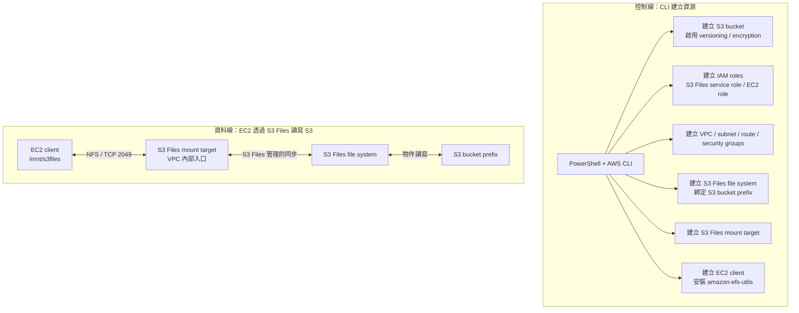
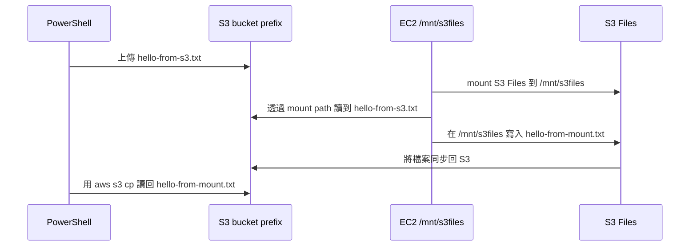

# S3 Files CLI 實作流程圖

日期：2026-07-21  
範圍：說明使用 CLI 手動建立並驗證成功的 S3 Files PoC。本文只保留去識別化架構，不記錄完整帳號 ID、ARN、IP、私鑰或敏感資源細節。

## 可以去 CloudFormation 看嗎？

不能直接看。

這次成功的 PoC 是用 AWS CLI 一個指令一個指令建立出來的，不是由 CloudFormation stack 建立。因此 CloudFormation 主控台不會出現這次 CLI 資源的 stack，也不會有 CloudFormation 的資源關聯圖。

若日後改用 `cloudformation/s3-files-self-contained.yaml` 部署，CloudFormation 才會顯示一個 stack，並列出它建立的 S3 bucket、S3 Files file system、mount target、VPC、subnet、security group、EC2 role 等資源。但那會是一套新的 CloudFormation 管理資源，不是這次已經用 CLI 建好的那一套。

## 這次 PoC 實際建立了什麼？

這次的資源可以想成兩條線：一條是「控制線」，負責建立 AWS 資源；另一條是「資料線」，負責讓 EC2 像讀檔案系統一樣讀寫 S3。

## AWS Console 要去哪裡看？

因為不是 CloudFormation stack，所以要分服務看：

| 想看什麼 | Console 位置 | 你會看到什麼 |
|---|---|---|
| S3 原始物件 | S3 > Buckets | `hello-from-s3.txt` 與從 mount 寫回的 `hello-from-mount.txt` |
| S3 Files file system | S3 Files > File systems | file system 狀態、綁定的 bucket / prefix、role |
| mount target | S3 Files > File system > Mount targets | mount target 所在 subnet / security group |
| EC2 client | EC2 > Instances | 用來掛載 S3 Files 的 Amazon Linux instance |
| 網路 | VPC > VPCs / Subnets / Route tables / Security groups | EC2 到 mount target 的網路與 TCP 2049 規則 |
| 權限 | IAM > Roles | S3 Files service role 與 EC2 instance role |

## 這次真正驗證成功的是什麼？

這次不是只建立資源，而是完成端到端資料驗證：

驗證意義：

- `S3 -> S3 Files -> EC2 mount` 可讀。
- `EC2 mount -> S3 Files -> S3` 可寫回。
- EC2 看到的是檔案系統路徑，S3 端看到的是 object。
- S3 Files file system 建立在指定 prefix 上，所以 mount 根目錄對應的是該 prefix，不需要再多打一層 `poc/`。

## 如果想在 CloudFormation 看到類似流程

可行，但那是下一個實驗，不是查看這次 CLI 成果。

做法是部署 `cloudformation/s3-files-self-contained.yaml`，讓 CloudFormation 自己建立一套新的 self-contained PoC。好處是資源生命週期會比較清楚，cleanup 時可以直接刪 stack；缺點是會再建立一套新的 AWS 資源，會產生成本，而且仍要看帳號權限是否允許。

建議說法：

> 這次 PoC 是 CLI 手動建立，因此 CloudFormation 看不到 stack。若要展示 IaC 管理版本，可以另外用已驗證過的 CloudFormation template 建一套可刪除的 stack。

