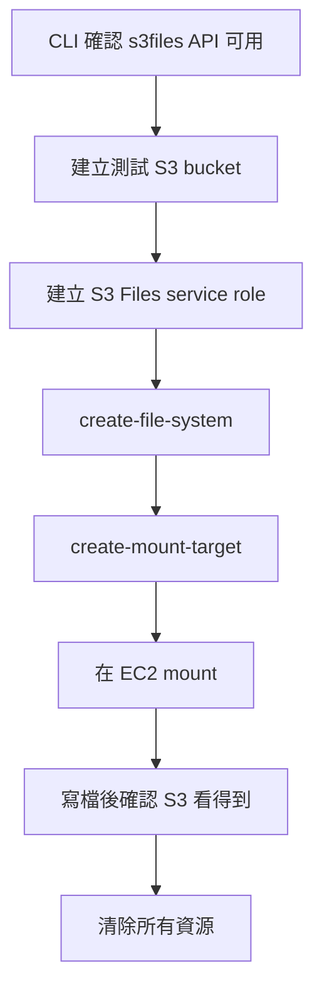

# S3 Files CLI 教學書

日期：2026-07-20  
目的：讓你親手用 AWS CLI 驗證 S3 Files 從「新聞概念」走到「可建立、可掛載、可清除」的最小 PoC。  
建議區域：`ap-southeast-1`  
建議 profile：`intern`

> 重要：這份教學會建立 AWS 資源，可能產生成本。先跑到每個停損點確認成功，再繼續下一段。不要把 terminal output 裡的 account id、ARN、bucket name 貼到公開地方。

## 你今天要驗證什麼



本教學分兩段：

- A 段：用 CLI 建立 S3 bucket、S3 Files file system、mount target。這段在你的 Windows PowerShell 執行。
- B 段：進 EC2 mount 後寫檔。這段需要一台同 VPC 的 Linux EC2，且 EC2 role 有 S3 Files client 權限。

如果你目前沒有 EC2，先完成 A 段就好；那已經足夠證明 CLI resource path 可以走通。

## 0. 先做安全檢查

在 PowerShell 跑：

```powershell
$env:AWS_PAGER = ""
$Profile = "intern"
$Region = "ap-southeast-1"

aws --version
aws sts get-caller-identity --profile $Profile --query "Arn" --output text
aws s3files list-file-systems --profile $Profile --region $Region --output table
```

看到 `list-file-systems` 沒報錯就可以繼續。  
如果看到 `AccessDenied`，先停，代表目前 IAM 權限不夠。

## 1. 建立本次 PoC 變數與本機暫存資料夾

```powershell
$Name = "s3files-poc-$((Get-Date).ToString('yyyyMMddHHmmss'))"
$Bucket = $Name.ToLower()
$Prefix = "poc/"
$WorkDir = Join-Path (Get-Location) "poc\s3-files-cli-poc\.local\$Name"

New-Item -ItemType Directory -Force -Path $WorkDir | Out-Null

$AccountId = aws sts get-caller-identity --profile $Profile --query "Account" --output text
$BucketArn = "arn:aws:s3:::$Bucket"
$RoleName = "$Name-role"
$ClientToken = $Name

"PoC name: $Name"
"Work dir: $WorkDir"
```

不要把 `.local/` 裡的檔案 commit；此目錄已被 `poc/s3-files-cli-poc/.gitignore` 忽略。

## 2. 建立測試 S3 bucket

```powershell
aws s3api create-bucket `
  --profile $Profile `
  --region $Region `
  --bucket $Bucket `
  --create-bucket-configuration LocationConstraint=$Region

aws s3api put-bucket-versioning `
  --profile $Profile `
  --region $Region `
  --bucket $Bucket `
  --versioning-configuration Status=Enabled
```

建立 SSE-S3 encryption 設定檔：

```powershell
$EncryptionJson = @'
{
  "Rules": [
    {
      "ApplyServerSideEncryptionByDefault": {
        "SSEAlgorithm": "AES256"
      }
    }
  ]
}
'@

$EncryptionPath = Join-Path $WorkDir "bucket-encryption.json"
[System.IO.File]::WriteAllText($EncryptionPath, $EncryptionJson, (New-Object System.Text.UTF8Encoding($false)))

aws s3api put-bucket-encryption `
  --profile $Profile `
  --region $Region `
  --bucket $Bucket `
  --server-side-encryption-configuration "file://$EncryptionPath"
```

放一個初始檔案進 S3，等一下掛載後可以看它是否同步到 file system：

```powershell
$HelloPath = Join-Path $WorkDir "hello-from-s3.txt"
"hello from S3 at $(Get-Date -Format o)" | Set-Content -LiteralPath $HelloPath -Encoding UTF8

aws s3 cp $HelloPath "s3://$Bucket/$Prefix" --profile $Profile --region $Region
aws s3 ls "s3://$Bucket/$Prefix" --profile $Profile --region $Region
```

停損點：如果 bucket 建立、versioning、encryption 或 `aws s3 cp` 任一步失敗，先不要往下做。

## 3. 建立 S3 Files service role

官方文件的 trust principal 是 `elasticfilesystem.amazonaws.com`，不是 `s3files.amazonaws.com`。這點很重要。

建立 trust policy：

```powershell
$TrustPolicy = @"
{
  "Version": "2012-10-17",
  "Statement": [
    {
      "Sid": "AllowS3FilesAssumeRole",
      "Effect": "Allow",
      "Principal": {
        "Service": "elasticfilesystem.amazonaws.com"
      },
      "Action": "sts:AssumeRole",
      "Condition": {
        "StringEquals": {
          "aws:SourceAccount": "$AccountId"
        },
        "ArnLike": {
          "aws:SourceArn": "arn:aws:s3files:${Region}:${AccountId}:file-system/*"
        }
      }
    }
  ]
}
"@

$TrustPath = Join-Path $WorkDir "s3files-trust-policy.json"
[System.IO.File]::WriteAllText($TrustPath, $TrustPolicy, (New-Object System.Text.UTF8Encoding($false)))

aws iam create-role `
  --profile $Profile `
  --role-name $RoleName `
  --assume-role-policy-document "file://$TrustPath"
```

建立 inline permission policy。這份用 SSE-S3，所以不放 KMS 權限；若你改用 SSE-KMS，要另外補 KMS 權限。

```powershell
$RolePolicy = @"
{
  "Version": "2012-10-17",
  "Statement": [
    {
      "Sid": "S3BucketPermissions",
      "Effect": "Allow",
      "Action": [
        "s3:ListBucket",
        "s3:ListBucketVersions"
      ],
      "Resource": "$BucketArn",
      "Condition": {
        "StringEquals": {
          "aws:ResourceAccount": "$AccountId"
        }
      }
    },
    {
      "Sid": "S3ObjectPermissions",
      "Effect": "Allow",
      "Action": [
        "s3:AbortMultipartUpload",
        "s3:DeleteObject*",
        "s3:GetObject*",
        "s3:List*",
        "s3:PutObject*"
      ],
      "Resource": "$BucketArn/*",
      "Condition": {
        "StringEquals": {
          "aws:ResourceAccount": "$AccountId"
        }
      }
    },
    {
      "Sid": "EventBridgeManage",
      "Effect": "Allow",
      "Action": [
        "events:DeleteRule",
        "events:DisableRule",
        "events:EnableRule",
        "events:PutRule",
        "events:PutTargets",
        "events:RemoveTargets"
      ],
      "Condition": {
        "StringEquals": {
          "events:ManagedBy": "elasticfilesystem.amazonaws.com"
        }
      },
      "Resource": [
        "arn:aws:events:*:*:rule/DO-NOT-DELETE-S3-Files*"
      ]
    },
    {
      "Sid": "EventBridgeRead",
      "Effect": "Allow",
      "Action": [
        "events:DescribeRule",
        "events:ListRuleNamesByTarget",
        "events:ListRules",
        "events:ListTargetsByRule"
      ],
      "Resource": [
        "arn:aws:events:*:*:rule/*"
      ]
    }
  ]
}
"@

$RolePolicyPath = Join-Path $WorkDir "s3files-role-policy.json"
[System.IO.File]::WriteAllText($RolePolicyPath, $RolePolicy, (New-Object System.Text.UTF8Encoding($false)))

aws iam put-role-policy `
  --profile $Profile `
  --role-name $RoleName `
  --policy-name "$Name-policy" `
  --policy-document "file://$RolePolicyPath"

$RoleArn = aws iam get-role `
  --profile $Profile `
  --role-name $RoleName `
  --query "Role.Arn" `
  --output text

Start-Sleep -Seconds 15
$RoleArn
```

停損點：如果公司 SCP 禁止 `iam:CreateRole` 或 `iam:PutRolePolicy`，這段會失敗。把錯誤碼記下來，不要硬改既有公司 role。

## 4. 建立 S3 Files file system

```powershell
$FsResponseJson = aws s3files create-file-system `
  --profile $Profile `
  --region $Region `
  --bucket $BucketArn `
  --prefix $Prefix `
  --role-arn $RoleArn `
  --client-token $ClientToken `
  --accept-bucket-warning `
  --output json

$FsResponse = $FsResponseJson | ConvertFrom-Json
$FileSystemId = if ($FsResponse.fileSystem.fileSystemId) { $FsResponse.fileSystem.fileSystemId } else { $FsResponse.fileSystemId }
$FileSystemId
```

查狀態：

```powershell
aws s3files get-file-system `
  --profile $Profile `
  --region $Region `
  --file-system-id $FileSystemId `
  --query "{id:fileSystemId,status:status,bucket:bucket,roleArn:roleArn}" `
  --output table
```

如果 status 還在建立中，等 30-60 秒再查一次。

## 5. 建立 VPC security group 與 mount target

先找 default VPC 和一個 subnet。若公司帳號沒有 default VPC，這段會回傳 `None`，你就要改用主管指定的 sandbox VPC/subnet。

```powershell
$VpcId = aws ec2 describe-vpcs `
  --profile $Profile `
  --region $Region `
  --filters Name=isDefault,Values=true `
  --query "Vpcs[0].VpcId" `
  --output text

$SubnetId = aws ec2 describe-subnets `
  --profile $Profile `
  --region $Region `
  --filters Name=vpc-id,Values=$VpcId `
  --query "Subnets[0].SubnetId" `
  --output text

"VPC: $VpcId"
"Subnet: $SubnetId"
```

建立兩個 security group：一個給未來 EC2 client，一個給 S3 Files mount target。

```powershell
$ClientSgId = aws ec2 create-security-group `
  --profile $Profile `
  --region $Region `
  --group-name "$Name-client-sg" `
  --description "S3 Files PoC client SG" `
  --vpc-id $VpcId `
  --query "GroupId" `
  --output text

$MountSgId = aws ec2 create-security-group `
  --profile $Profile `
  --region $Region `
  --group-name "$Name-mount-sg" `
  --description "S3 Files PoC mount target SG" `
  --vpc-id $VpcId `
  --query "GroupId" `
  --output text

aws ec2 authorize-security-group-ingress `
  --profile $Profile `
  --region $Region `
  --group-id $MountSgId `
  --protocol tcp `
  --port 2049 `
  --source-group $ClientSgId

"Client SG: $ClientSgId"
"Mount target SG: $MountSgId"
```

建立 mount target：

```powershell
$MtResponseJson = aws s3files create-mount-target `
  --profile $Profile `
  --region $Region `
  --file-system-id $FileSystemId `
  --subnet-id $SubnetId `
  --security-groups $MountSgId `
  --output json

$MtResponse = $MtResponseJson | ConvertFrom-Json
$MountTargetId = if ($MtResponse.mountTarget.mountTargetId) { $MtResponse.mountTarget.mountTargetId } else { $MtResponse.mountTargetId }
$MountTargetId
```

查 mount target：

```powershell
aws s3files list-mount-targets `
  --profile $Profile `
  --region $Region `
  --file-system-id $FileSystemId `
  --output table
```

到這裡，A 段完成。你已經用 CLI 建出 S3 Files 的主要 resource path。

## 6. B 段：在 EC2 上 mount

這段需要一台 Linux EC2：

- 和 mount target 在同一個 VPC。
- security group 包含剛剛的 `$ClientSgId`，或至少能被 mount target SG 允許 TCP 2049。
- EC2 instance profile 有 `AmazonS3FilesClientFullAccess`，並可讀 linked bucket。
- EC2 裡有 `amazon-efs-utils` 3.0.0+。

如果你已有 EC2 role 名稱，先在 PowerShell 附上 AWS managed policy：

```powershell
$Ec2RoleName = "<填你的 EC2 IAM role name>"

aws iam attach-role-policy `
  --profile $Profile `
  --role-name $Ec2RoleName `
  --policy-arn "arn:aws:iam::aws:policy/AmazonS3FilesClientFullAccess"

aws iam attach-role-policy `
  --profile $Profile `
  --role-name $Ec2RoleName `
  --policy-arn "arn:aws:iam::aws:policy/AmazonElasticFileSystemUtils"
```

再補 bucket read inline policy，讓 mount helper 可直接從 S3 讀資料：

```powershell
$Ec2BucketReadPolicy = @"
{
  "Version": "2012-10-17",
  "Statement": [
    {
      "Sid": "S3ObjectReadAccess",
      "Effect": "Allow",
      "Action": [
        "s3:GetObject",
        "s3:GetObjectVersion"
      ],
      "Resource": "$BucketArn/*"
    },
    {
      "Sid": "S3BucketListAccess",
      "Effect": "Allow",
      "Action": "s3:ListBucket",
      "Resource": "$BucketArn"
    }
  ]
}
"@

$Ec2BucketReadPath = Join-Path $WorkDir "ec2-bucket-read-policy.json"
[System.IO.File]::WriteAllText($Ec2BucketReadPath, $Ec2BucketReadPolicy, (New-Object System.Text.UTF8Encoding($false)))

aws iam put-role-policy `
  --profile $Profile `
  --role-name $Ec2RoleName `
  --policy-name "$Name-ec2-bucket-read" `
  --policy-document "file://$Ec2BucketReadPath"
```

進 EC2 後跑：

```bash
sudo yum -y install amazon-efs-utils
python3 -m pip install --user botocore || true

sudo mkdir -p /mnt/s3files
sudo mount -t s3files fs-xxxxxxxxxxxxxxxxx:/ /mnt/s3files
```

把 `fs-xxxxxxxxxxxxxxxxx` 換成你的 `$FileSystemId`。

驗證從 S3 匯入的檔案：

```bash
ls -la /mnt/s3files/poc
cat /mnt/s3files/poc/hello-from-s3.txt
```

從 file system 寫回 S3：

```bash
echo "hello from mounted file system $(date -Iseconds)" | sudo tee /mnt/s3files/poc/hello-from-mount.txt
sync
```

回到 PowerShell 查 S3。官方說同步可能需要數秒到數分鐘，所以沒看到就等一下再查。

```powershell
aws s3 ls "s3://$Bucket/$Prefix" --profile $Profile --region $Region
aws s3 cp "s3://$Bucket/$Prefix/hello-from-mount.txt" - --profile $Profile --region $Region
```

成功標準：

- mount path 看得到 `hello-from-s3.txt`。
- 從 mount path 建立的 `hello-from-mount.txt` 最後能在 S3 看到。
- 你能說清楚同步不是零延遲。

## 7. 清除資源

先在 EC2 unmount：

```bash
sudo umount /mnt/s3files
```

PowerShell 清除 mount target：

```powershell
$MountTargetIds = aws s3files list-mount-targets `
  --profile $Profile `
  --region $Region `
  --file-system-id $FileSystemId `
  --query "mountTargets[].mountTargetId" `
  --output text

foreach ($MtId in ($MountTargetIds -split "\s+")) {
  if ($MtId) {
    aws s3files delete-mount-target `
      --profile $Profile `
      --region $Region `
      --mount-target-id $MtId
  }
}

Start-Sleep -Seconds 90
```

確認 mount target 已清掉後再刪 file system。如果還看得到 mount target，就再等一分鐘。

```powershell
aws s3files list-mount-targets `
  --profile $Profile `
  --region $Region `
  --file-system-id $FileSystemId `
  --output table
```

清除 file system：

```powershell
aws s3files delete-file-system `
  --profile $Profile `
  --region $Region `
  --file-system-id $FileSystemId `
  --force-delete
```

清空並刪除 bucket。因為本教學有啟用 versioning，不能只靠 `aws s3 rm --recursive`，要把 object versions 和 delete markers 都刪掉。

```powershell
aws s3 rm "s3://$Bucket" --recursive --profile $Profile --region $Region

$VersionsJson = aws s3api list-object-versions `
  --profile $Profile `
  --region $Region `
  --bucket $Bucket `
  --output json

$Versions = $VersionsJson | ConvertFrom-Json

foreach ($Obj in @($Versions.Versions) + @($Versions.DeleteMarkers)) {
  if ($Obj -and $Obj.Key -and $Obj.VersionId) {
    aws s3api delete-object `
      --profile $Profile `
      --region $Region `
      --bucket $Bucket `
      --key $Obj.Key `
      --version-id $Obj.VersionId | Out-Null
  }
}

aws s3api delete-bucket `
  --profile $Profile `
  --region $Region `
  --bucket $Bucket
```

清除 IAM role：

```powershell
aws iam delete-role-policy `
  --profile $Profile `
  --role-name $RoleName `
  --policy-name "$Name-policy"

aws iam delete-role `
  --profile $Profile `
  --role-name $RoleName
```

如果你有執行 B 段並替 EC2 role 加了測試 policy，記得移除。若該 EC2 role 原本就需要這些 managed policies，不要亂 detach；只刪本教學新增的 inline policy 即可。

```powershell
if ($Ec2RoleName) {
  aws iam delete-role-policy `
    --profile $Profile `
    --role-name $Ec2RoleName `
    --policy-name "$Name-ec2-bucket-read"
}
```

清除 security groups。若出現 dependency violation，等 mount target 完全刪除後再重試。

```powershell
aws ec2 delete-security-group --profile $Profile --region $Region --group-id $MountSgId
aws ec2 delete-security-group --profile $Profile --region $Region --group-id $ClientSgId
```

最後確認：

```powershell
aws s3files list-file-systems --profile $Profile --region $Region --output table
aws s3 ls "s3://$Bucket" --profile $Profile --region $Region
```

第二行若顯示 bucket 不存在，是正常的。

## 常見錯誤

| 錯誤 | 可能原因 | 處理 |
|---|---|---|
| `AccessDenied` at `iam create-role` | 公司 SCP 或 IAM 權限不足 | 停下來，記錄錯誤碼，改請主管提供 sandbox role 或改 Console route |
| `Invalid principal` | trust policy principal 寫錯 | 確認是 `elasticfilesystem.amazonaws.com` |
| `create-file-system` bucket warning | bucket 既有資料或設定不符 | 本教學用新 bucket，仍加 `--accept-bucket-warning`；若是真實 bucket 不要直接接受 |
| `No default VPC` | 公司帳號沒有 default VPC | 改用主管指定 VPC/subnet |
| EC2 mount timeout | security group 沒開 TCP 2049 | Mount target SG inbound 2049 source 要是 client SG |
| S3 看不到 mount 寫入檔 | 同步延遲或未 export 完成 | 等數分鐘再查；不要立刻判定失敗 |
| delete SG 失敗 | mount target ENI 尚未清完 | 等 2-5 分鐘再刪 |

## 本次 PoC 回報格式

做完後，把下面幾項貼回來即可，不要貼 account id、完整 ARN、憑證或 presigned URL：

```text
區域：
做到哪一步：
FileSystemId 前 8 碼：
list-file-systems status：
mount target 是否建立：
是否有 EC2 mount：
S3 -> mount 是否成功：
mount -> S3 是否成功：
遇到的錯誤碼：
是否已 cleanup：
```

## 參考來源

- AWS News Blog: https://aws.amazon.com/tw/blogs/aws/launching-s3-files-making-s3-buckets-accessible-as-file-systems/
- S3 Files 使用者指南: https://docs.aws.amazon.com/AmazonS3/latest/userguide/s3-files.html
- S3 Files prerequisites / policies: https://docs.aws.amazon.com/AmazonS3/latest/userguide/s3-files-prereq-policies.html
- S3 Files resource management: https://docs.aws.amazon.com/AmazonS3/latest/userguide/s3-files-resources.html
- S3 Files metering: https://docs.aws.amazon.com/AmazonS3/latest/userguide/s3-files-metering.html
