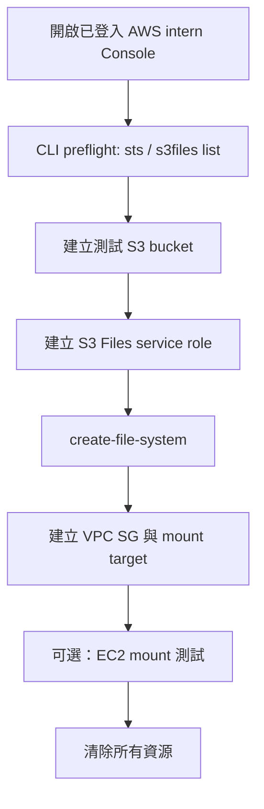

# S3 Files CLI PoC 教學書：從已登入 AWS intern 帳號開始

日期：2026-07-20  
目的：用你已經登入過的 AWS intern 帳號，親手驗證 S3 Files 是否能從「新聞概念」走到「CLI 建立資源、可掛載、可清除」。
建議區域：`ap-southeast-1`  
建議 CLI profile：`intern`

> 這份是重寫版。前面踩到的坑都已收斂：所有 AWS CLI 都帶 `--profile $Profile --region $Region`，所有 JSON 暫存檔都用 UTF-8 no BOM，PowerShell 裡的 ARN 變數都用 `${Region}:${AccountId}`，避免 `$Region:` 解析錯誤。

## 先講結論

你今天不是要把 S3 Files 正式導入公司，而是驗證三件事：

- intern 帳號可不可以操作 `s3files` API。
- S3 bucket、S3 Files service role、file system、mount target 能不能用 CLI 建起來。
- 若有 Linux EC2，能不能 mount 後做 `S3 -> file system` 與 `file system -> S3` 的雙向同步驗證。

如果你沒有 EC2，做到 mount target 建立也算一次有效 PoC。
如果卡在 IAM / SCP / VPC 權限，錯誤本身也是驗證證據。



## 0. 開啟過去登入好的 AWS intern 帳號

先打開 AWS Console。這只是讓你視覺確認目前登入的是 intern 帳號，真正建立資源仍以 CLI 為主。

在 PowerShell 跑：

```powershell
Start-Process "https://ap-southeast-1.console.aws.amazon.com/console/home?region=ap-southeast-1"
```

打開後確認：

- 右上角是你平常使用的 AWS intern / 公司練習帳號。
- Region 切到 `ap-southeast-1`。
- 不要貼 Console 裡的完整 account id、ARN、presigned URL 或任何 credential 到公開地方。

可以順手開這幾頁觀察，不需要在 Console 手動建立：

```powershell
Start-Process "https://ap-southeast-1.console.aws.amazon.com/s3/home?region=ap-southeast-1"
Start-Process "https://ap-southeast-1.console.aws.amazon.com/vpcconsole/home?region=ap-southeast-1"
Start-Process "https://ap-southeast-1.console.aws.amazon.com/iam/home"
```

S3 Files 若 Console 搜尋得到，就從 AWS Console 搜尋列輸入 `S3 Files`。不同 Console 版本入口可能會調整，所以這裡不硬寫深層 URL。

## 1. 回到專案目錄執行

建議不要在 `C:\Users\youhs>` 直接跑，避免 `.local/` 暫存資料散在家目錄。

```powershell
cd "C:\Users\youhs\Documents\實習專案"
$env:AWS_PAGER = ""
$Profile = "intern"
$Region = "ap-southeast-1"
```

確認 CLI 身分：

```powershell
aws --version
aws sts get-caller-identity --profile $Profile --query "Arn" --output text
aws s3files list-file-systems --profile $Profile --region $Region --output table
```

成功標準：

- `sts get-caller-identity` 能回傳 ARN。
- `s3files list-file-systems` 沒有 `AccessDenied` 或 credential error。

若看到 `InvalidAccessKeyId`，通常是忘記帶 `--profile $Profile` 或 default credential 壞掉。
若看到 `AccessDenied`，代表目前 IAM/SCP 權限不足，先停。

## 2. 選擇接續或重跑

### 2A. 接續你剛剛已建立的 PoC

如果你要接續剛剛已成功建立 bucket 的那次，使用這組：

```powershell
$Name = "s3files-poc-20260720160816"
$Bucket = $Name.ToLower()
$Prefix = "poc/"
$WorkDir = Join-Path (Get-Location) "poc\s3-files-cli-poc\.local\$Name"
New-Item -ItemType Directory -Force -Path $WorkDir | Out-Null
```

### 2B. 從零重跑一個新的 PoC

如果你想乾淨重跑，使用這組：

```powershell
$Name = "s3files-poc-$((Get-Date).ToString('yyyyMMddHHmmss'))"
$Bucket = $Name.ToLower()
$Prefix = "poc/"
$WorkDir = Join-Path (Get-Location) "poc\s3-files-cli-poc\.local\$Name"
New-Item -ItemType Directory -Force -Path $WorkDir | Out-Null
```

### 2C. 共用變數

不管接續或重跑，都接著跑：

```powershell
$AccountId = aws sts get-caller-identity --profile $Profile --query "Account" --output text
$BucketArn = "arn:aws:s3:::$Bucket"
$RoleName = "$Name-role"
$ClientToken = $Name

"PoC name: $Name"
"Bucket: $Bucket"
"Work dir: $WorkDir"
```

不要把 `.local/` 裡的 JSON 暫存檔 commit；此資料夾已被 `poc/s3-files-cli-poc/.gitignore` 排除。

## 3. 建立或確認測試 S3 bucket

如果你是接續剛剛那次，bucket 已經存在，可以直接跑「確認」段落。
如果是從零重跑，先建立 bucket：

```powershell
aws s3api create-bucket `
  --profile $Profile `
  --region $Region `
  --bucket $Bucket `
  --create-bucket-configuration LocationConstraint=$Region
```

啟用 versioning：

```powershell
aws s3api put-bucket-versioning `
  --profile $Profile `
  --region $Region `
  --bucket $Bucket `
  --versioning-configuration Status=Enabled
```

設定 SSE-S3 encryption。注意這裡用 UTF-8 no BOM 寫檔：

```powershell
$EncryptionJson = @'
{
  "Rules": [
    {
      "ApplyServerSideEncryptionByDefault": {
        "SSEAlgorithm": "AES256"
      }
    }
  ]
}
'@

$EncryptionPath = Join-Path $WorkDir "bucket-encryption.json"
[System.IO.File]::WriteAllText($EncryptionPath, $EncryptionJson, (New-Object System.Text.UTF8Encoding($false)))

aws s3api put-bucket-encryption `
  --profile $Profile `
  --region $Region `
  --bucket $Bucket `
  --server-side-encryption-configuration "file://$EncryptionPath"
```

確認 bucket 狀態：

```powershell
aws s3api get-bucket-versioning --profile $Profile --region $Region --bucket $Bucket --output json
aws s3api get-bucket-encryption --profile $Profile --region $Region --bucket $Bucket --output json
```

放入初始檔案。這兩行一定要帶 `--profile`，不要省：

```powershell
$HelloPath = Join-Path $WorkDir "hello-from-s3.txt"
"hello from S3 at $(Get-Date -Format o)" | Set-Content -LiteralPath $HelloPath -Encoding UTF8

aws s3 cp $HelloPath "s3://$Bucket/$Prefix" --profile $Profile --region $Region
aws s3 ls "s3://$Bucket/$Prefix" --profile $Profile --region $Region
```

成功標準：看到 `hello-from-s3.txt`。

## 4. 建立 S3 Files service role

官方文件的 service role trust principal 是 `elasticfilesystem.amazonaws.com`，不是 `s3files.amazonaws.com`。
PowerShell ARN 裡要寫 `${Region}:${AccountId}`，不能寫 `$Region:$AccountId`。

建立 trust policy：

```powershell
$TrustPolicy = @"
{
  "Version": "2012-10-17",
  "Statement": [
    {
      "Sid": "AllowS3FilesAssumeRole",
      "Effect": "Allow",
      "Principal": {
        "Service": "elasticfilesystem.amazonaws.com"
      },
      "Action": "sts:AssumeRole",
      "Condition": {
        "StringEquals": {
          "aws:SourceAccount": "$AccountId"
        },
        "ArnLike": {
          "aws:SourceArn": "arn:aws:s3files:${Region}:${AccountId}:file-system/*"
        }
      }
    }
  ]
}
"@

$TrustPath = Join-Path $WorkDir "s3files-trust-policy.json"
[System.IO.File]::WriteAllText($TrustPath, $TrustPolicy, (New-Object System.Text.UTF8Encoding($false)))
```

建立 role：

```powershell
aws iam create-role `
  --profile $Profile `
  --role-name $RoleName `
  --assume-role-policy-document "file://$TrustPath"
```

如果回 `EntityAlreadyExists`，代表前面可能已建立過 role。你可以改跑：

```powershell
aws iam get-role --profile $Profile --role-name $RoleName --query "Role.Arn" --output text
```

若是 `AccessDenied`，停下來，這代表 intern 帳號目前不能建立 IAM role。

建立 role inline policy。這份使用 SSE-S3，所以不含 KMS 權限；若改 SSE-KMS，必須另外補 KMS 權限。

```powershell
$RolePolicy = @"
{
  "Version": "2012-10-17",
  "Statement": [
    {
      "Sid": "S3BucketPermissions",
      "Effect": "Allow",
      "Action": [
        "s3:ListBucket",
        "s3:ListBucketVersions"
      ],
      "Resource": "$BucketArn",
      "Condition": {
        "StringEquals": {
          "aws:ResourceAccount": "$AccountId"
        }
      }
    },
    {
      "Sid": "S3ObjectPermissions",
      "Effect": "Allow",
      "Action": [
        "s3:AbortMultipartUpload",
        "s3:DeleteObject*",
        "s3:GetObject*",
        "s3:List*",
        "s3:PutObject*"
      ],
      "Resource": "$BucketArn/*",
      "Condition": {
        "StringEquals": {
          "aws:ResourceAccount": "$AccountId"
        }
      }
    },
    {
      "Sid": "EventBridgeManage",
      "Effect": "Allow",
      "Action": [
        "events:DeleteRule",
        "events:DisableRule",
        "events:EnableRule",
        "events:PutRule",
        "events:PutTargets",
        "events:RemoveTargets"
      ],
      "Condition": {
        "StringEquals": {
          "events:ManagedBy": "elasticfilesystem.amazonaws.com"
        }
      },
      "Resource": [
        "arn:aws:events:*:*:rule/DO-NOT-DELETE-S3-Files*"
      ]
    },
    {
      "Sid": "EventBridgeRead",
      "Effect": "Allow",
      "Action": [
        "events:DescribeRule",
        "events:ListRuleNamesByTarget",
        "events:ListRules",
        "events:ListTargetsByRule"
      ],
      "Resource": [
        "arn:aws:events:*:*:rule/*"
      ]
    }
  ]
}
"@

$RolePolicyPath = Join-Path $WorkDir "s3files-role-policy.json"
[System.IO.File]::WriteAllText($RolePolicyPath, $RolePolicy, (New-Object System.Text.UTF8Encoding($false)))

aws iam put-role-policy `
  --profile $Profile `
  --role-name $RoleName `
  --policy-name "$Name-policy" `
  --policy-document "file://$RolePolicyPath"

$RoleArn = aws iam get-role `
  --profile $Profile `
  --role-name $RoleName `
  --query "Role.Arn" `
  --output text

Start-Sleep -Seconds 15
$RoleArn
```

成功標準：拿到 role ARN。

## 5. 建立 S3 Files file system

```powershell
$FsResponseJson = aws s3files create-file-system `
  --profile $Profile `
  --region $Region `
  --bucket $BucketArn `
  --prefix $Prefix `
  --role-arn $RoleArn `
  --client-token $ClientToken `
  --accept-bucket-warning `
  --output json

$FsResponse = $FsResponseJson | ConvertFrom-Json
$FileSystemId = if ($FsResponse.fileSystem.fileSystemId) { $FsResponse.fileSystem.fileSystemId } else { $FsResponse.fileSystemId }
$FileSystemId
```

查狀態：

```powershell
aws s3files get-file-system `
  --profile $Profile `
  --region $Region `
  --file-system-id $FileSystemId `
  --query "{id:fileSystemId,status:status,bucket:bucket,roleArn:roleArn}" `
  --output table
```

如果 status 還在建立中，等 30-60 秒再查。

## 6. 建立 VPC security group 與 mount target

先找 default VPC。若公司 intern 帳號沒有 default VPC，這裡會回 `None`，就要改用公司 sandbox VPC/subnet。

```powershell
$VpcId = aws ec2 describe-vpcs `
  --profile $Profile `
  --region $Region `
  --filters Name=isDefault,Values=true `
  --query "Vpcs[0].VpcId" `
  --output text

$SubnetId = aws ec2 describe-subnets `
  --profile $Profile `
  --region $Region `
  --filters Name=vpc-id,Values=$VpcId `
  --query "Subnets[0].SubnetId" `
  --output text

"VPC: $VpcId"
"Subnet: $SubnetId"
```

若 `$VpcId` 或 `$SubnetId` 是空值或 `None`，先停。

建立 client SG 與 mount target SG：

```powershell
$ClientSgId = aws ec2 create-security-group `
  --profile $Profile `
  --region $Region `
  --group-name "$Name-client-sg" `
  --description "S3 Files PoC client SG" `
  --vpc-id $VpcId `
  --query "GroupId" `
  --output text

$MountSgId = aws ec2 create-security-group `
  --profile $Profile `
  --region $Region `
  --group-name "$Name-mount-sg" `
  --description "S3 Files PoC mount target SG" `
  --vpc-id $VpcId `
  --query "GroupId" `
  --output text

aws ec2 authorize-security-group-ingress `
  --profile $Profile `
  --region $Region `
  --group-id $MountSgId `
  --protocol tcp `
  --port 2049 `
  --source-group $ClientSgId

"Client SG: $ClientSgId"
"Mount target SG: $MountSgId"
```

建立 mount target：

```powershell
$MtResponseJson = aws s3files create-mount-target `
  --profile $Profile `
  --region $Region `
  --file-system-id $FileSystemId `
  --subnet-id $SubnetId `
  --security-groups $MountSgId `
  --output json

$MtResponse = $MtResponseJson | ConvertFrom-Json
$MountTargetId = if ($MtResponse.mountTarget.mountTargetId) { $MtResponse.mountTarget.mountTargetId } else { $MtResponse.mountTargetId }
$MountTargetId
```

查 mount target：

```powershell
aws s3files list-mount-targets `
  --profile $Profile `
  --region $Region `
  --file-system-id $FileSystemId `
  --output table
```

成功標準：看到 mount target resource。
如果你沒有 EC2，做到這裡就可以停，先記錄結果，再去 cleanup。

## 7. 可選：在 EC2 上 mount

需要條件：

- Linux EC2 與 mount target 在同一 VPC。
- EC2 security group 是 `$ClientSgId`，或被 mount target SG 允許 TCP 2049。
- EC2 instance profile 有 S3 Files client 權限。
- EC2 內有 `amazon-efs-utils` 3.0.0+。

如果你知道 EC2 role name，先加權限：

```powershell
$Ec2RoleName = "<填你的 EC2 IAM role name>"

aws iam attach-role-policy `
  --profile $Profile `
  --role-name $Ec2RoleName `
  --policy-arn "arn:aws:iam::aws:policy/AmazonS3FilesClientFullAccess"

aws iam attach-role-policy `
  --profile $Profile `
  --role-name $Ec2RoleName `
  --policy-arn "arn:aws:iam::aws:policy/AmazonElasticFileSystemUtils"
```

補 bucket read inline policy：

```powershell
$Ec2BucketReadPolicy = @"
{
  "Version": "2012-10-17",
  "Statement": [
    {
      "Sid": "S3ObjectReadAccess",
      "Effect": "Allow",
      "Action": [
        "s3:GetObject",
        "s3:GetObjectVersion"
      ],
      "Resource": "$BucketArn/*"
    },
    {
      "Sid": "S3BucketListAccess",
      "Effect": "Allow",
      "Action": "s3:ListBucket",
      "Resource": "$BucketArn"
    }
  ]
}
"@

$Ec2BucketReadPath = Join-Path $WorkDir "ec2-bucket-read-policy.json"
[System.IO.File]::WriteAllText($Ec2BucketReadPath, $Ec2BucketReadPolicy, (New-Object System.Text.UTF8Encoding($false)))

aws iam put-role-policy `
  --profile $Profile `
  --role-name $Ec2RoleName `
  --policy-name "$Name-ec2-bucket-read" `
  --policy-document "file://$Ec2BucketReadPath"
```

SSH 進 EC2 後跑：

```bash
sudo yum -y install amazon-efs-utils
python3 -m pip install --user botocore || true

sudo mkdir -p /mnt/s3files
sudo mount -t s3files fs-xxxxxxxxxxxxxxxxx:/ /mnt/s3files
```

把 `fs-xxxxxxxxxxxxxxxxx` 換成你的 `$FileSystemId`。

驗證 `S3 -> file system`：

```bash
ls -la /mnt/s3files/poc
cat /mnt/s3files/poc/hello-from-s3.txt
```

驗證 `file system -> S3`：

```bash
echo "hello from mounted file system $(date -Iseconds)" | sudo tee /mnt/s3files/poc/hello-from-mount.txt
sync
```

回 PowerShell 查 S3。同步可能要數秒到數分鐘。

```powershell
aws s3 ls "s3://$Bucket/$Prefix" --profile $Profile --region $Region
aws s3 cp "s3://$Bucket/$Prefix/hello-from-mount.txt" - --profile $Profile --region $Region
```

成功標準：

- mount path 看得到 `hello-from-s3.txt`。
- 從 mount path 建立的 `hello-from-mount.txt` 最後能在 S3 看到。
- 你能說清楚：S3 Files 同步不是零延遲。

## 8. Cleanup：一定要做

如果有 EC2 mount，先在 EC2 unmount：

```bash
sudo umount /mnt/s3files
```

PowerShell 刪 mount target：

```powershell
$MountTargetIds = aws s3files list-mount-targets `
  --profile $Profile `
  --region $Region `
  --file-system-id $FileSystemId `
  --query "mountTargets[].mountTargetId" `
  --output text

foreach ($MtId in ($MountTargetIds -split "\s+")) {
  if ($MtId) {
    aws s3files delete-mount-target `
      --profile $Profile `
      --region $Region `
      --mount-target-id $MtId
  }
}

Start-Sleep -Seconds 90

aws s3files list-mount-targets `
  --profile $Profile `
  --region $Region `
  --file-system-id $FileSystemId `
  --output table
```

刪 file system：

```powershell
aws s3files delete-file-system `
  --profile $Profile `
  --region $Region `
  --file-system-id $FileSystemId `
  --force-delete
```

清空 versioned bucket 並刪 bucket：

```powershell
aws s3 rm "s3://$Bucket" --recursive --profile $Profile --region $Region

$VersionsJson = aws s3api list-object-versions `
  --profile $Profile `
  --region $Region `
  --bucket $Bucket `
  --output json

$Versions = $VersionsJson | ConvertFrom-Json

foreach ($Obj in @($Versions.Versions) + @($Versions.DeleteMarkers)) {
  if ($Obj -and $Obj.Key -and $Obj.VersionId) {
    aws s3api delete-object `
      --profile $Profile `
      --region $Region `
      --bucket $Bucket `
      --key $Obj.Key `
      --version-id $Obj.VersionId | Out-Null
  }
}

aws s3api delete-bucket `
  --profile $Profile `
  --region $Region `
  --bucket $Bucket
```

刪 S3 Files service role：

```powershell
aws iam delete-role-policy `
  --profile $Profile `
  --role-name $RoleName `
  --policy-name "$Name-policy"

aws iam delete-role `
  --profile $Profile `
  --role-name $RoleName
```

若有執行 EC2 role inline policy，刪掉本次新增的 inline policy：

```powershell
if ($Ec2RoleName) {
  aws iam delete-role-policy `
    --profile $Profile `
    --role-name $Ec2RoleName `
    --policy-name "$Name-ec2-bucket-read"
}
```

刪 security groups：

```powershell
aws ec2 delete-security-group --profile $Profile --region $Region --group-id $MountSgId
aws ec2 delete-security-group --profile $Profile --region $Region --group-id $ClientSgId
```

若出現 dependency violation，等 mount target 的 ENI 完全消失後再重試。

最後確認：

```powershell
aws s3files list-file-systems --profile $Profile --region $Region --output table
aws s3 ls "s3://$Bucket" --profile $Profile --region $Region
```

第二行若顯示 bucket 不存在，是正常結果。

## 9. 如果你想從目前半成品直接 cleanup

你剛剛已建立過 bucket，若想先清掉重來，跑：

```powershell
$Profile = "intern"
$Region = "ap-southeast-1"
$Name = "s3files-poc-20260720160816"
$Bucket = $Name.ToLower()
$RoleName = "$Name-role"

aws s3 rm "s3://$Bucket" --recursive --profile $Profile --region $Region

$VersionsJson = aws s3api list-object-versions --profile $Profile --region $Region --bucket $Bucket --output json
$Versions = $VersionsJson | ConvertFrom-Json
foreach ($Obj in @($Versions.Versions) + @($Versions.DeleteMarkers)) {
  if ($Obj -and $Obj.Key -and $Obj.VersionId) {
    aws s3api delete-object --profile $Profile --region $Region --bucket $Bucket --key $Obj.Key --version-id $Obj.VersionId | Out-Null
  }
}

aws s3api delete-bucket --profile $Profile --region $Region --bucket $Bucket
```

如果 role 已經建立過，再跑：

```powershell
aws iam delete-role-policy --profile $Profile --role-name $RoleName --policy-name "$Name-policy"
aws iam delete-role --profile $Profile --role-name $RoleName
```

若 role 根本不存在，AWS 會回 `NoSuchEntity`，可忽略。

## 10. 回報格式

做完後回報這幾項即可，不要貼完整 account id、完整 ARN、credential 或 presigned URL：

```text
區域：
使用接續或重跑：
做到哪一步：
bucket 是否建立：
hello-from-s3.txt 是否上傳成功：
role 是否建立：
file system status：
mount target 是否建立：
是否有 EC2 mount：
S3 -> mount 是否成功：
mount -> S3 是否成功：
遇到的錯誤碼：
是否已 cleanup：
```

## 11. 常見錯誤

| 錯誤 | 可能原因 | 解法 |
|---|---|---|
| `InvalidAccessKeyId` | 少帶 `--profile $Profile`，CLI 吃到壞掉的 default credential | 重跑同一行並加 `--profile $Profile --region $Region` |
| JSON 開頭出現奇怪字元 | PowerShell 寫出 UTF-8 BOM | 用 `[System.IO.File]::WriteAllText(... UTF8Encoding($false))` |
| `$Region:$AccountId` parser error | PowerShell 把 `$Region:` 當成特殊變數語法 | 改 `${Region}:${AccountId}` |
| `AccessDenied` at IAM | intern 帳號或 SCP 不允許建立 role/policy | 停下來，把錯誤碼當證據，不要硬改公司既有 role |
| `No default VPC` | 帳號沒有 default VPC | 改用公司指定 sandbox VPC/subnet |
| mount timeout | security group 沒開 TCP 2049 | Mount target SG inbound 2049 source 要是 client SG |
| S3 暫時看不到 mount 寫入檔 | 同步延遲 | 等數分鐘再查 |
| bucket 刪不掉 | versioning 下還有 object versions/delete markers | 跑 versioned bucket cleanup |

## 來源

- AWS News Blog: https://aws.amazon.com/tw/blogs/aws/launching-s3-files-making-s3-buckets-accessible-as-file-systems/
- S3 Files user guide: https://docs.aws.amazon.com/AmazonS3/latest/userguide/s3-files.html
- S3 Files prerequisites / policies: https://docs.aws.amazon.com/AmazonS3/latest/userguide/s3-files-prereq-policies.html
- S3 Files metering: https://docs.aws.amazon.com/AmazonS3/latest/userguide/s3-files-metering.html
