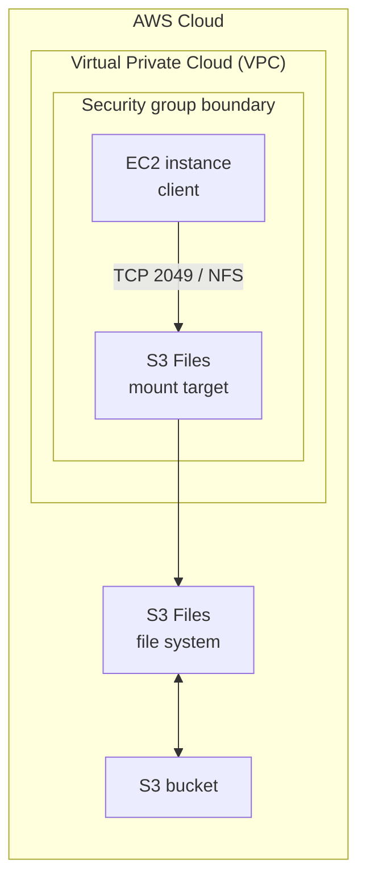

# S3 Files 完整流程圖教學書：補完 EC2 mount 與雙向同步

日期：2026-07-21  
對應新聞：https://aws.amazon.com/tw/blogs/aws/launching-s3-files-making-s3-buckets-accessible-as-file-systems/  
目的：把 AWS News Blog 圖中的完整流程做完，從已建立的 S3 Files resource path 延伸到 EC2 instance mount，最後驗證 `S3 -> mount` 與 `mount -> S3`。

> 本教學會建立 EC2、Internet Gateway、route table、key pair、IAM instance profile 等資源，會產生成本。若只是要證明 S3 Files 可建立，到 mount target 就已完成 A 段；若要完整證明「像檔案系統一樣使用」，才繼續本教學。

## 0. 這張圖在說什麼



你目前已做到：

- S3 bucket 建立。
- bucket versioning / SSE-S3 encryption 完成。
- `hello-from-s3.txt` 已上傳到 `poc/` prefix。
- S3 Files service role 建立。
- S3 Files file system 已建立過，後來誤刪後又重建。
- VPC / subnet / security group / mount target 已做到一定程度。

接下來要補的，是圖左側的 EC2 client：

- 讓 VPC 可以用 SSH 連入 EC2。
- 建立 EC2 instance role / profile。
- 建立 EC2 key pair。
- 啟動 Amazon Linux EC2。
- 從 EC2 mount S3 Files。
- 驗證 S3 檔案是否在 mount path 看得到。
- 從 mount path 寫檔，再確認 S3 bucket 看得到。

## 1. 先恢復 PowerShell 變數

在新的 PowerShell 先回專案目錄：

```powershell
cd "C:\Users\youhs\Documents\實習專案"

$env:AWS_PAGER = ""
$Profile = "intern"
$Region = "ap-southeast-1"
$Name = "s3files-poc-202607201650"
$Bucket = $Name.ToLower()
$Prefix = "poc/"
$WorkDir = Join-Path (Get-Location) "poc\s3-files-cli-poc\.local\$Name"
New-Item -ItemType Directory -Force -Path $WorkDir | Out-Null

$AccountId = aws sts get-caller-identity --profile $Profile --query "Account" --output text
$BucketArn = "arn:aws:s3:::$Bucket"
$RoleName = "$Name-role"
```

找回目前新的 S3 Files file system。不要使用已刪除的舊 file system ID。

```powershell
$FileSystemId = aws s3files list-file-systems `
  --profile $Profile `
  --region $Region `
  --query "fileSystems[?bucket=='$BucketArn'].fileSystemId | [0]" `
  --output text

$FileSystemId
```

找回你有 subnet 的 VPC。你曾經不小心建立兩個 VPC；以下寫法用 subnet 反查正確 VPC。

```powershell
$SubnetId = aws ec2 describe-subnets `
  --profile $Profile `
  --region $Region `
  --filters Name=tag:Name,Values="$Name-subnet" `
  --query "Subnets[0].SubnetId" `
  --output text

$VpcId = aws ec2 describe-subnets `
  --profile $Profile `
  --region $Region `
  --subnet-ids $SubnetId `
  --query "Subnets[0].VpcId" `
  --output text

$ClientSgId = aws ec2 describe-security-groups `
  --profile $Profile `
  --region $Region `
  --filters Name=vpc-id,Values=$VpcId Name=group-name,Values="$Name-client-sg" `
  --query "SecurityGroups[0].GroupId" `
  --output text

$MountSgId = aws ec2 describe-security-groups `
  --profile $Profile `
  --region $Region `
  --filters Name=vpc-id,Values=$VpcId Name=group-name,Values="$Name-mount-sg" `
  --query "SecurityGroups[0].GroupId" `
  --output text

"FileSystem: $FileSystemId"
"VPC: $VpcId"
"Subnet: $SubnetId"
"Client SG: $ClientSgId"
"Mount SG: $MountSgId"
```

成功標準：

- `$FileSystemId` 是新的 `fs-...`。
- `$VpcId` 不是你那個沒有 subnet 的空 VPC。
- `$SubnetId`、`$ClientSgId`、`$MountSgId` 都有值。

## 2. 確認 mount target

```powershell
aws s3files list-mount-targets `
  --profile $Profile `
  --region $Region `
  --file-system-id $FileSystemId `
  --output table
```

如果已經有 mount target，繼續第 3 章。  
如果沒有，使用現有 subnet 和 mount SG 建立：

```powershell
$MtResponseJson = aws s3files create-mount-target `
  --profile $Profile `
  --region $Region `
  --file-system-id $FileSystemId `
  --subnet-id $SubnetId `
  --security-groups $MountSgId `
  --output json

$MtResponse = $MtResponseJson | ConvertFrom-Json
$MountTargetId = if ($MtResponse.mountTarget.mountTargetId) { $MtResponse.mountTarget.mountTargetId } else { $MtResponse.mountTargetId }
$MountTargetId
```

## 3. 讓 VPC 可以連進 EC2

你現在的 VPC 是私有 VPC。若要用 SSH 進 EC2，需要：

- Internet Gateway。
- route table 的 `0.0.0.0/0` route。
- subnet 自動指派 public IP，或 run instance 時指定 public IP。
- client security group 開 SSH，但只開給你自己的 public IP。

建立 Internet Gateway：

```powershell
$IgwId = aws ec2 create-internet-gateway `
  --profile $Profile `
  --region $Region `
  --tag-specifications "ResourceType=internet-gateway,Tags=[{Key=Name,Value=$Name-igw}]" `
  --query "InternetGateway.InternetGatewayId" `
  --output text

aws ec2 attach-internet-gateway `
  --profile $Profile `
  --region $Region `
  --internet-gateway-id $IgwId `
  --vpc-id $VpcId

$IgwId
```

建立 route table 並關聯 subnet：

```powershell
$RouteTableId = aws ec2 create-route-table `
  --profile $Profile `
  --region $Region `
  --vpc-id $VpcId `
  --tag-specifications "ResourceType=route-table,Tags=[{Key=Name,Value=$Name-public-rt}]" `
  --query "RouteTable.RouteTableId" `
  --output text

aws ec2 create-route `
  --profile $Profile `
  --region $Region `
  --route-table-id $RouteTableId `
  --destination-cidr-block 0.0.0.0/0 `
  --gateway-id $IgwId

$RouteAssocId = aws ec2 associate-route-table `
  --profile $Profile `
  --region $Region `
  --route-table-id $RouteTableId `
  --subnet-id $SubnetId `
  --query "AssociationId" `
  --output text

aws ec2 modify-subnet-attribute `
  --profile $Profile `
  --region $Region `
  --subnet-id $SubnetId `
  --map-public-ip-on-launch

"Route table: $RouteTableId"
"Route association: $RouteAssocId"
```

只允許你目前的 public IP SSH 進 client SG：

```powershell
$MyIp = (Invoke-RestMethod "https://checkip.amazonaws.com").Trim()

aws ec2 authorize-security-group-ingress `
  --profile $Profile `
  --region $Region `
  --group-id $ClientSgId `
  --protocol tcp `
  --port 22 `
  --cidr "$MyIp/32"

"SSH allowed from: $MyIp/32"
```

如果出現 duplicate rule，代表之前已加過，可忽略。

## 4. 建立 EC2 client role / instance profile

EC2 client 需要權限去 mount S3 Files，也需要讀 bucket 中的測試檔。

建立 EC2 assume role trust policy：

```powershell
$Ec2RoleName = "$Name-ec2-role"
$InstanceProfileName = "$Name-ec2-profile"

$Ec2TrustPolicy = @'
{
  "Version": "2012-10-17",
  "Statement": [
    {
      "Effect": "Allow",
      "Principal": {
        "Service": "ec2.amazonaws.com"
      },
      "Action": "sts:AssumeRole"
    }
  ]
}
'@

$Ec2TrustPath = Join-Path $WorkDir "ec2-trust-policy.json"
[System.IO.File]::WriteAllText($Ec2TrustPath, $Ec2TrustPolicy, (New-Object System.Text.UTF8Encoding($false)))

aws iam create-role `
  --profile $Profile `
  --role-name $Ec2RoleName `
  --assume-role-policy-document "file://$Ec2TrustPath"
```

如果 `EntityAlreadyExists`，代表 role 已存在，繼續下一步。

附加 AWS managed policy：

```powershell
aws iam attach-role-policy `
  --profile $Profile `
  --role-name $Ec2RoleName `
  --policy-arn "arn:aws:iam::aws:policy/AmazonS3FilesClientFullAccess"
```

補 bucket read inline policy：

```powershell
$Ec2BucketReadPolicy = @"
{
  "Version": "2012-10-17",
  "Statement": [
    {
      "Sid": "S3ObjectReadAccess",
      "Effect": "Allow",
      "Action": [
        "s3:GetObject",
        "s3:GetObjectVersion"
      ],
      "Resource": "$BucketArn/*"
    },
    {
      "Sid": "S3BucketListAccess",
      "Effect": "Allow",
      "Action": "s3:ListBucket",
      "Resource": "$BucketArn"
    }
  ]
}
"@

$Ec2BucketReadPath = Join-Path $WorkDir "ec2-bucket-read-policy.json"
[System.IO.File]::WriteAllText($Ec2BucketReadPath, $Ec2BucketReadPolicy, (New-Object System.Text.UTF8Encoding($false)))

aws iam put-role-policy `
  --profile $Profile `
  --role-name $Ec2RoleName `
  --policy-name "$Name-ec2-bucket-read" `
  --policy-document "file://$Ec2BucketReadPath"
```

建立 instance profile：

```powershell
aws iam create-instance-profile `
  --profile $Profile `
  --instance-profile-name $InstanceProfileName

aws iam add-role-to-instance-profile `
  --profile $Profile `
  --instance-profile-name $InstanceProfileName `
  --role-name $Ec2RoleName

Start-Sleep -Seconds 20
```

如果 `create-instance-profile` 或 `add-role-to-instance-profile` 顯示已存在，就跳過或確認：

```powershell
aws iam get-instance-profile `
  --profile $Profile `
  --instance-profile-name $InstanceProfileName `
  --query "InstanceProfile.Roles[].RoleName" `
  --output table
```

## 5. 建立 SSH key pair

你剛剛查過沒有 key pair。這裡建立一個暫時 key，存在 `.local/`，不要上傳 Git。

```powershell
$KeyName = "$Name-key"
$KeyPath = Join-Path $WorkDir "$KeyName.pem"

$KeyMaterial = aws ec2 create-key-pair `
  --profile $Profile `
  --region $Region `
  --key-name $KeyName `
  --query "KeyMaterial" `
  --output text

[System.IO.File]::WriteAllText($KeyPath, $KeyMaterial, (New-Object System.Text.UTF8Encoding($false)))
icacls $KeyPath /inheritance:r | Out-Null
icacls $KeyPath /grant:r "$($env:USERNAME):R" | Out-Null

$KeyPath
```

如果 key pair 已存在但本機沒有 `.pem`，不要覆蓋。改新 key name：

```powershell
$KeyName = "$Name-key-2"
$KeyPath = Join-Path $WorkDir "$KeyName.pem"
```

再重跑 create-key-pair。

## 6. 啟動 EC2 instance

找 Amazon Linux 2023 AMI：

```powershell
$AmiId = aws ec2 describe-images `
  --profile $Profile `
  --region $Region `
  --owners amazon `
  --filters Name=name,Values="al2023-ami-2023*kernel-6.1*x86_64" Name=architecture,Values=x86_64 Name=virtualization-type,Values=hvm `
  --query "sort_by(Images,&CreationDate)[-1].ImageId" `
  --output text

$AmiId
```

啟動 EC2：

```powershell
$InstanceId = aws ec2 run-instances `
  --profile $Profile `
  --region $Region `
  --image-id $AmiId `
  --instance-type t3.micro `
  --subnet-id $SubnetId `
  --security-group-ids $ClientSgId `
  --iam-instance-profile Name=$InstanceProfileName `
  --key-name $KeyName `
  --associate-public-ip-address `
  --tag-specifications "ResourceType=instance,Tags=[{Key=Name,Value=$Name-ec2-client}]" `
  --query "Instances[0].InstanceId" `
  --output text

aws ec2 wait instance-running `
  --profile $Profile `
  --region $Region `
  --instance-ids $InstanceId

$PublicIp = aws ec2 describe-instances `
  --profile $Profile `
  --region $Region `
  --instance-ids $InstanceId `
  --query "Reservations[0].Instances[0].PublicIpAddress" `
  --output text

"Instance: $InstanceId"
"Public IP: $PublicIp"
```

等 EC2 status check 起來：

```powershell
aws ec2 describe-instance-status `
  --profile $Profile `
  --region $Region `
  --instance-ids $InstanceId `
  --output table
```

## 7. SSH 進 EC2

```powershell
ssh -i $KeyPath ec2-user@$PublicIp
```

第一次會問是否 trust host，輸入 `yes`。

如果 SSH timeout：

- 確認 `$PublicIp` 不是空的。
- 確認 route table 有 `0.0.0.0/0 -> igw-...`。
- 確認 client SG inbound 22 是你的 `$MyIp/32`。
- 確認公司網路沒有阻擋 SSH outbound。

## 8. 在 EC2 上 mount S3 Files

以下在 EC2 terminal 裡跑，不是在本機 PowerShell。

安裝 / 更新 mount helper：

```bash
sudo yum -y install amazon-efs-utils
rpm -q amazon-efs-utils
```

建立 mount point：

```bash
sudo mkdir -p /mnt/s3files
```

把下面的 `fs-xxxxxxxxxxxxxxxxx` 換成你的 `$FileSystemId`：

```bash
FS="fs-xxxxxxxxxxxxxxxxx"
sudo mount -t s3files $FS:/ /mnt/s3files
```

驗證 mount：

```bash
df -h /mnt/s3files
findmnt -T /mnt/s3files
```

## 9. 驗證 S3 -> mount

你之前已經把 `hello-from-s3.txt` 放到 S3 的 `poc/` prefix。

在 EC2 上跑：

```bash
ls -la /mnt/s3files
ls -la /mnt/s3files/poc
cat /mnt/s3files/poc/hello-from-s3.txt
```

如果暫時看不到，等 30-90 秒再試。S3 Files 同步不是零延遲。

## 10. 驗證 mount -> S3

在 EC2 上寫檔：

```bash
echo "hello from mounted S3 Files $(date -Iseconds)" | sudo tee /mnt/s3files/poc/hello-from-mount.txt
sync
```

回本機 PowerShell 查 S3。同步可能需要數秒到數分鐘。

```powershell
aws s3 ls "s3://$Bucket/$Prefix" --profile $Profile --region $Region
aws s3 cp "s3://$Bucket/$Prefix/hello-from-mount.txt" - --profile $Profile --region $Region
```

成功標準：

- EC2 mount path 讀得到 `hello-from-s3.txt`。
- S3 bucket 讀得到 `hello-from-mount.txt`。

到這裡，完整流程圖 PoC 才算完成。

## 11. 完成後要記錄的證據

不要貼完整 account id、完整 ARN、private key、presigned URL。

```text
S3 bucket：存在，versioning/encryption 已啟用
S3 Files file system：fs-...，status=available
Mount target：fsmt-...，status=...
VPC/subnet：vpc-... / subnet-...
Security group：client SG / mount target SG，TCP 2049 已允許
EC2：i-...，可 SSH
S3 -> mount：hello-from-s3.txt 可讀
mount -> S3：hello-from-mount.txt 可在 S3 讀回
限制：同步有延遲；本次是 PoC，不代表正式導入
```

## 12. Cleanup

完成證據截取後立刻 cleanup，避免成本。

### EC2 上 unmount

```bash
sudo umount /mnt/s3files
exit
```

### 本機 PowerShell 清 EC2

```powershell
aws ec2 terminate-instances `
  --profile $Profile `
  --region $Region `
  --instance-ids $InstanceId

aws ec2 wait instance-terminated `
  --profile $Profile `
  --region $Region `
  --instance-ids $InstanceId
```

### 刪 mount target

```powershell
$MountTargetIds = aws s3files list-mount-targets `
  --profile $Profile `
  --region $Region `
  --file-system-id $FileSystemId `
  --query "mountTargets[].mountTargetId" `
  --output text

foreach ($MtId in ($MountTargetIds -split "\s+")) {
  if ($MtId) {
    aws s3files delete-mount-target `
      --profile $Profile `
      --region $Region `
      --mount-target-id $MtId
  }
}

Start-Sleep -Seconds 120
```

### 刪 file system

```powershell
aws s3files delete-file-system `
  --profile $Profile `
  --region $Region `
  --file-system-id $FileSystemId `
  --force-delete
```

### 清 bucket version 並刪 bucket

```powershell
aws s3 rm "s3://$Bucket" --recursive --profile $Profile --region $Region

$VersionsJson = aws s3api list-object-versions `
  --profile $Profile `
  --region $Region `
  --bucket $Bucket `
  --output json

$Versions = $VersionsJson | ConvertFrom-Json

foreach ($Obj in @($Versions.Versions) + @($Versions.DeleteMarkers)) {
  if ($Obj -and $Obj.Key -and $Obj.VersionId) {
    aws s3api delete-object `
      --profile $Profile `
      --region $Region `
      --bucket $Bucket `
      --key $Obj.Key `
      --version-id $Obj.VersionId | Out-Null
  }
}

aws s3api delete-bucket `
  --profile $Profile `
  --region $Region `
  --bucket $Bucket
```

### 刪 IAM

```powershell
aws iam remove-role-from-instance-profile `
  --profile $Profile `
  --instance-profile-name $InstanceProfileName `
  --role-name $Ec2RoleName

aws iam delete-instance-profile `
  --profile $Profile `
  --instance-profile-name $InstanceProfileName

aws iam delete-role-policy `
  --profile $Profile `
  --role-name $Ec2RoleName `
  --policy-name "$Name-ec2-bucket-read"

aws iam detach-role-policy `
  --profile $Profile `
  --role-name $Ec2RoleName `
  --policy-arn "arn:aws:iam::aws:policy/AmazonS3FilesClientFullAccess"

aws iam delete-role `
  --profile $Profile `
  --role-name $Ec2RoleName

aws iam delete-role-policy `
  --profile $Profile `
  --role-name $RoleName `
  --policy-name "$Name-policy"

aws iam delete-role `
  --profile $Profile `
  --role-name $RoleName
```

### 刪 key pair

```powershell
aws ec2 delete-key-pair `
  --profile $Profile `
  --region $Region `
  --key-name $KeyName
```

本機 `.pem` 可以留在 `.local/` 到你確認 cleanup 完成後再手動刪除；`.local/` 不會進 Git。

### 刪 security groups / route / IGW / subnet / VPC

```powershell
aws ec2 delete-security-group --profile $Profile --region $Region --group-id $MountSgId
aws ec2 delete-security-group --profile $Profile --region $Region --group-id $ClientSgId

aws ec2 disassociate-route-table `
  --profile $Profile `
  --region $Region `
  --association-id $RouteAssocId

aws ec2 delete-route-table `
  --profile $Profile `
  --region $Region `
  --route-table-id $RouteTableId

aws ec2 detach-internet-gateway `
  --profile $Profile `
  --region $Region `
  --internet-gateway-id $IgwId `
  --vpc-id $VpcId

aws ec2 delete-internet-gateway `
  --profile $Profile `
  --region $Region `
  --internet-gateway-id $IgwId

aws ec2 delete-subnet `
  --profile $Profile `
  --region $Region `
  --subnet-id $SubnetId

aws ec2 delete-vpc `
  --profile $Profile `
  --region $Region `
  --vpc-id $VpcId
```

你還曾建立過一個沒有 subnet 的 extra VPC。若確認它沒有被使用，再刪：

```powershell
$ExtraVpcId = "<填你前面誤建、且確認沒有 subnet/SG/route/IGW 的 VPC ID>"
aws ec2 delete-vpc --profile $Profile --region $Region --vpc-id $ExtraVpcId
```

## 13. 參考來源

- AWS News Blog - Launching S3 Files: https://aws.amazon.com/tw/blogs/aws/launching-s3-files-making-s3-buckets-accessible-as-file-systems/
- S3 Files user guide: https://docs.aws.amazon.com/AmazonS3/latest/userguide/s3-files.html
- Mounting S3 file systems on EC2: https://docs.aws.amazon.com/AmazonS3/latest/userguide/s3-files-mounting.html
- S3 Files prerequisites and policies: https://docs.aws.amazon.com/AmazonS3/latest/userguide/s3-files-prereq-policies.html
