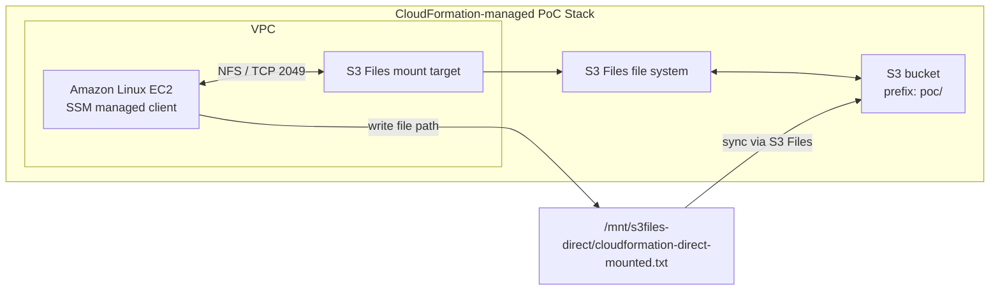

# S3 Files 雷達式 PoC 報告

日期：2026-07-21  
主題：以技術雷達 S1-S5 架構驗證 AWS News Blog「Launching S3 Files, making S3 buckets accessible as file systems」  
狀態：CloudFormation-managed PoC 已建立並完成 S4 端到端驗證；待 cleanup  
安全處理：本文不保存完整 account ID、ARN、IP、private key、resource IDs 或 presigned URL。

## 一句話結論

這次已從「手動 CLI PoC」升級成「技術雷達式 PoC」：先用 S1-S5 判斷 S3 Files 是否值得驗證，再用 CloudFormation 建立一套可在 AWS Console / CloudFormation 查看資源關係的 PoC stack，最後用 EC2 mount path 寫檔並從 S3 讀回，完成新聞核心主張驗證。

## 本次 PoC 和新聞的對齊程度

| AWS News Blog 架構元素 | 本次 CloudFormation PoC | 狀態 |
|---|---|---|
| S3 bucket 作為資料來源 | 建立測試 S3 bucket 並啟用 versioning / SSE-S3 | 已完成 |
| S3 Files file system | 建立 S3 Files file system，綁定 S3 bucket prefix | 已完成 |
| VPC 內 mount target | 建立 VPC、public subnet、security group、mount target | 已完成 |
| EC2 client | 建立 Amazon Linux 2023 EC2 test client | 已完成 |
| NFS / file-system mount | EC2 以 `mount -t s3files` 掛載到 `/mnt/s3files-direct` | 已完成 |
| 從 file path 寫回 S3 | EC2 mount path 寫入 `cloudformation-direct-mounted.txt` | 已完成 |
| S3 端讀回檔案 | PowerShell 從 S3 讀回同一檔案內容 | 已完成 |
| CloudFormation 可視化 | 這次由 CloudFormation 建立 stack，因此可在 CloudFormation / Infrastructure Composer 查看模板與資源 | 已完成 |

## S1-S5 執行軌跡

### S1 Scan

輸入來源：

- AWS News Blog：S3 Files launch article。
- 既有專案資料：`research/s3-files-s1-s5-evaluation-2026-07-20.md`。
- 既有手動 PoC 證據：`S3-Files手動部署去識別化證據摘錄-2026-07-21.md`。

判斷結果：

- 技術主張明確：讓 S3 bucket 可作為 file system 被 compute client 掛載。
- 可外部驗證：不需公司內部系統架構，不碰 PII。
- 可用 AWS CLI / CloudFormation 建立最小 PoC。

### S2 Compare

比較重點：

| 選項 | 適合場景 | 本次取捨 |
|---|---|---|
| S3 API | 應用可直接使用 object API | 不能證明新聞的 file-system access 主張 |
| EFS | 傳統共享 NFS 檔案系統 | 資料不直接落在 S3 bucket object 模型 |
| S3 Files | 資料在 S3，但 workload 需要 file path / NFS mount | 本次主方案 |
| DataSync | 資料搬移或同步 | 不是互動式 mount |

選擇 S3 Files 的原因：

- 最貼近新聞架構。
- 可用 EC2 mount path 做端到端驗證。
- 可保留 CloudFormation-managed stack，解決前一次 CLI direct resource 無法在 CloudFormation 看到的問題。

### S3 Evaluate

評估結果：

| 評估面向 | 判斷 |
|---|---|
| 技術成熟度 | 可做 PoC，但仍需注意新服務限制與權限細節 |
| AWS 適配 | 高，完全在 AWS 內完成 |
| PoC 難度 | 中，需要 VPC、IAM、S3 Files、EC2、mount helper |
| 風險 | 中，主要是成本、cleanup、IAM/POSIX 權限與同步延遲 |
| 公司適用性 | 適合「資料在 S3，但既有工具或 workload 需要檔案路徑」的情境 |

評估結論：

進入 S4 驗證是合理的，因為本題不需 Bedrock、不需內部業務資料、不需公司系統權限，且能產生可重現技術證據。

### S4 Validate

驗證方法：

1. 使用 `cloudformation/s3-files-self-contained.yaml` 建立新的 CloudFormation stack。
2. 開啟 `CreateTestInstance=true`，由 stack 建立 Amazon Linux 2023 EC2。
3. 等 CloudFormation stack `CREATE_COMPLETE`。
4. 等 EC2 status check 變為 `running / ok / passed`。
5. 使用 SSM 檢查 EC2 內部狀態。
6. 以 SSM 在 EC2 上執行 direct mount：

```bash
sudo mount -t s3files [FILE_SYSTEM_ID]:/ /mnt/s3files-direct
```

7. 從 mount path 寫入：

```text
cloudformation-direct-mounted.txt
hello from cfn direct mount [TIMESTAMP]
```

8. 等待 S3 Files 同步後，用 PowerShell 從 S3 讀回同一檔案。

驗證證據：

```text
CloudFormation stack status: CREATE_COMPLETE
EC2 status: running / ok / passed
S3 Files file system status: available
Mount target status: available
findmnt FSTYPE: nfs4
S3 object: cloudformation-direct-mounted.txt
S3 read-back content: hello from cfn direct mount [TIMESTAMP]
```

重要發現：

- Stack 建立成功不等於應用層驗證成功；CloudFormation 不會自動知道 UserData 寫檔是否成功。
- 原本 access point mount 可成功 mount，但寫入根目錄時遇到 POSIX `Permission denied`。
- 以 file system direct mount 後可寫入並同步回 S3。
- 已修正 `cloudformation/s3-files-self-contained.yaml`：預設 UserData 改用 direct mount 寫回證據檔，access point mount command 保留為選配輸出。

### S5 Report

本次交付物：

- `cloudformation/s3-files-self-contained.yaml`：可部署的 CloudFormation-managed PoC template。
- `poc/s3-files-cli-poc/S3-Files雷達式PoC報告-2026-07-21.md`：本報告。
- `poc/s3-files-cli-poc/S3-Files手動部署去識別化證據摘錄-2026-07-21.md`：前一次手動 CLI PoC 的安全證據摘錄。
- `poc/s3-files-cli-poc/S3-Files-CLI實作流程圖-2026-07-21.md`：CLI direct resource 與 CloudFormation-managed resource 的差異說明。

## 架構圖



## Cleanup 提醒

目前本次 CloudFormation-managed PoC 仍會產生成本，主要來自：

- EC2 test instance。
- S3 Files file system / mount target。
- S3 bucket / object / request。
- VPC 相關資源。

晚點 cleanup 前，先保留 stack name 與 bucket output。建議流程：

```powershell
$Profile = "intern"
$Region = "ap-southeast-1"
$StackName = "s3files-news-demo-202607211626"

$Bucket = aws cloudformation describe-stacks `
  --profile $Profile `
  --region $Region `
  --stack-name $StackName `
  --query "Stacks[0].Outputs[?OutputKey=='BucketName'].OutputValue | [0]" `
  --output text

aws cloudformation delete-stack `
  --profile $Profile `
  --region $Region `
  --stack-name $StackName

aws cloudformation wait stack-delete-complete `
  --profile $Profile `
  --region $Region `
  --stack-name $StackName
```

注意：

- Template 內的 S3 bucket 設為 retain，避免 stack 刪除時誤刪資料。
- 若要刪 bucket，需要另外清空 bucket versions / delete markers 後再刪。
- 前一次手動 CLI PoC 的 EC2 / S3 Files / VPC / IAM / key pair 也還需要另外 cleanup，不能只刪這次 CloudFormation stack。

## 對專案主線的意義

這次 PoC 證明技術雷達不只是摘要新聞，而是可以：

1. 從短新聞抓出可驗證技術主張。
2. 對比替代 AWS 服務並做可行性評估。
3. 建立 CloudFormation-managed 最小環境。
4. 用 AWS 帳號內真實資源完成端到端驗證。
5. 把錯誤、修正、證據與 cleanup 風險寫成可給人類審核的報告。

