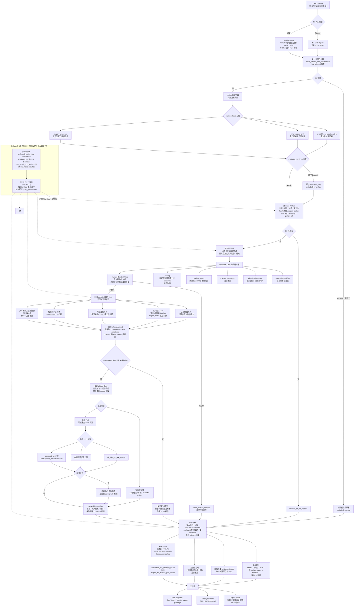

# Agentic Cloud Radar 設計基線

## 1. 目標

把「看見一篇新技術新聞」走到「有證據、可量測、可停止的 PoC 提案」：

```text
S1 Scan -> S2 Compare + Proposal -> S3 Evaluate -> human gate -> S4 Validate -> S5 Report
```

## 2. 入口

系統沒有入口 S0。入口只有兩種：

1. 使用者指定公開 URL：直接進 `S1 URL Import`。
2. 使用者要求技術探索：直接進 `S1 Discovery`。

URL import 仍有 HTTPS、trusted host、redirect、content-type 的資料安全檢查；這些是來源驗證，不是需求審查。

## 3. 五個 Skills

| Skill | 產物 | 不能做的事 |
| --- | --- | --- |
| S1 Scan | 真實候選、來源、擷取文字、GA evidence、data gaps | 不推薦、不做商業適配結論 |
| S2 Compare | 候選提案卡、比較矩陣、改善假設、利弊、驗證設計 | 不自動選題、不把 unknown 補成事實 |
| S3 Evaluate | 人類短名單的比較與決策依據 | 不繞過人工 shortlist |
| S4 Validate | 已核准且可 cleanup 的低風險驗證 | 不碰敏感／production data，不超 USD 3 |
| S5 Report | 可回查的結論、限制、證據與後續 | 不把估計寫成已驗證 |

## 4. S2 的提案卡規格

每個 S1 candidate 都要有：

- Source-backed technology mechanism。
- 待確認的問題、使用者、baseline、成功條件。
- Potential improvement vectors 與量化／質化證據等級。
- Benefits（有來源）與 tradeoffs（標 source fact 或 planning inference）。
- 成熟度、文件／定價／區域證據、環境訊號。
- Before/after metrics、stop conditions、下一個人工問題。

S2 的 purpose 是讓 Mentor 或使用者可以從同一張矩陣判斷「哪張提案值得花時間補情境」，不是讓模型假裝能直接排序。

## 5. 證據原則

- 每個候選都保留 source URL、是否真實 fetch、來源類型與 data gaps。
- 官方 AWS 來源才能被用來證明 AWS GA；GitHub 等公開來源只證明該專案的公開存在與 metadata。
- 價格與 Region 未查到時，輸出 unknown 或 review note，不要求使用者補環境表單。
- `ap-southeast-1` 不再是 shortlist 或 PoC 審查硬門檻。S2 只標記 Region status：有功能級官方證據時為 `available_ap_southeast_1`，未查到時為 `region_unknown` warning。
- 只把 verified、implemented awaiting validation、estimated 三種主張分開寫。

## 6. 目前完整流程圖


