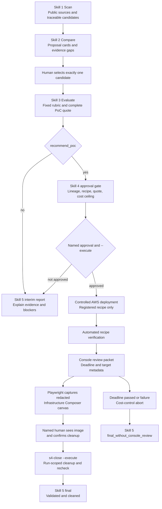

# Agentic Cloud Radar Design Baseline

## Purpose

This project evaluates cloud technology evidence in five stages. It is an evidence and controlled-PoC workflow, not a production AWS platform by itself.

## Current Flow

## Stage Boundaries

- Skill 1 and Skill 2 may process many candidates.
- Skill 3 onward operates on exactly one human-selected candidate.
- Skill 3 always creates the complete non-binding PoC quote before Skill 4 can deploy.
- Skill 4 is the only resource-creating, potentially paid PoC stage. There is no separate low-risk Skill 4 track.
- A screenshot is checked by a human. Software validates its evidence binding and privacy contract, not the screenshot pixels.
- New `s4.runtime-evidence.v3` runs become actual-PoC `final` only after cleanup, screenshot metadata, and `display_channel_confirmed` are all recorded.
- `s4-abort` is cost control. It may verify cleanup but never creates a normal Console-reviewed final conclusion.

## Cost and Evidence Rules

- A Skill 3 quote is a public-rate-card estimate unless it explicitly records `live_pricing_api_used=true`.
- Runtime duration and CloudFormation status are not actual billing evidence.
- Actual cost remains `pending` until an attributable Billing, Cost Explorer, or CUR artifact is available.
- `recommend_poc` means technical eligibility for one controlled PoC. It does not prove workload fit or approve production adoption.

## Productization Boundary

The five Skills do not claim to be the full production architecture. A production deployment still needs separately implemented identity, API, orchestration, persistence, observability, security, and CI/CD components.
