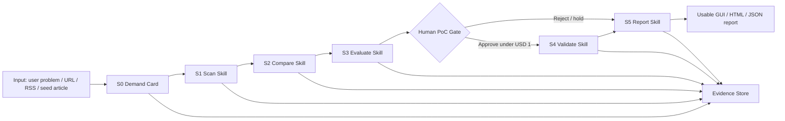

# AI Agentic 雲端技術雷達與評估系統設計基準

狀態：討論草案
日期：2026-07-24
目的：建立新版 AWS 技術雷達的設計邊界，先對齊定位、證據、評分、PoC、部署與 Skill 化，再開始寫程式。

## 1. 新版定位

正式名稱：AI Agentic 雲端技術雷達與評估系統。

建議 AWS resource prefix：`agentic-cloud-radar`。若需要區分環境，使用 `agentic-cloud-radar-dev`、`agentic-cloud-radar-test`、`agentic-cloud-radar-prod`。資源名稱不使用中文、空白或版本詞。

新版雷達不是「AI 自動幫公司選技術」，而是「有證據鏈、有人工閘門、可驗證的技術決策輔助系統」。

它要幫使用者把 AWS 新聞、官方文件或指定文章，整理成可被主管或架構人員審查的判斷材料：

- 這篇文章提到什麼新能力或服務變化。
- 它可能對公司情境有什麼價值。
- 目前有哪些證據支持這個判斷。
- 哪些內容只是推論或仍缺資料。
- 是否值得進入低成本 PoC。
- PoC 做完後，哪些假設被驗證，哪些還不能宣稱成立。

## 2. 非目標

新版雷達明確不做以下事情：

- 不自動代表公司做採用決策。
- 不在 S4 前自動建立付費 AWS PoC 資源。
- 不把 LLM 推論寫成已查證事實。
- 不把內建靜態案例寫成即時外部企業比較。
- 不把 GCP / Azure 比較設計成另一條平行流程；它只出現在最終報告的補充比較區。
- 不為了展示漂亮而省略失敗、fallback、權限限制、cleanup 或成本風險。

## 3. 交付型態

新版完整系統要同時有兩種交付型態。

### 3.1 GUI 可用操作版

GUI 不是純展示圖，而是要能實際使用的前端。後續預期部署到 S3 靜態網站，必要時搭配 CloudFront、API Gateway 與 Cognito。

GUI 的用途是讓使用者真的操作雷達流程，同時讓主管快速理解狀態。它應該能處理：

- 輸入文章 URL、貼上文章內容、或選擇 RSS 候選。
- 建立一次新的 radar run。
- 查看 S1 到 S5 每一階段狀態。
- 查看分數、證據強度、不確定性。
- 查看每個判斷背後的證據。
- 在 human gate 核准、拒絕或補充 PoC 條件。
- 查看 PoC 執行狀態與 cleanup 狀態。
- 開啟 HTML 報告或下載 JSON artifacts。

GUI 不是核心判斷來源。它只能呼叫後端 API 或讀取後端產物，不能把評分、證據判斷或 PoC 邏輯寫死在前端。

### 3.2 五個可拆 Skill

五個 Skill 是長期可交接、可重複使用的核心產物。公司人員應該可以單獨使用其中一個 Skill，也可以把五個 Skill 串起來跑完整流程。

每個 Skill 都必須有清楚的：

- 輸入格式。
- 輸出格式。
- 責任邊界。
- 使用的資料來源。
- 可能疏漏。
- 驗證方式。
- 不能宣稱的事情。

### 3.3 Python CLI 的角色

Python CLI 不是給主管看的主要介面，也不是要取代 GUI。它的用途是讓五個 Skill 可以被測試、重現與自動化。

CLI 的好處：

- 本機開發時不用部署 AWS，也能測 S0 到 S5 的資料格式和邏輯。
- 展示前可以用固定輸入重跑一遍，確認報告沒有壞。
- 公司人員日後若不想開 GUI，也可以用命令列批次跑多篇新聞。
- CI/CD 可以用 CLI 跑測試，檢查每個 Skill 是否還能輸出合法 JSON。
- AWS Lambda handler 可以共用同一套核心 Python 函式，避免 GUI、CLI、Lambda 三套邏輯各寫一份。

建議做法：五個 Skill 的核心邏輯寫成 Python package；再提供兩層入口，一層是 CLI，另一層是 AWS Lambda handler。GUI 呼叫後端 API，不直接執行核心判斷。

## 4. S0 需求卡

S0 放在 S1 前面，作為新版雷達的需求入口。它的責任不是對外搜尋，而是把人類需求整理成後續 S1 到 S5 可以使用的需求卡。

責任：

- 記錄使用者想解決的業務或技術問題。
- 記錄現有方法為何不足。
- 記錄限制條件，例如成本、區域、資安、不可用服務。
- 記錄成功標準。
- 檢查輸入是否含敏感資訊。
- 讓人類確認後再進入 S1 Scan。

輸入：

- 使用者自由描述。
- 可選的系統場景。
- 可選的成功標準與限制條件。

輸出：

- 需求摘要。
- 技術搜尋方向。
- 排除條件。
- 成功標準。
- 敏感資訊檢查結果。
- 人工確認狀態。

不能做：

- 不自行開始外部搜尋。
- 不自行判定公司真正需求。
- 不把模糊需求直接送進 PoC。

可能不可靠因素：

- 使用者一開始描述不完整。
- 公司內部限制未被輸入。
- 敏感資訊檢查可能漏判。
- 需求卡過度簡化後，可能讓後續評分偏掉。

## 5. S1 到 S5 責任邊界

### S1 Scan

責任：讀取新聞、RSS、官方文章或受控人工輸入，抽出技術主題與基本資訊。

輸入：

- URL、標題、摘要、全文或 RSS item。
- S0 公司情境需求卡。

輸出：

- 技術名稱。
- 相關 AWS 服務。
- 文章主要宣稱。
- 可能應用場景。
- 來源類型。
- 初步標籤。
- 資料缺口。

不能做：

- 不做最終推薦。
- 不把文章宣傳語當成事實。
- 不把人工貼上的文章宣稱為當日自動掃到。

可能不可靠因素：

- 文章內容被截斷。
- 新聞標題誇大。
- RSS 摘要缺少限制條件。
- LLM 摘要可能漏掉重要但不顯眼的限制。

### S2 Compare

責任：比較候選技術與相關替代方案。

輸入：

- S1 輸出的技術主題與服務列表。
- 官方文件或可查證參考來源。
- S0 公司需求卡。

輸出：

- AWS 內部相近服務比較。
- GCP / Azure 對應服務比較。
- 功能差異。
- 適用情境差異。
- 資料來源與引用等級。

不能做：

- 不把 GCP / Azure 比較變成另一條技術雷達入口。
- 不因為某雲端也有類似服務，就提高 AWS 候選的採用分數。
- 不用靜態案例直接補強評分。

可能不可靠因素：

- 雲服務規格可能更新。
- 不同雲的同名能力不一定等價。
- 沒有公司內部架構資訊時，只能做一般性比較。
- runtime web search 可能查到過時、二手轉述或行銷內容，因此來源等級必須標示。

### S3 Evaluate

責任：用固定 rubric 評估候選是否值得進 PoC。

輸入：

- S1 掃描結果。
- S2 比較結果。
- 證據清單。
- 公司情境需求卡。

輸出：

- 各項指標分數。
- 每個分數的理由。
- 支援理由的證據。
- 證據強度。
- 信心等級。
- 是否建議送人工 PoC 審查。

建議評分指標：

- 公司情境適配度。
- 技術成熟度。
- 可整合性。
- PoC 可驗證性。
- 營運風險。
- 安全與治理風險。

重要規則：

- 技術分數和證據強度必須分開。
- 證據強度不能直接把技術分數加高。
- 沒有證據時要降信心，不要用流暢文字補洞。
- 最終 Top 3 必須在每個候選都完成 S1 到 S5 後，才能用平均分選出。
- S3 的正式權重、分數門檻與 PoC eligibility 條件尚未定案，需下一步專門討論。
- 成本不是主要技術價值分數；公司並非高度成本受限。成本應作為治理揭露、PoC 風險提示與人工核准條件，而不是直接把有價值但較貴的技術打低分。S4 PoC 另有小型驗證成本上限，避免把最小驗證做成大規模試點。

可能不可靠因素：

- 公司需求卡不完整。
- 只有一篇新聞，缺少官方限制說明。
- 權重設計可能偏向某些技術類型。
- LLM 可能過度推論商業價值。

### S4 Validate

責任：在人工核准後，用最小可行 PoC 驗證核心假設。

輸入：

- S3 評估結果。
- 人工核准紀錄。
- PoC 範圍。
- 成本上限。
- 成功標準。
- cleanup 計畫。
- 預設低風險 PoC 提醒線：USD 1。
- 單次小型 S4 PoC 成本硬上限：USD 3。

輸出：

- 要建立的 AWS 資源。
- 實際部署狀態。
- 測試步驟。
- 測試結果。
- 成本與耗時。
- 失敗與修正紀錄。
- cleanup 狀態。
- 哪些結論可以宣稱，哪些不能宣稱。

不能做：

- 沒有人核准就建立付費資源。
- 預估成本超過 USD 1 時，不代表技術不值得做；但必須明確說明成本、目的與 cleanup，再要求人工核准。
- 預估成本超過 USD 3 時，不應作為本系統的標準小型 S4 PoC 直接執行；應拆小、先做本機程式測試或文件驗證作為開發證據，或另案說明並取得更高層級核准。
- 把 CloudFormation template validation 寫成正式部署成功。
- 把 CLI 單點成功寫成端到端驗證。
- cleanup 未確認時宣稱資源已清掉。

可能不可靠因素：

- 測試規模太小。
- 公司帳戶權限與正式環境不同。
- PoC 沒有真實流量。
- 沒有資安審查或成本壓測。
- Console 人工確認與 CLI 查詢結果可能不同步。

### S5 Report

責任：把 S1 到 S4 的結果整理成主管看得懂、工程上可審查的報告。

輸入：

- S1 掃描輸出。
- S2 比較輸出。
- S3 評估輸出。
- S4 驗證輸出或未執行原因。
- 證據清單。
- 不可靠因素清單。

輸出：

- 摘要結論。
- 技術價值。
- 評分細節。
- 證據強度。
- PoC 狀態。
- 風險與限制。
- 建議下一步。
- 可宣稱與不可宣稱的結論。

不能做：

- 不用檔名和流水帳堆砌專業感。
- 不省略會影響判斷的細節。
- 不把靜態案例寫成外部查證。
- 不把 fallback 寫成正式 LLM 評分。

可能不可靠因素：

- 報告可能過度摘要，導致失去證據鏈。
- 使用者若只看結論，可能忽略限制。
- 外部案例如果沒有來源，不能支撐採用建議。

## 6. 證據分級

新版報告必須標示每個重要判斷的證據等級。

| 等級 | 來源 | 用途 |
|---|---|---|
| A | AWS 官方文件、AWS 官方 blog、service announcement、我們自己的 PoC 結果 | 可作為主要證據 |
| B | AWS solution、re:Post、官方 sample、可信技術白皮書 | 可作為輔助證據 |
| C | 新聞媒體、第三方文章、企業案例頁 | 可作為背景或參考 |
| D | LLM 推論、tag match、內建靜態案例、未查證資料 | 只能作為提示，不能直接支撐評分 |

允許 runtime web search，但必須符合以下規則：

- 搜尋結果要保存 URL、標題、擷取時間與用途。
- 重要結論優先引用官方或一手來源。
- 外部案例若無可追溯來源，只能標示為未查證，不可支撐評分。
- LLM 讀取搜尋結果後產生的摘要仍然是衍生內容，不能取代原始來源。

## 7. 評分原則

新版分數分成兩層。

第一層是技術評分，回答「這個技術本身是否值得追」。

第二層是證據信心，回答「我們有多相信這個判斷」。

這兩層不可混在一起。例如一個技術可能看起來很有價值，但如果只有一篇宣傳新聞，技術分數可以高，證據信心必須低。

建議輸出格式：

```json
{
  "technical_score": 4.1,
  "confidence": "medium",
  "dimensions": {
    "business_fit": {
      "score": 4,
      "reason": "可能改善大量非結構化文件存取流程",
      "evidence_ids": ["evidence-001"],
      "uncertainty": "缺少公司內部 workload 數據"
    }
  },
  "poc_recommendation": "eligible_for_human_review",
  "automatic_poc_start": false
}
```

## 8. 建議架構



建議 AWS 元件：

- Step Functions：串接 S1 到 S5，保留每階段狀態。
- Lambda：每個 Skill 對應一個或多個 handler。
- S3：存原文、證據、JSON、HTML 報告與 PoC artifacts。
- DynamoDB：存 run 狀態、人工 gate、分數、feedback、cleanup 狀態。
- Secrets Manager：存 API key 或外部服務憑證。
- CloudWatch：記錄錯誤、耗時、token、成本估算。
- CDK：作為正式基礎建設定義；CloudFormation 是 CDK synth 後的部署層。
- GUI：部署到 S3 靜態網站，必要時搭配 CloudFront；透過 API Gateway 呼叫後端流程，或讀取 S3 中已產生的報告 artifacts。

第一版優先順序：

1. 先完成後端資料流、S0 到 S5 schema、核心 Python package、CLI 測試入口與 Lambda handler 邊界。
2. 再完成 CDK 架構，讓 Step Functions、S3、DynamoDB、API 與 GUI hosting 的關係清楚。
3. GUI 要可實際操作，但第一版不追求最完整視覺包裝；先確保能輸入、啟動、查狀態、做 human gate、看報告。

## 9. 舊系統處理原則

可沿用：

- Step Functions 串接概念。
- S3 / DynamoDB 保存 artifacts 與 review log 的想法。
- human review gate 的方向。
- CDK 產生 CloudFormation，再用 CLI 或 Console 驗證的做法。
- S3 Files PoC 的教學與 cleanup 經驗。

需重做：

- 對外名稱與資源前綴。
- S5 報告邏輯。
- 靜態企業案例與評分的關係。
- 技術分數和證據信心混在一起的設計。
- 單一路徑流程未對齊的部分。
- 過度依賴 fallback 但報告口徑不夠清楚的部分。

暫不繼承：

- 任何沒有來源、只靠 tag overlap 的企業比較。
- 任何會讓使用者誤以為已完成正式公司環境驗證的文字。
- 任何帶有舊版命名的對外包裝。

## 10. 維運要求

新版每次 run 都應該能追到：

- 輸入來源。
- 每階段輸出。
- 每個分數的理由與證據。
- LLM 是否成功、fallback 是否啟動。
- token 或 API 成本估算。
- 人工 gate 決策。
- PoC 資源建立與清理狀態。
- 最終報告版本。

部署後的基本維運檢查：

- Step Functions 是否成功跑完。
- Lambda 是否有錯誤與 timeout。
- S3 artifacts 是否齊全。
- DynamoDB run 狀態是否一致。
- Secrets 是否存在但沒有外洩。
- CloudWatch 是否能看到每階段耗時與錯誤。
- PoC 資源是否已清理或仍在計費。

## 11. 下一步討論題

開始寫程式前，至少要先確認：

1. S3 評分指標、權重與 PoC 門檻。
2. 五個 Skill 是否同時提供 Codex Skill 與 Python CLI，或第一版先做 Python package + CLI，再包成 Codex Skill。
3. runtime web search 的允許來源白名單與引用格式。
4. GUI 第一版的最小可用畫面。
5. 後端 API 是否第一版就加入 Cognito，或先用本地／受控部署測試。
