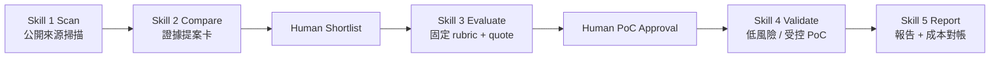

# S1-S5 Skills 第一版 Mentor Review Package - 2026-07-31

## Review 目標

本文件整理「AI Agentic 雲端技術雷達與評估系統」第一版可交付範圍，供 Mentor 檢查五個 repository-backed Skills 是否已能以公開證據、人工關卡、受控 PoC 與可稽核報告完成一條可重現的技術評估流程。

## 第一版交付範圍

| 項目 | 狀態 | 證據 |
|---|---|---|
| Skill 1 Scan | 已建立 | `skills/scan-cloud-technologies/SKILL.md` |
| Skill 2 Compare | 已建立 | `skills/compare-cloud-candidates/SKILL.md` |
| Skill 3 Evaluate | 已建立 | `skills/evaluate-cloud-candidate/SKILL.md` |
| Skill 4 Validate | 已建立 | `skills/validate-cloud-poc/SKILL.md` |
| Skill 5 Report | 已建立 | `skills/report-cloud-evidence/SKILL.md` |
| S3 Files 完整案例 | 已完成 | Scan -> Report、live PoC、Console review、cleanup、final report |
| Lambda self-managed S3 code storage 案例 | 部分完成 | CloudFormation 與 invoke 已驗證；Console review 與 cleanup 決策仍待人工確認 |
| 成本估算 | 已完成 | Skill 3 產出非約束性公開牌價 quote |
| 實際帳務成本 | pending | Skill 5 已新增對帳區塊；尚無可歸因 Billing / Cost Explorer / CUR artifact |
| 自動化檢測 | 已完成 | 28 項 unittest、Python compile、web JS syntax 通過 |

## 核心設計

S1-S5 現在以 artifact-first 方式串接。每一階段只讀前一階段輸出的 JSON artifact，不靠口頭記憶補事實；Skill 4 建立資源前必須有人工選定候選、具名核准、成本上限、已登錄 recipe、明確 `--execute`、Console review 與受控 cleanup。

五個 Skill folder 是交付介面，實際邏輯共用 `agentic_cloud_radar/`，避免把商業規則複製到不同 Skill 內造成分歧。



## 可回查案例：S3 Files

來源文章：
`https://aws.amazon.com/tw/blogs/aws/launching-s3-files-making-s3-buckets-accessible-as-file-systems/`

主要 artifact：

| 階段 | 檔案 | 重點 |
|---|---|---|
| S1 | `out/s1-s3-files-general-20260730-161842.json` | 官方 URL import，建立候選 |
| S2 | `out/s2-s3-files-general-20260730-161842.json` | 建立提案卡，Region 為 `available_ap_southeast_1` |
| S3 | `out/s3-s3-files-20260730-quote.json` | score `4.4/5`，`eligible_for_poc_review=true`，Quote ID `POC-QUOTE-4C820F98175B` |
| S4 | `out/s4-s3-files-20260730-live.json` | 受控 PoC validation artifact |
| Runtime | `out/s4-runtime-s3-files-20260730-cleaned.json` | `cleanup_verified`；CloudFormation、雙向資料驗證、Console review、cleanup 均有 artifact |
| S5 | `out/s5-s3-files-20260731-cost-reconciliation.md` | final report，加入估算 vs 實際帳務成本對帳 |

S3 Files PoC 已驗證的內容：

- CloudFormation stack 達 `CREATE_COMPLETE`。
- EC2 測試端可掛載 S3 Files。
- S3 物件可從 mount path 讀取。
- mount path 寫入檔案後可由 S3 讀回。
- Cleo 已完成 AWS Console review。
- cleanup 已完成，且回查確認 run-scoped 資源已移除。

## 重跑方式

在 `radar-redesign/` 目錄執行：

```powershell
python -m agentic_cloud_radar.cli s5 `
  --s1 .\out\s1-s3-files-general-20260730-161842.json `
  --s2 .\out\s2-s3-files-general-20260730-161842.json `
  --s3 .\out\s3-s3-files-20260730-quote.json `
  --s4 .\out\s4-s3-files-20260730-live.json `
  --runtime .\out\s4-runtime-s3-files-20260730-cleaned.json `
  --output .\out\s5-review-rerun.json `
  --markdown-output .\out\s5-review-rerun.md
```

若未來有可歸因的 Cost Explorer、Billing 或 CUR artifact，可加上：

```powershell
  --billing .\out\cost-explorer-attribution.json
```

沒有帳務 artifact 時，Skill 5 必須顯示 `pending_actual_cost`，不得以 runtime 推算實際費用。

## 檢測清單

已執行並通過：

```powershell
python -m unittest discover -s tests -v
python -m compileall agentic_cloud_radar tests
node --check web\app.js
git diff --check
```

結果摘要：

- `unittest`：28 項通過。
- Python compile：通過。
- web JavaScript syntax：通過。
- `git diff --check`：只有 Windows LF/CRLF 提醒，沒有 whitespace error。

## 已知限制

- S3 Files PoC 是隔離 sandbox、小型合成資料驗證，不能外推為公司正式環境採用結論。
- Skill 3 報價是 AWS 公開牌價加明列假設的非約束性估算，不是 AWS 帳單、發票或正式銷售報價。
- Skill 5 目前尚無可歸因實際帳務成本 artifact，因此 actual cost 正確狀態是 `pending`。
- Lambda self-managed S3 code storage 另一條 PoC 已完成 deployment 與 invoke，但仍需要 Cleo 完成人工 Console review 與 cleanup 決策後才能封閉。
- Notion connector 先前不可用；Git repository 是 source of truth。
- 五個 Skills 目前是 repository-backed packages，個人安裝到 `$CODEX_HOME/skills` 屬後續選配，不影響本次 Mentor review。

## Mentor 建議檢查點

- 五個 `SKILL.md` 是否清楚描述輸入、輸出、停止條件與不可越界事項。
- S3 Files artifact chain 是否足以支持「公開證據 -> 評估 -> 受控 PoC -> cleanup -> final report」。
- 成本口徑是否清楚區分 quote、approval ceiling、actual billing。
- Skill 4 是否沒有繞過人工核准、`--execute`、Console review 與 cleanup gate。
- 第一版限制是否標示清楚，沒有把 sandbox 驗證寫成公司採用結論。
