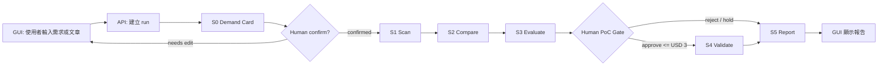
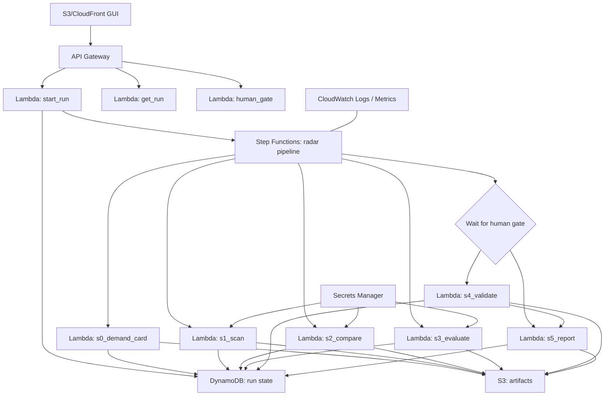

# S0 需求卡與後端架構設計

狀態：開發前規格草案
日期：2026-07-24
系統：AI Agentic 雲端技術雷達與評估系統
AWS prefix：`agentic-cloud-radar`

## 1. 這份文件要解決什麼

新版系統要先從 S0 需求卡開始，而不是直接把一篇 AWS 新聞丟進評分器。

原因很簡單：如果沒有先定義公司目前想解什麼問題，S1 到 S5 很容易變成「看新聞後硬找應用場景」。這樣報告會很會講，但不一定對公司有用。

S0 的目的，是把人類輸入整理成一張可以被後端、Skill、GUI 和報告共同使用的需求卡。

## 2. S0 在整套流程的位置



重點：

- S0 不搜尋外部資料。
- S0 可以接收 URL、RSS 條件或貼文，但只做格式、範圍與安全檢查；不在 S0 階段抓取網頁內容或搜尋相關新聞。
- S0 可以使用 LLM 當需求卡助理，幫忙整理輸入、判斷模糊處、產生追問和草擬需求卡。
- LLM 在 S0 不可自行放行流程；最後仍需規則檢查與人工確認。
- S0 不做技術推薦。
- S0 不啟動 PoC。
- S0 只負責把需求變成清楚、可檢查、可追蹤的輸入。
- S1 才開始外部資料動作：抓取指定 URL、讀 RSS、runtime web search、整理官方文件與相關新聞。

## 3. S0 要問使用者什麼

第一版 GUI 的 S0 表單不需要複雜，但要問到足以避免後面亂評分。

必要欄位：

| 欄位 | 意義 | 範例 |
|---|---|---|
| problem_statement | 目前想解決的問題 | 想評估某個 AWS 新功能是否能改善檔案共享流程 |
| current_approach | 目前做法或既有困難 | 現在用 S3 API，但非開發人員不易直接操作 |
| desired_outcome | 希望改善的結果 | 讓應用可以用接近檔案系統的方式讀寫 S3 資料 |
| constraints | 限制條件 | 不使用 Bedrock、不能碰真實客戶資料、PoC 成本不超過 USD 3 |
| success_criteria | 成功標準 | 可以用小型 PoC 驗證雙向讀寫 |
| source_mode | 技術來源模式 | RSS、URL、貼上文章、指定 AWS 服務 |
| sensitivity_check | 敏感資訊檢查結果 | 沒有客戶資料、憑證、內部 IP、帳號 ID |
| human_confirmed | 是否人工確認 | true / false |

可選欄位：

| 欄位 | 意義 |
|---|---|
| business_domain | 業務場景，例如保險、內部維運、資料平台 |
| preferred_region | 預設 AWS region，例如 ap-southeast-1 |
| excluded_services | 明確排除服務，例如 Bedrock |
| evaluation_priority | 使用者偏重：效率、治理、維運、安全、整合 |
| notes | 其他補充 |

## 4. S0 輸出資料格式

S0 輸出應該是一份 JSON。之後 S1 到 S5 都只能讀這份需求卡，不要各自重新猜使用者需求。

建議格式：

```json
{
  "run_id": "agentic-cloud-radar-20260724-001",
  "stage": "S0",
  "status": "confirmed",
  "created_at": "2026-07-24T10:00:00+08:00",
  "created_by": "cleo",
  "problem_statement": "想評估某個 AWS 新功能是否能改善檔案共享流程",
  "current_approach": "現在用 S3 API，但非開發人員不易直接操作",
  "desired_outcome": "讓應用可以用接近檔案系統的方式讀寫 S3 資料",
  "constraints": {
    "excluded_services": ["Bedrock"],
    "max_small_poc_usd": 3,
    "no_sensitive_data": true,
    "preferred_region": "ap-southeast-1"
  },
  "success_criteria": [
    "可以說清楚技術用途",
    "可以找到官方來源",
    "可以定義低成本 PoC 驗證假設"
  ],
  "source_mode": "url",
  "source_input": {
    "url": "https://example.com/aws-news",
    "title": "Optional title"
  },
  "sensitivity_check": {
    "status": "passed",
    "flags": [],
    "notes": "未偵測到憑證、客戶資料或內部識別資訊"
  },
  "human_confirmed": true
}
```

## 5. S0 驗證規則

S0 採「LLM 需求卡助理 + 固定規則檢查 + 人工確認」。

LLM 需求卡助理可以做：

- 把使用者輸入整理成需求卡草稿。
- 判斷哪些欄位模糊或缺漏。
- 產生追問，例如「你想改善的是查詢速度、維運流程、成本，還是資料同步？」
- 建議 success criteria 的寫法。
- 標記可能含敏感資訊的片段，交給固定規則再檢查。

LLM 需求卡助理不能做：

- 不向外搜尋。
- 不自行抓 URL 內容。
- 不自行判定 S0 通過。
- 不取代敏感資訊規則檢查。
- 不取代人工確認。

S0 至少要做四種固定檢查。

第一，完整性檢查：

- `problem_statement` 不可空白。
- `desired_outcome` 不可空白。
- `success_criteria` 至少一項。
- `source_mode` 必須是 RSS、URL、貼文、指定服務之一。

第二，敏感資訊檢查：

- 不接受 AWS access key。
- 不接受 secret key。
- 不接受完整帳號 ID。
- 不接受 private key。
- 不接受客戶姓名、身分證、保單號等個資。
- 不接受內部 IP、內部系統 URL 或未遮蔽主機名稱。

第三，限制條件檢查：

- 如果使用者沒有填 region，預設 `ap-southeast-1`。
- 如果使用者沒有填排除服務，預設排除 Bedrock 類路線，除非 Cleo 另行指定。
- 如果使用者沒有填成本限制，S4 小型 PoC 預設 USD 3 硬上限。

第四，人工確認：

- S0 可以由系統草擬，但必須由人確認後才能進 S1。
- 如果 `human_confirmed=false`，Step Functions 應停在 S0，不可自動掃描外部資料。

S0 通過條件：

- 需求完整性檢查通過。
- 敏感資訊檢查沒有 blocking flag。
- 限制條件已套用預設值或由使用者明確填寫。
- 來源模式明確，例如指定 URL、RSS、貼文或指定 AWS 服務。
- LLM 沒有標記重大模糊處，或使用者已回覆追問並修正需求卡。
- 使用者確認需求卡內容合理。

S0 狀態建議：

| 狀態 | 意義 | 下一步 |
|---|---|---|
| `draft` | 系統或使用者剛建立，尚未檢查完整 | 留在 S0 |
| `needs_revision` | 欄位不足或需求太模糊 | 回 GUI 修改 |
| `blocked_sensitive` | 偵測到敏感資料或機密資訊 | 停止，不進 S1 |
| `ready_for_confirmation` | 檢查通過，但還沒人工確認 | 等使用者按確認 |
| `confirmed` | 人工確認完成 | 進入 S1 |

重要邊界：

- 如果使用者只輸入 URL，但沒有需求，S0 應要求補需求；否則後面只會變成一般新聞摘要。
- 如果使用者只輸入需求，但沒有指定 URL，S0 可通過；S1 會依需求去 RSS 或 runtime web search 找候選新聞。
- 如果使用者同時輸入需求和 URL，S0 通過後，S1 會優先抓指定 URL，再視需求補找官方文件與相關新聞。

## 6. S0 可能疏漏

S0 不是萬能的，這些地方會讓後續結果不可靠：

- 使用者一開始問題描述太抽象，系統可能整理出錯方向。
- 敏感資訊檢查只能攔明顯格式，不能保證抓到所有公司機密。
- 如果公司實際架構限制沒有填，後面可能高估可整合性。
- 如果成功標準寫得太寬，S4 PoC 可能驗證不到真正風險。
- 如果只輸入新聞 URL，沒有輸入公司問題，評分會偏向一般技術價值，而不是公司適配度。

## 7. 後端第一版總架構

第一版後端採「核心 Python package + CLI + Lambda handler + Step Functions」。



## 8. 後端元件責任

### API Gateway

責任：

- 提供 GUI 呼叫後端的入口。
- 第一版 API 至少需要建立 run、查 run、送 human gate 決策、取得報告。

可能疏漏：

- 如果第一版沒有 Cognito，部署範圍必須受控，不能開成公開 API。
- CORS 設定錯誤會讓 GUI 無法呼叫。

### Lambda: start_run

責任：

- 接收 GUI 或 CLI 的 S0 初始輸入。
- 建立 `run_id`。
- 寫入 DynamoDB 初始狀態。
- 把原始輸入存到 S3。
- 啟動 Step Functions。

可能疏漏：

- 未去識別化就把敏感輸入存進 S3。
- 重複送出造成多個 run。
- 使用者以為送出後 PoC 會自動開始。

### Step Functions

責任：

- 管理 S0 到 S5 的順序。
- 在 S0 未確認時停止。
- 在 S3 後等待 human PoC gate。
- 保留每階段成功、失敗、重試與停止原因。

可能疏漏：

- retry 設太寬會造成重複呼叫外部 API 或增加成本。
- timeout 設太短會讓 web search 或報告生成失敗。
- human gate 若設計不清，可能被誤解成自動核准。

### DynamoDB: run state

責任：

- 存每次 run 的狀態摘要。
- 存 human gate 決策。
- 存目前階段、錯誤、報告位置、cleanup 狀態。

建議 key：

- partition key：`run_id`
- sort key：`record_type`

常見 `record_type`：

- `META`
- `S0`
- `S1`
- `S2`
- `S3`
- `HUMAN_GATE`
- `S4`
- `S5`
- `ERROR`

可能疏漏：

- 若每階段只更新同一筆資料，會失去歷史。
- 若沒有記錄 artifact path，日後追證據會很痛苦。
- 若錯誤訊息寫入敏感資料，會變成治理風險。

### S3: artifacts

責任：

- 保存原始輸入、每階段 JSON、搜尋證據、報告、PoC artifact。

建議路徑：

```text
runs/{run_id}/input/original.json
runs/{run_id}/s0/demand-card.json
runs/{run_id}/s1/scan.json
runs/{run_id}/s2/compare.json
runs/{run_id}/s3/evaluate.json
runs/{run_id}/s4/validate.json
runs/{run_id}/s5/report.json
runs/{run_id}/s5/report.html
runs/{run_id}/evidence/evidence-ledger.json
```

可能疏漏:

- 沒有 lifecycle rule 會長期累積成本。
- 報告如果含敏感輸入，GUI 下載會有外洩風險。
- 如果 JSON schema 沒版本欄位，日後改格式會很難維護。

### Secrets Manager

責任：

- 存 runtime web search、LLM 或其他外部 API key。

不能做：

- API key 不可出現在 GUI。
- API key 不可出現在 repo。
- API key 不可出現在日誌或報告。

可能疏漏：

- Lambda log accidentally print secret。
- Secret rotation 後 Lambda 還吃舊值。

### CloudWatch

責任：

- 記錄每階段耗時、成功失敗、token 使用、估算成本、錯誤原因。

可能疏漏：

- 如果只看 Step Functions 成功，不看每階段輸出品質，會誤判系統真的有效。
- 如果 logs 保存太久，可能累積成本或保存不該保存的內容。

## 9. 第一版 API 草案

| Method | Path | 用途 |
|---|---|---|
| POST | `/runs` | 建立一次分析，送入 S0 初始資料 |
| GET | `/runs/{run_id}` | 查詢 run 狀態與各階段摘要 |
| GET | `/runs/{run_id}/artifacts` | 列出可讀 artifact |
| POST | `/runs/{run_id}/s0/confirm` | 人工確認 S0 需求卡 |
| POST | `/runs/{run_id}/poc-gate` | 核准、拒絕或暫緩 S4 PoC |
| GET | `/runs/{run_id}/report` | 取得 S5 報告入口 |

第一版若還沒有 Cognito，API 只能用在本機、受控測試或公司內部受限環境，不應公開部署。

## 10. 第一版資料流

1. 使用者在 GUI 輸入需求與文章來源。
2. GUI 呼叫 `POST /runs`。
3. `start_run` 建立 run，保存原始輸入。
4. Step Functions 執行 S0，產生需求卡。
5. 如果 S0 未確認，流程停住，GUI 要求使用者確認或修改。
6. 使用者確認 S0 後，流程進入 S1。
7. S1 根據 S0 和來源模式掃描技術資訊。
8. S2 做 AWS / GCP / Azure 補充比較，保存來源證據。
9. S3 依 rubric 產生技術分數、證據信心與 PoC 建議。
10. 若不符合 PoC 條件，直接進 S5 報告。
11. 若符合條件，流程停在 human gate。
12. 使用者核准後，S4 檢查 PoC 是否低於 USD 3 並執行最小驗證。
13. S4 完成或拒絕後，S5 產出報告。
14. GUI 顯示報告與 artifacts。

## 11. 開發順序

第一階段先不碰 AWS：

- 定義 S0 到 S5 JSON schema。
- 寫 Python package。
- 寫 CLI，讓本機可以跑一篇範例輸入。
- 寫單元測試，確認 S0 阻擋、敏感資訊檢查、human gate 狀態正確。

第二階段做 AWS 後端：

- 寫 Lambda handler。
- 寫 CDK stack。
- 建立 S3、DynamoDB、Step Functions、API Gateway。
- 先保留 runtime web search 與 LLM provider 的可插拔介面，並用固定範例驗證資料格式與狀態轉換；正式 Deployed mode 才接真實外部服務。

第三階段接 GUI：

- 做可用的 S3 靜態前端。
- 串 API。
- 顯示狀態、證據、分數、human gate 與報告。

第四階段再接 runtime web search：

- 設定允許來源。
- 保存 evidence ledger。
- 在 S5 報告顯示來源與查詢時間。

## 12. 這樣設計的取捨

好處：

- S0 先確認需求，後面不容易亂評分。
- 核心 Python 邏輯可以同時給 CLI、Lambda 和 Skill 使用。
- GUI 真的可操作，但不承擔判斷邏輯。
- S3 和 DynamoDB 讓每次 run 都能追證據。
- Step Functions 讓 human gate 不會被藏在程式碼裡。

代價：

- 第一版會比單純寫一支腳本慢。
- schema 要先想清楚，後面才不會一直改格式。
- GUI、CLI、Lambda 三個入口要共用核心邏輯，需要專案結構一開始就設好。
- 若第一版不放 Cognito，就只能受控測試，不能當正式公開入口。
