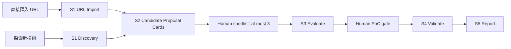

# S1/S2 入口與提案架構

> 檔名保留是為了不讓既有連結失效；S0 已不再是系統入口或獨立 stage。

## 1. 為什麼移除入口 S0

「先把需求填完整，再開始找技術」有一個根本問題：使用者常常正是因為不知道有哪些新技術，才需要系統探索。若把需求卡放在最前面，容易出現兩種不自然的流程：

1. 已有一篇 URL，卻要先經過與 URL 無關的確認關卡。
2. 想看跨領域新技術，卻要先假裝知道某個明確公司痛點。

因此入口只保留資料動作；問題定義移到看到真實候選之後。

## 2. S1 的兩條入口

### A. `s1-url`: 直接匯入 URL

- 不需要 S0 或人工確認卡，因為使用者貼 URL 已是明確意圖。
- 保留 HTTPS、AWS/GitHub/GitLab/Codeberg allowlist、redirect、content-type 檢查。
- 輸出 `entry_point.type=direct_url_import` 與一筆可回查候選。
- 不會編造「公司問題」或「預期效益」；這些留給 S2 提案卡確認。

### B. `s1`: 技術探索

- 讀 AWS Blogs 分類目錄、選擇 RSS feed、抓回候選文章；非 GA-only 模式可補 GitHub Public Repository Search。
- `discovery_scope`、年限、最大候選數、GA 要求是掃描參數，不是需求審核。
- `problem_statement` 等欄位可作為 focused scan hint，但不代表已確認的商業需求。

## 3. S2 合併原 S0 的價值

S2 對每個 S1 候選建立一張 `proposal_card`。它不是替公司決定要做什麼，而是把「若要考慮這項技術，問題要怎麼被定義」攤開。

| 提案卡區塊 | 要回答的問題 | 證據規則 |
| --- | --- | --- |
| candidate opportunity | 來源說這項技術能做什麼？ | 只保留 S1 抓到的來源摘錄。 |
| problem definition | 哪個工作流、使用者、現況基準值得改善？ | 未知即標未知，交由人類補。 |
| improvement hypothesis | 可能改善速度、人工步驟、整合範圍、成本或開發效率嗎？ | 有來源量化才稱量化；否則是待驗證假設。 |
| benefits | 為什麼值得繼續看？ | 每項對應來源字詞或摘錄。 |
| tradeoffs and risks | 設定、治理、環境、成本或可比性的代價？ | 清楚標為 source fact 或 planning inference。 |
| validation design | S3/S4 要量什麼、什麼時候停止？ | 同一工作負載的 before/after、USD 3、權限、cleanup。 |

## 4. 比較指標

S2 不算假精準總分，而是用固定欄位形成橫向比較矩陣：

1. 技術範圍與 AWS service signal。
2. 交付型態：SDK、managed desktop、compute、hybrid、regional extension、developer tooling 等。
3. 來源支持的能力摘錄。
4. 可能改善向量：效能／延遲、流程自動化、開發者效率、整合範圍、成本或資源效率。
5. 改善程度證據：量化來源數字、僅質化描述、或尚未建立。
6. 環境訊號與前置條件。
7. GA 成熟度與來源摘錄。
8. 官方文件、定價、區域／可用性證據是否已找到。
9. 證據覆蓋率與重要未知。
10. 驗證可觀測性：能否量 before/after、失敗／rollback、人工介入與資源成本。
11. 新加坡功能級可用性：必須有候選相關官方證據明確指向 `ap-southeast-1`，服務本身有 endpoint 不足以通過。

## 5. 不做的事

- S1 不因為資料探索而宣稱已找到公司需求。
- S2 不自動挑選技術、不把缺定價視為免費、不以文案取代基準量測。
- S2 不建立 AWS 資源；S4 前仍需人類選題、範圍、權限、成本與 cleanup gate。
