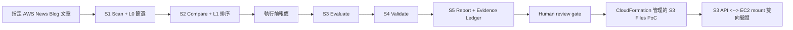

# S3 Files 完整雷達評估與 PoC 報告

日期：2026-07-23
來源：[AWS News Blog｜Launching S3 Files, making S3 buckets accessible as file systems](https://aws.amazon.com/blogs/aws/launching-s3-files-making-s3-buckets-accessible-as-file-systems/)

## 結論

S3 Files 已完成從指定新聞輸入、S1 到 S5、CloudFormation 管理的 PoC，到雙向檔案同步的完整證據鏈。它適合列為「可進一步 trial 的 S3 檔案介面能力」，但不是直接採用到正式環境的結論。

本次正式雷達評分是 `4.35 / 5`。唯一候選因為新聞輸入只有一篇，所以報告只有 1 個最終候選；不能把它寫成 Top 3 已選出。S3/S4 的 Anthropic 呼叫失敗後系統自動改用 rubric fallback，因此分數是可重現的規則評分，不是 LLM 評分成果。

本次共跑兩次：第一次發現 Lambda layer 缺少 Linux/Python 3.12 相容的原生模組，已改用 Linux wheel 更新 layer；第二次已能載入套件，但 Secrets Manager 內的 Anthropic key 回傳 401 invalid key。這兩個問題不能混為一談；前者已修正，後者需要持有核准 key 的人更新 Secret。

## 本次架構

原本的 RSS 掃描不會保證收錄數月前的文章，所以雷達新增受控的 `seed_article` 輸入分支。它保留一般 RSS 路徑，且要求每篇指定文章有標題、官方 URL、摘要與評估訊號；這不是把文章偷偷放進輸出，也不是聲稱今天 RSS 掃到它。

## S1 到 S5 結果

| 階段 | 已驗證結果 | 限制 |
|---|---|---|
| S1 Scan | 指定官方文章通過 L0；來源模式為 `seed_article`。 | 這是受控單篇輸入，不是今日 RSS 掃描結果。 |
| S2 Compare | 保留 1 個候選：S3 Files。 | 單篇案例沒有候選間競爭，不能宣稱已完成 Top 3 選拔。 |
| 報價 | 預估 USD 0.0232，低於 USD 0.50 上限，quote gate 核准。 | 報價核准不代表外部 LLM 一定成功。 |
| S3 Evaluate | 依 maturity、AWS fit、case evidence、effort、risk 產生分數。 | Linux layer 相容性已修正；目前 Anthropic key 無效，已自動改成 rubric-only。 |
| S4 Validate | 獨立權重重評，沒有高風險或低成熟度 hard rule。 | 同樣是 rubric-only，不是第二個 LLM 的獨立判斷。 |
| S5 Report | 最終平均分為 4.35，產出 HTML report、evidence ledger、decision layer、review packet、audit packet 與成本檔。 | `awaiting_human_review`；尚無真人 approve/reject/override。 |

完整產物在 `research/s3-files-radar-run-2026-07-23/` 與修正 layer 後的 `research/s3-files-radar-run-2026-07-23-llm/`。其中 JSON 與 HTML 是已從公司帳戶的 pipeline 下載回來的輸出，不含帳號、ARN、IP 或 presigned URL。

## 為什麼值得做 PoC

AWS 官方文章說明 S3 Files 可以把 general purpose bucket 提供給 EC2、容器或 Lambda 作為 NFS 檔案系統使用；資料仍以 S3 為主，檔案操作會同步回物件。對技術雷達來說，真正要驗證的是：是否能被 CloudFormation 重建、mount 是否成功、S3 與 mount 是否雙向同步，以及同步不是宣稱即時。

## CloudFormation 與 PoC 證據

### 已驗證

- 雷達主 stack 已更新為 `UPDATE_COMPLETE`：只增加指定新聞輸入分支，更新既有 Lambda code 與 Step Functions 定義，沒有新增雷達基礎資源。
- 已有的 S3 Files PoC stack 為 `CREATE_COMPLETE`，包含 S3 bucket、S3 Files file system、mount target、access point、EC2、VPC、security groups 與 IAM role。
- EC2 狀態為 running/ok，SSM 為 Online；`/mnt/s3files` 確認為 `nfs4` mount。
- S3 API 寫入的小型文字檔可從 EC2 的 `/mnt/s3files` 讀到。
- EC2 mount 寫入的小型文字檔可從 S3 API 讀回；本次約第 13 次、約 36 秒輪詢後可見。
- 每次驗證只使用小型文字檔，沒有建立第二套 EC2、VPC 或 S3 Files 資源。

### 仍需人工確認

- Cleo 應再到 AWS Console 手動確認 CloudFormation Resources/Infrastructure Composer、S3 Files file system/mount target、EC2 狀態與 S3 object；CLI 與 SSM 不能取代這些 Console 證據。
- 最終是否把 4.35 分轉為 trial 決策，仍需 human review gate 的真人決定與理由。
- 未做多 EC2、容器/Lambda mount、壓力、長時間穩定性、故障復原或完整成本量測。

## 成本與 cleanup

- 本次雷達 run 的估算費用是 USD 0.0232；實際外部 LLM 呼叫因無效 key 失敗，因此不能把該估算寫成實際 Anthropic 花費。
- S3 Files PoC 已有 EC2 與網路資源持續運作，會產生成本；本次雙向驗證只增加少量 S3 request/storage。
- Console 證據與必要報告保存後，應刪除整個 S3 Files PoC stack，並確認 bucket/versioned objects、S3 Files、EC2、VPC、security group、IAM role/profile 都已清除。不要刪除帳號層級的 CloudTrail。

## 我如何自己再做一次

1. 在雷達的指定新聞輸入提供官方 URL、摘要、tags 與預先定義的訊號，確認 S1 輸出標記為 `seed_article`。
2. 從 Step Functions 看 S1→S2→Quote→S3→S4→S5 是否成功，並下載 S5 的 report、evidence ledger、review packet。
3. 若 S3/S4 不是 `api.anthropic.com`，先看 JSON 中的 fallback error；需要時由持有核准 API key 的人更新 Secrets Manager，不能把 key 貼到 repo、日誌或聊天。
4. 到 CloudFormation 看 PoC stack 的 Resources 與 Infrastructure Composer，理解 bucket、S3 Files、mount target、access point、EC2、VPC、security group、IAM role 的連線。
5. 在 EC2 以 Session Manager 檢查 `findmnt -T /mnt/s3files`，確認是 `nfs4`。
6. 先從 S3 放一個小文字檔，等待它出現在 mount；再從 mount 寫一個小文字檔，輪詢 S3 直到讀回內容。記錄可見時間，不說成即時。
7. 完成後先保存去識別化證據與報告，再 cleanup stack 並回查資源是否已刪除。

## 架構掃描

`aws-architecture-scout` 對本機封包掃到 24/26（92%），但這個數字不能直接當完成度：掃描器把相依套件中的文字誤算成 Bedrock、CloudFront、Cognito 與 RAG 實作，也把舊的 Entry B 提示視為未對齊。本專案目前刻意排除 Bedrock，且公司帳戶版不部署 CloudFront；因此此掃描僅能當檔案覆蓋提示，實際部署與本次 S1-S5/PoC 證據才是判斷依據。
