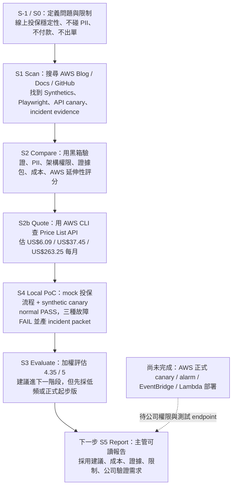

# 線上投保穩定性 S3 評估 - 2026-07-20

## 評估目標

本文件承接 S1 掃描、S2 比較、S2b 報價與本機 S4 PoC，判斷「CloudWatch Synthetics / Playwright journey canary + API canary + incident packet」是否值得作為線上投保穩定性第一階段方案。

這次評估不宣稱已接入公司真實保單系統，也不宣稱已在 AWS 建立正式 canary。評估重點是：

- 在實習生只能外部觀察、無完整系統架構權限時，是否仍可驗證方案可行性。
- 是否能避免碰客戶 PII、付款、出單。
- 是否能產生主管與工程師可接手的故障證據。
- 成本是否足以支持第一階段 PoC 或小規模導入。

## 我們到底測了什麼

| 類型 | 已做什麼 | 驗證狀態 | 不能說成什麼 |
|---|---|---|---|
| 本機功能驗證 | 建 mock 線上投保服務與 synthetic canary，跑正常、報價 500、付款前 timeout、前端錯誤 | 已驗證 | 不能說公司真實保單系統已被監控 |
| AWS CLI 查證 | 用 `intern` profile 查 AWS Price List API，取得 Tokyo canary、alarm、logs、Lambda、S3 單價 | 已驗證 | 不能說已建立 AWS canary 或 alarm |
| AWS 正式部署 | 尚未建立 CloudWatch Synthetics、Alarm、EventBridge、Lambda incident packet | 待公司環境驗證 | 不能說已正式上線 |
| 真實投保流程 | 尚未取得公司可測試 journey、sandbox URL 或測試帳號 | 待人類確認 | 不能拿 mock 結果代表真實服務 SLA |

## 沒有完整 AWS 權限時怎麼測

目前測試採「分層驗證」：

1. **本機 PoC 驗證方案邏輯**
   用 mock 線上投保流程模擬首頁、報價 API、付款前確認、前端錯誤檢查。這能驗證 canary 是否能定位失敗步驟、分類錯誤、產 incident packet。

2. **AWS CLI 驗證成本資料**
   用 `intern` profile 查 AWS Price List API。這只讀定價資料，不建立資源、不改 AWS 環境、不需要保單系統權限。

3. **AWS 正式功能保留為下一階段**
   真正的 CloudWatch Synthetics、Alarm、EventBridge、Lambda incident packet 需要公司允許的 AWS 權限與測試 endpoint。這一段標為「待公司環境驗證」。

這樣做的好處是：即使拿不到公司保單系統架構，也能先交付一個可跑、可解釋、可估成本的低風險驗證。

## 評估矩陣

| 評估項目 | 權重 | 評分 | 理由 |
|---|---:|---:|---|
| 低侵入性 | 20% | 5 | 第一階段可用外部黑箱方式，不需要進內部服務或資料庫 |
| PII / 付款 / 出單風險 | 20% | 5 | PoC 明確只跑假資料、preview route，不付款、不出單 |
| 異常定位能力 | 20% | 4 | 可定位 homepage、quote API、application preview、frontend error；若要更完整需 Playwright 截圖與 network HAR |
| 故障證據可交接性 | 15% | 4 | 已產 Markdown report 與 incident packet JSON；正式版可接 S3 / CloudWatch Logs / EventBridge |
| 成本可接受度 | 15% | 4 | 低頻約 US$6.09/月，正式起步約 US$37.45/月；高頻每分鐘版成本明顯升高 |
| AWS 正式落地可行性 | 10% | 3 | 架構可行，但仍需公司權限、測試 endpoint、告警對象與安全審查 |

加權分數：**4.35 / 5**

S3 判斷：**建議進入下一階段，但採低頻驗證版或正式起步版，不直接做高頻強化版。**

## 推薦採用範圍

### 第一階段建議採用

- CloudWatch Synthetics / Playwright journey canary。
- Multi-step API canary。
- CloudWatch Alarm。
- EventBridge + Lambda incident packet。
- S3 / CloudWatch Logs 保存報告與錯誤證據。

### 第一階段不建議採用

- CloudWatch RUM：需前端植入與 PII 遮罩設計，先放第二階段。
- Application Signals：需要內部服務與 agent instrumentation，先放第二階段。
- Resilience Hub / FIS：需要 workload inventory、測試環境與故障注入權限，先放第二階段。
- 每分鐘高頻 canary：成本會放大，除非有明確尖峰或高風險時段。

## 風險與緩解

| 風險 | 影響 | 緩解方式 |
|---|---|---|
| 測試流程誤觸真實付款或出單 | 高 | 只使用 sandbox / preview route；測試資料與真實客戶資料隔離 |
| Canary 頻率太高造成成本或流量壓力 | 中 | 先用 5 至 15 分鐘頻率；尖峰時段才加密監測頻率 |
| 只看外部流程，無法定位內部服務根因 | 中 | 第一階段只定位到失敗步驟；第二階段再接 Application Signals / trace |
| Log 或 screenshot 含敏感資訊 | 高 | 設定遮罩規則；incident packet 不保存客戶姓名、身分證、電話、保單號 |
| 公司 AWS 權限不足 | 中 | 先交付本機 PoC 與報價；正式部署需管理者提供最小權限或代建 |

## 下一步

進入 S5 Report 前，建議先補兩個小缺口：

1. 將本機 canary 升級為 Playwright browser journey，增加截圖與 console error evidence。
2. 整理一份主管可讀 S5 報告，把 S1/S2/S2b/S3/S4 串成完整故事：推薦什麼、為什麼、多少錢、驗證結果、限制與下一步。

## 目前流程圖

## 一句話結論

這個方案值得作為線上投保穩定性第一階段 PoC：它低侵入、成本可控、能從使用者視角提早發現流程異常，也能產生 incident packet 讓人接手；但正式 AWS 部署與真實保單系統測試仍需公司提供測試 endpoint 與最小 AWS 權限。
