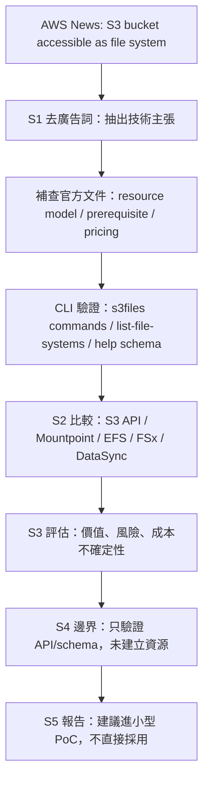

# S3 Files 新聞截斷測試：S1-S5 評估報告

日期：2026-07-20  
主題：AWS News Blog「Launching S3 Files, making S3 buckets accessible as file systems」  
定位：本次已暫停保單系統與 S0 建置，改用短篇 AWS 新聞測試技術雷達 S1-S5 的推論、查證與 CLI 驗證能力。

## 一句話結論

S3 Files 值得放入技術雷達候選，但不能只因為「讓 S3 bucket 像檔案系統」這句廣告語就採用。它真正適合的是：既有資料在 S3、應用或 AI/ML 工作流程又需要 NFS/POSIX file access 的情境。若只是一般物件讀寫、靜態網站、備份或簡單資料湖，直接用 S3 API、Mountpoint for S3、EFS、FSx 或 DataSync 可能更清楚且可控。

本次 CLI 驗證只做到「AWS CLI 已支援 s3files API、目前帳號/區域可 list、未建立任何 S3 Files 資源」。要進入真 PoC，還需要 throwaway S3 bucket、bucket versioning/encryption、service role、VPC subnet/security group、EC2 或其他 compute mount client，會產生成本，因此本次沒有直接建立。

## S1 Scan：去除廣告詞後的真技術主張

### 原始新聞可留下的有效資訊

- S3 Files 是新服務，讓 S3 general purpose bucket 可以透過 file system 方式被 EC2、ECS、EKS、Lambda 存取。
- 它支援 NFS v4.1+ 類型的 file operation，例如 create、read、update、delete。
- 它不是單純把 S3 API 包一層 mount command；官方文件說明底層使用 EFS，並把活躍資料放在高效能儲存層。
- 檔案系統變更會同步回 S3；S3 bucket 變更也會同步回檔案系統，但同步不是零延遲，官方描述可能是數秒到數分鐘。
- 需要 VPC mount target、IAM role、bucket versioning/encryption、amazon-efs-utils 3.0.0+，也要處理 NFS 2049 security group。
- 成本不只 S3 storage，還有 S3 Files high-performance storage、read/write data access、metadata 操作與同步造成的 S3 request。

### 若只看到截斷資訊，AI 應該推回的實作架構

假設新聞只剩一句：「S3 buckets are accessible as file systems」，合理推論不應直接變成「mount S3 就好」，而應拆成：

1. 有一個 S3 bucket 作為 authoritative object store。
2. AWS 會建立一個 file system resource，綁定 bucket ARN 或 bucket prefix。
3. 因為 file system 需要網路掛載，所以必定有 VPC mount target。
4. 因為 file system 需代 AWS 讀寫 S3，所以必定需要 service role。
5. 因為 Linux/compute 需要 mount，所以客戶端要有 mount helper 或 NFS client。
6. 因為 S3 與 file system 語意不同，所以必須確認同步延遲、POSIX 權限、metadata 與成本。

這組推論與官方文件、CLI command schema 相符。

## S2 Compare：和相近方案比較

| 方案 | 適合情境 | 不適合情境 | 本次判斷 |
|---|---|---|---|
| S3 API | 物件導向、事件處理、資料湖、低成本儲存 | 既有程式只會讀寫檔案路徑、需要 shared file semantics | 若應用可改程式，優先考慮 |
| Mountpoint for S3 | Linux workload 想把 S3 object 以檔案路徑讀取，偏高吞吐資料處理 | 需要完整共享 mutable file system 語意、跨多 compute 協作寫入 | 需另行細查，但可能是較輕量替代 |
| EFS | 原生 shared POSIX/NFS file system，適合 Lambda/ECS/EKS/EC2 多端共享 | 資料主體已在 S3，且想保留 S3 object workflow | 若 file system 是主體資料層，EFS 更單純 |
| FSx | 高效能、企業檔案協定、Windows/Lustre/ONTAP/OpenZFS 等特殊需求 | 只想把 S3 bucket 變成簡單 file access | 專業檔案系統需求才考慮 |
| DataSync | 批次搬移、同步、遷移、備份 | 需要即時掛載使用 | 它是資料搬運，不是線上 file system |
| S3 Files | S3 是主資料層，但 workload 需要 NFS/POSIX file access 與共享掛載 | 不能接受同步延遲、metadata 成本高、只需簡單物件 API | 值得進雷達候選，需用 workload benchmark 驗證 |

## S2b Quote：報價時不能漏掉的成本因子

本次不給單一總價，因為 S3 Files 的成本取決於 workload。主管可讀報價應至少要求使用者輸入：

- S3 bucket 既有資料量與 active working set 大小。
- 小檔比例、metadata 操作量、讀寫比例。
- 每日同步變更量。
- 掛載 compute 類型與執行時間。
- 是否使用 KMS、CloudWatch metrics/logs、CloudTrail。
- 是否跨 AZ、跨 VPC、跨帳號或需要 NAT/data transfer。

CLI 查證證據：

```text
aws pricing get-products ... AmazonS3 / Asia Pacific (Singapore)
抓到 S3 Files 價格項：
APS1-Files-Read / S3-API-Files-Read / Files data reads
USD 0.04 per GB for APS1-Files-Read in Asia Pacific (Singapore)
```

這代表 S3 Files 不是「用 S3 原價免費多一層檔案系統」，而是會有自己的 Files data access 計費項。完整價格仍需依 AWS Pricing 頁面與實際 workload 補齊。

## S3 Evaluate：採用價值與風險

### 初步評分

| 評估項 | 分數 | 理由 |
|---|---:|---|
| 新聞重點可落地性 | 4/5 | CLI 與官方文件已有完整 resource model，不是概念預告 |
| 對既有系統改造價值 | 4/5 | 可降低 legacy file-based workload 接 S3 的改造成本 |
| 成本可預測性 | 2/5 | metadata、小檔、sync、active storage 都會影響費用 |
| PoC 可驗證性 | 3/5 | CLI 可驗證 API，但真掛載需要 VPC/EC2/IAM/S3 bucket |
| 企業導入成熟度 | 3/5 | 官方新服務，需觀察限制、Region、quota、實際 benchmark |

平均：3.2/5。  
建議：列為「值得 PoC，但不得直接採用」。

### 主要風險

- 同步延遲：S3 與 file system 的變更不是永遠即時，不能用在強一致、多端即時協調的假設上。
- 成本不透明：metadata-heavy、小檔、大量 rename/update 可能讓成本偏離預期。
- 權限複雜：S3 IAM、S3 Files service role、bucket policy、KMS、POSIX permission 都要一致設計。
- 網路需求：需要 VPC mount target 與 NFS 2049，和單純 S3 API 的無伺服器存取模型不同。
- 適配邊界：它不是萬用替代 EFS/FSx/S3 API。應先問 workload 到底需要 object semantics 還是 file semantics。

## S4 Validate：本次 CLI 驗證與未驗證邊界

### 已驗證

```text
aws --version
aws-cli/2.35.21 Python/3.14.6 Windows/11 exe/AMD64
```

```text
aws s3files help
可用 commands 包含：
create-file-system、create-mount-target、list-file-systems、
get-file-system、delete-file-system、put-synchronization-configuration 等。
```

```text
aws s3files list-file-systems --profile intern --region ap-southeast-1
{
  "fileSystems": []
}
```

```text
aws s3files create-file-system help
必要參數：
--bucket <bucket ARN>
--role-arn <service role ARN>
可選：
--prefix、--client-token、--kms-key-id、--tags、--accept-bucket-warning
```

```text
aws s3files create-mount-target help
必要參數：
--file-system-id
--subnet-id
可選：
--ipv4-address、--ipv6-address、--ip-address-type、--security-groups
```

### 未建立資源的原因

本次沒有建立 S3 Files file system，因為建立會牽涉：

- 一個可丟棄的 S3 general purpose bucket。
- bucket versioning 與 SSE-S3/SSE-KMS encryption。
- S3 Files service role 與 bucket policy。
- VPC subnet、mount target security group。
- EC2/ECS/EKS/Lambda 等 compute client。
- NFS 2049 規則與 amazon-efs-utils 3.0.0+。
- 可能產生 S3 Files、S3 request、compute、CloudWatch、KMS 等費用。

這些都不是 read-only CLI 可以安全完成的項目，因此本次停在 service/API/schema 驗證。

## S5 Report：可交給人的判斷

### 主管版摘要

S3 Files 是 AWS 在 2026-04-07 發布的新服務，讓 S3 bucket 可透過 file system 方式被 compute 掛載。它最有價值的地方不是「酷」，而是讓既有 file-based application 能少改程式地使用 S3 資料。不過它帶來新的同步延遲、VPC/NFS/IAM/KMS 與成本模型，因此不應直接導入。建議進入小型 PoC：用 throwaway bucket 與 EC2 測試 file create/read/update/delete、S3 反向同步、延遲、metadata 操作與估價。

### 下一步 PoC 成功標準

- 從 EC2 mount S3 Files 成功。
- 在 mount path 建立檔案後，S3 bucket 於合理時間內看得到 object。
- 從 S3 上傳 object 後，mount path 於合理時間內看得到檔案。
- 量測小檔、多 metadata 操作、大檔讀取三類 workload。
- 產出成本估算：active data、read/write、metadata、sync、S3 request、compute。
- 若同步延遲或成本不可接受，回退比較 EFS、Mountpoint for S3 或 S3 API 改寫。



## 來源

- AWS News Blog: https://aws.amazon.com/tw/blogs/aws/launching-s3-files-making-s3-buckets-accessible-as-file-systems/
- S3 Files 使用者指南: https://docs.aws.amazon.com/AmazonS3/latest/userguide/s3-files.html
- S3 Files prerequisite / policies: https://docs.aws.amazon.com/AmazonS3/latest/userguide/s3-files-prereq-policies.html
- S3 Files resource management: https://docs.aws.amazon.com/AmazonS3/latest/userguide/s3-files-resources.html
- S3 Files metering: https://docs.aws.amazon.com/AmazonS3/latest/userguide/s3-files-metering.html
- S3 pricing: https://aws.amazon.com/s3/pricing/
