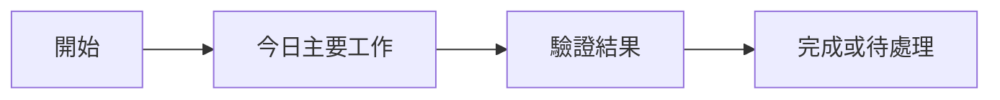

## 今日主題
填寫今日最重要的工作主題與預期成果。
## 今日完成事項
- [ ]
- [ ]
- [ ]
## 執行驗證
- 執行環境：
- 執行結果：
- 證據或連結：
## Skill 進度與積分
| 今日工作 | 對應 Skill | 積分 | 與原始目標的關係 | 證據 |
|---|---|---:|---|---|
|  |  | +0 | 直接扣回目標／間接支援／偏離目標 |  |
## 當日流程圖

## Mentor 討論筆記
### 第一次討論
- 關鍵字：
- 小筆記：
### 第二次討論
- 關鍵字：
- 小筆記：
## 遇到的問題與處理
- 問題：
- 處理：
- 結果：
## 技術調整紀錄
-
## 提醒事項
- [ ]
- [ ]
- [ ]
## 今日總結
用 2 至 4 句記錄今天的成果、風險與明日接續方向。
