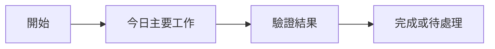

<!--
寫作視角：正式實習日誌是 Codex 代表 Cleo 寫，語氣要像 Cleo 本人的實習紀錄。
白話、少廢話、短句、直接。可以用「我」記錄我做的事、成果、驗證、學習與下一步，但不要每句都硬塞主詞。
Codex／AI 的操作細節只放在 AI 執行軌跡；若需提到 AI，寫成「我使用 AI PM 協助整理／驗證／追蹤」。
-->

## 今日主題
填寫今日最重要的工作主題與預期成果。
## 今日完成事項
- [ ]
- [ ]
- [ ]
## 執行驗證
- 執行環境：
- 執行結果：
- 證據或連結：
## Skill 進度與積分
| 今日工作 | 對應 Skill（掃描／比較／評估／驗證／報告） | 整數積分 | 與該 Skill 原始目標的關係 | 證據 |
|---|---|---:|---|---|
|  |  | +0 | 直接扣回目標／間接支援／偏離目標 |  |
## 主管評分表自評
> 只填今日有證據的項目；沒有新證據可填「無新增」。正式分數以主管評分為準，累計口徑參考 `MENTOR_EVALUATION_PROGRESS.md`。

### 四大項目
| 項目 | 今日證據 | 自評（1-5） | 補強方向 |
|---|---|---:|---|
| 組織認同／組織承諾 |  |  |  |
| 盡責 |  |  |  |
| 團隊合作 |  |  |  |
| 創新求變 |  |  |  |

### 行為觀察
| 評分表編號 | 今日對應行為或證據 | 自評（1-5） |
|---:|---|---:|
|  |  |  |
## 當日流程圖

## Mentor 討論筆記
### 第一次討論
- 關鍵字：
- 小筆記：
### 第二次討論
- 關鍵字：
- 小筆記：
## 遇到的問題與處理
- 問題：
- 處理：
- 結果：
## 技術調整紀錄
-
## 提醒事項
- [ ]
- [ ]
- [ ]
## 今日總結
用 2 至 4 句記錄今天的成果、風險與明日接續方向。
